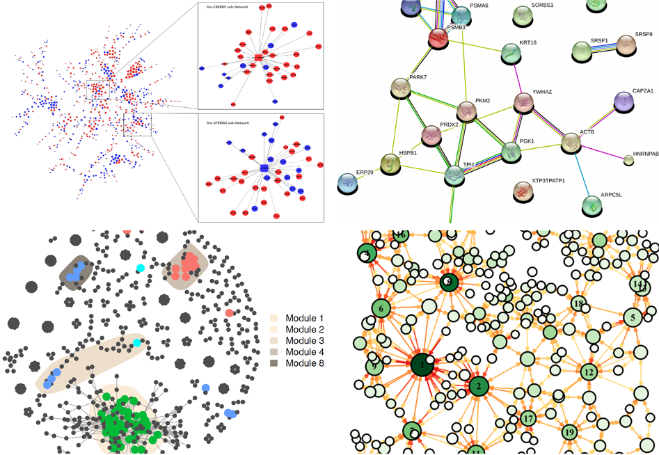

# Introduction

## Network

In mathematics,"networks" are often referred to as "graphs",and the mathematical field of graph
research is called "graph theory".

The basic elements in a network graph are nodes and edges. When constructing a network graph,the
objects are called "nodes" (vertices or nodes),and they are usually drawn as points; the connections
between nodes are called "edges" (edges). or links),and they are usually drawn as lines between
points.

We Can be divide into directed and undirected networks, weighted and unweighted networks according to the edges.

## Network in omics

Networks can represent various systems in the real world,and have many applications in biological
research,especially in systems biology: gene expression regulatory networks,metabolic
networks,ecosystem space networks,microbial co-occurrence networks,protein interaction networks,etc (Figure \@ref(fig:2-net)).

(\#fig:2-net)Applications of network in biology

WGCNA

Co-occurrence networks

PPI

## Software

-   R: igraph (<https://igraph.org/>), network

-   Python: networkx (<https://pypi.org/project/networkx/> )

-   Pajek (<http://vlado.fmf.uni-lj.si/pub/networks/pajek/> )

-   Cytoscape (<https://cytoscape.org/> )

-   Gephi (<https://gephi.org/> )

## MetaNet

**MetaNet** is a comprehensive network analysis package for omics data.

-   Calculate correlation network quickly, accelerate lots of analysis by parallel computing.

-   Support for multi-omics data, search sub-nets fluently.

-   Handle bigger data, more than 10,000 nodes in each omics.

-   Offer various layout method for multi-omics network and some interfaces to other software
    (Gephi, Cytoscape, ggplot), easy to visualize.

-   Provide comprehensive topology indexes calculation，including ecological network stability.
