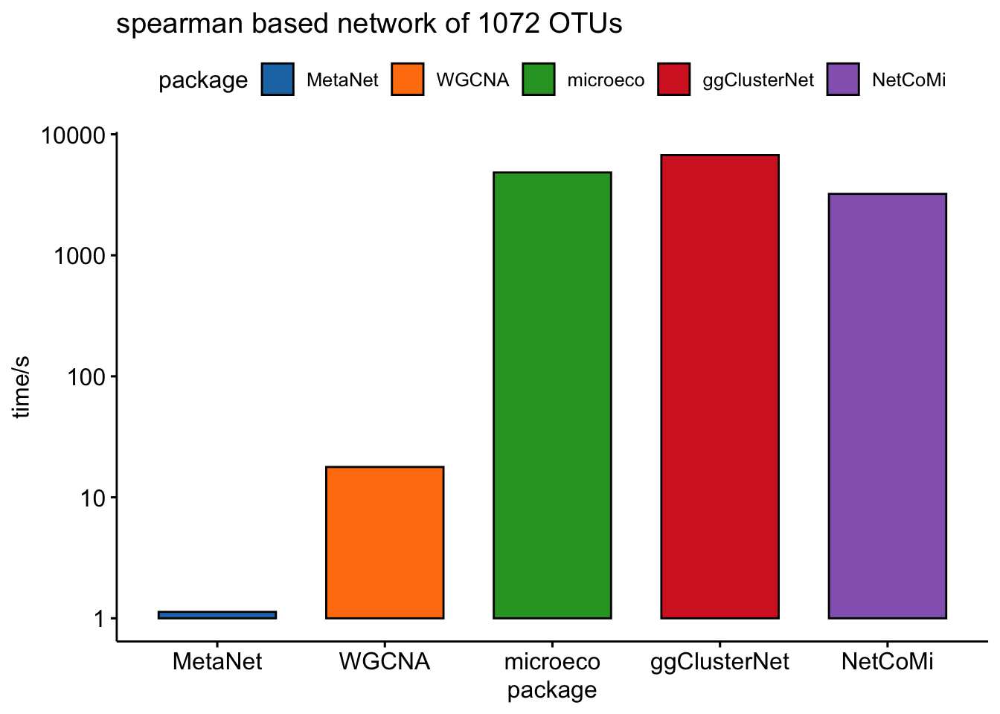
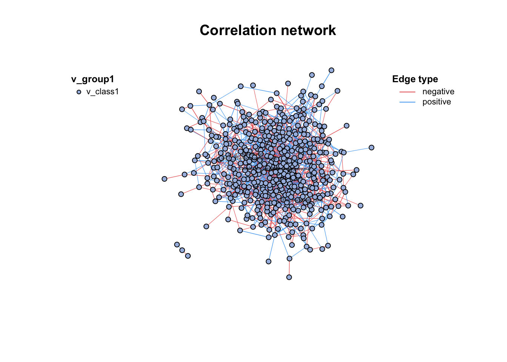
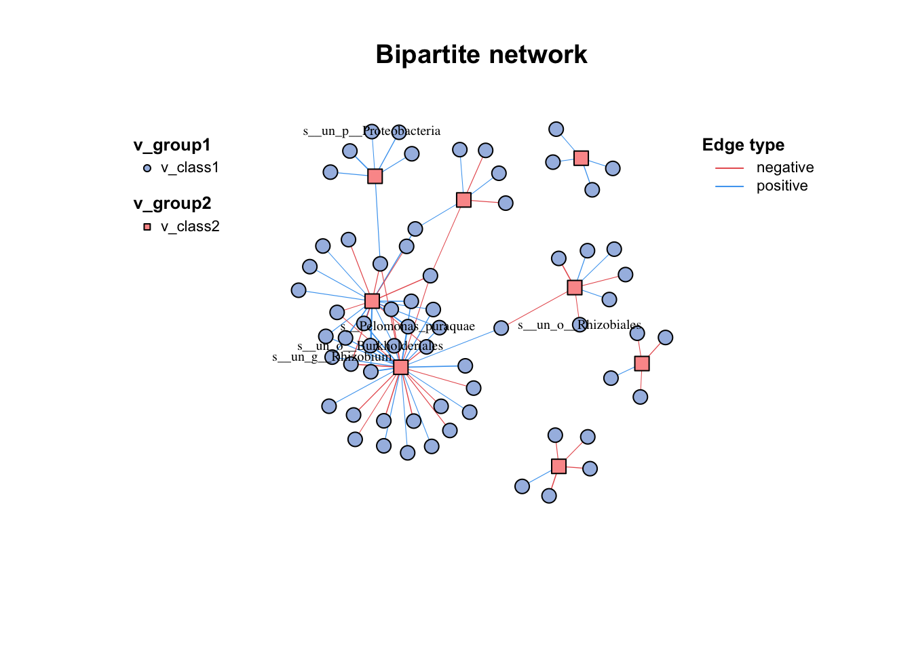
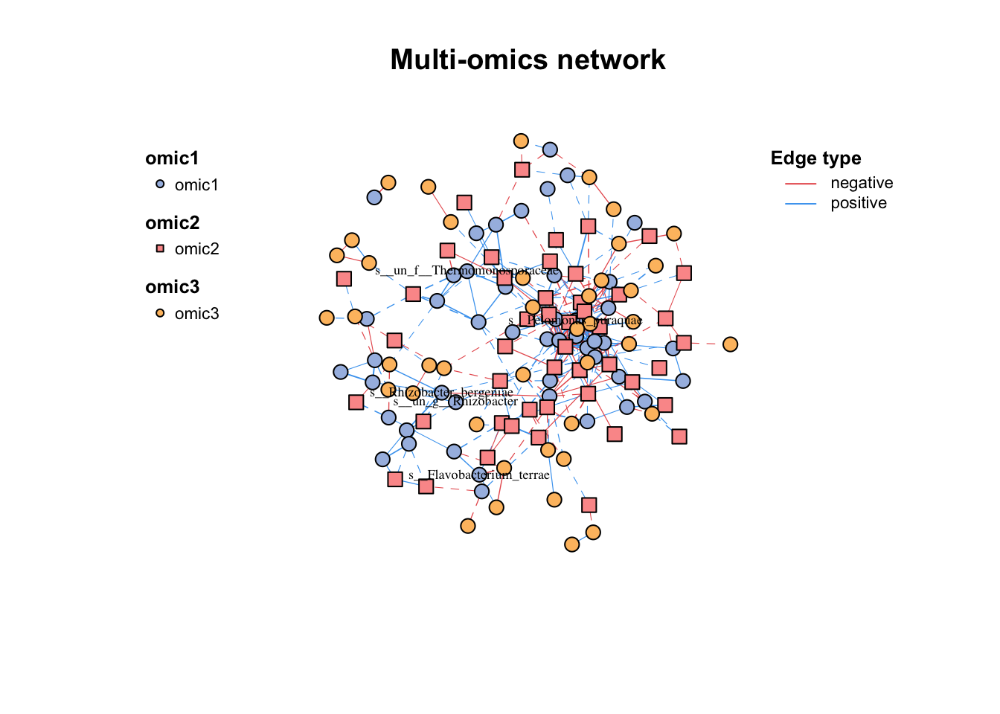
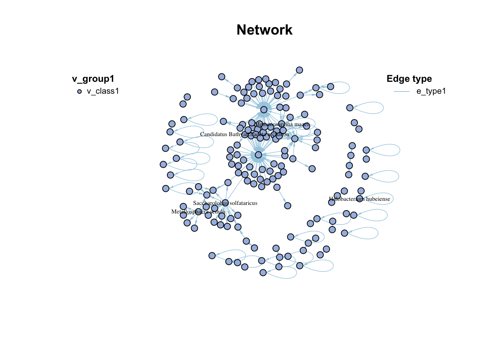
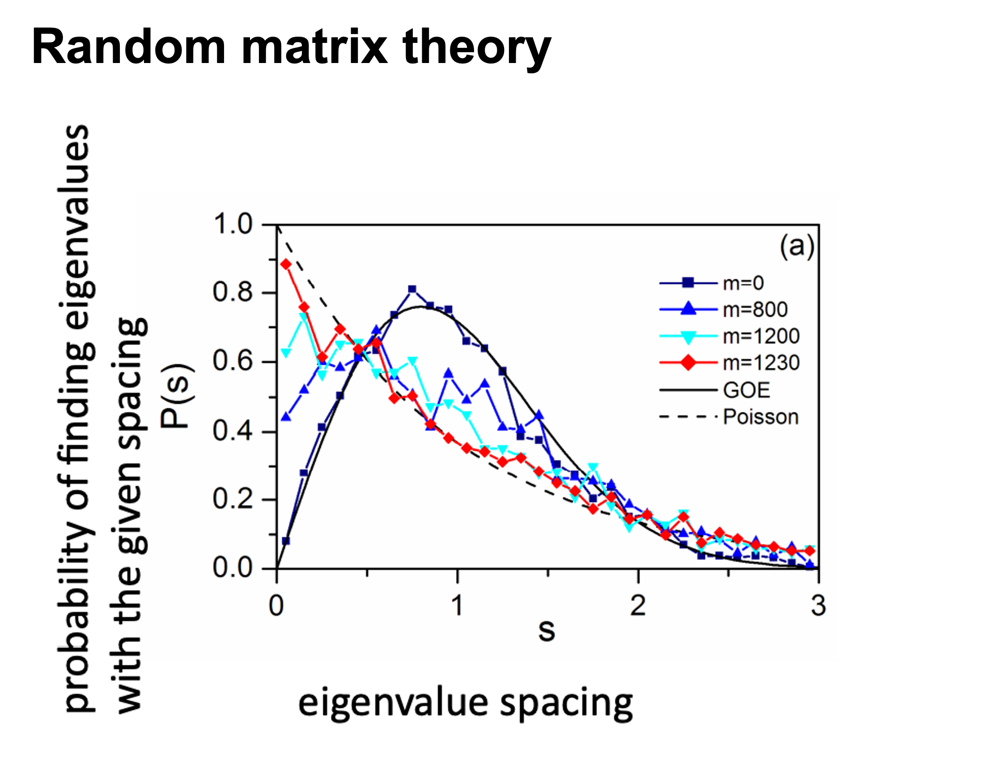
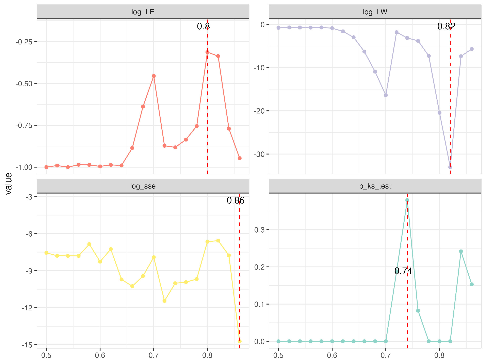
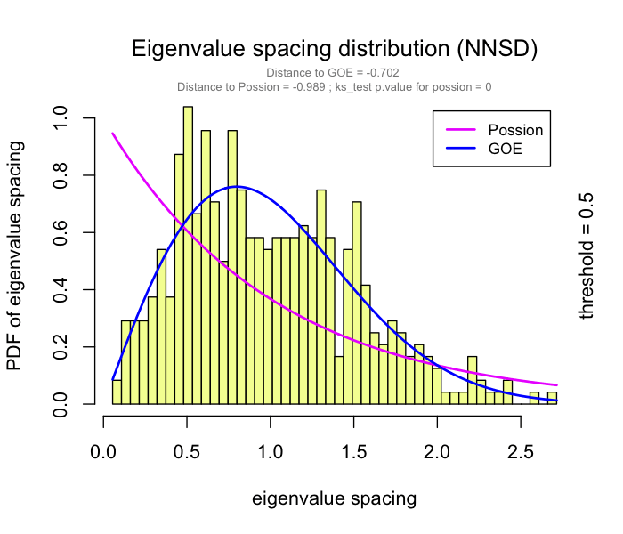

# Construction

## Pre-processing {#normalization}

The `trans()` function contains many normalization methods, suitable for pre-processing of different omics, some refer to `vegan::decostand()` @R-vegan.

+-------------+--------------------------------------------------------------------------------------------------------------------------------------------------------+
| **Method**  | **Description**                                                                                                                                        |
+-------------+--------------------------------------------------------------------------------------------------------------------------------------------------------+
| cpm         | Counts per million                                                                                                                                     |
+-------------+--------------------------------------------------------------------------------------------------------------------------------------------------------+
| minmax      | linear transfer to (min, max)                                                                                                                          |
+-------------+--------------------------------------------------------------------------------------------------------------------------------------------------------+
| acpm        | Counts per million, then asinh transfer                                                                                                                |
+-------------+--------------------------------------------------------------------------------------------------------------------------------------------------------+
| log1        | log(n+1) transformat                                                                                                                                   |
+-------------+--------------------------------------------------------------------------------------------------------------------------------------------------------+
| total       | divide by total                                                                                                                                        |
+-------------+--------------------------------------------------------------------------------------------------------------------------------------------------------+
| max         | divide by maximum                                                                                                                                      |
+-------------+--------------------------------------------------------------------------------------------------------------------------------------------------------+
| frequency   | divide by total and multiply by the number of non-zero items, so that the average of non-zero entries is one                                           |
+-------------+--------------------------------------------------------------------------------------------------------------------------------------------------------+
| normalize   | make margin sum of squares equal to one                                                                                                                |
+-------------+--------------------------------------------------------------------------------------------------------------------------------------------------------+
| range       | standardize values into range 0 \... 1 (same to `minmax(0,1)`). If all values are constant, they will be transformed to 0.                             |
+-------------+--------------------------------------------------------------------------------------------------------------------------------------------------------+
| rank        | rank replaces abundance values by their increasing ranks leaving zeros unchanged                                                                       |
+-------------+--------------------------------------------------------------------------------------------------------------------------------------------------------+
| rank, rrank | rank replaces abundance values by their increasing ranks leaving zeros unchanged, and rrank is similar but uses relative ranks with maximum 1          |
+-------------+--------------------------------------------------------------------------------------------------------------------------------------------------------+
| pa          | scale x to presence/absence scale (0/1).                                                                                                               |
+-------------+--------------------------------------------------------------------------------------------------------------------------------------------------------+
| standardize | scale x to zero mean and unit variance                                                                                                                 |
+-------------+--------------------------------------------------------------------------------------------------------------------------------------------------------+
| hellinger   | square root of method = "total"                                                                                                                        |
+-------------+--------------------------------------------------------------------------------------------------------------------------------------------------------+
| log         | logarithmic transformation as suggested by Anderson et al. (2006): logb(x)+1 for x\>0, where bb is the base of the logarithm; zeros are left as zeros. |
+-------------+--------------------------------------------------------------------------------------------------------------------------------------------------------+
| alr         | Additive log ratio ("alr") transformation (Aitchison 1986) reduces data skewness and compositionality bias.                                            |
|             |                                                                                                                                                        |
|             | $alr=[log\frac{x_1}{x_D},…,log\frac{x_{D-1}}{x_D}]$                                                                                                    |
+-------------+--------------------------------------------------------------------------------------------------------------------------------------------------------+
| clr         | centered log ratio ("clr") transformation proposed by Aitchison (1986) reduces data skewness and compositionality bias.                                |
|             |                                                                                                                                                        |
|             | $clr=log\frac{x_r}{g(x_r)}$                                                                                                                            |
+-------------+--------------------------------------------------------------------------------------------------------------------------------------------------------+
| rclr        | robust clr ("rclr") is similar to regular clr (see above) but allows data that contains zeroes.                                                        |
|             |                                                                                                                                                        |
|             | $rclr=log\frac{x_r}{g(x_r>0)}$                                                                                                                         |
+-------------+--------------------------------------------------------------------------------------------------------------------------------------------------------+

: (#tab:3-normalize) Normalization methods used in omics.


```r
library(MetaNet)
data(otutab,package = "pcutils")
#trans(otutab,method="cpm")%>%head()
trans(otutab,method="log1")%>%head(4)
#>                                   NS1      NS2      NS3
#> s__un_f__Thermomonosporaceae 6.996681 7.560601 6.698268
#> s__Pelomonas_puraquae        7.582229 7.118826 7.767687
#> s__Rhizobacter_bergeniae     6.378426 6.129050 6.791221
#> s__Flavobacterium_terrae     5.501258 5.459586 7.501634
#>                                   NS4      NS5      NS6
#> s__un_f__Thermomonosporaceae 7.211557 6.970730 6.976348
#> s__Pelomonas_puraquae        7.712891 7.973844 7.512071
#> s__Rhizobacter_bergeniae     6.804615 7.112327 6.749931
#> s__Flavobacterium_terrae     6.513230 7.276556 6.198479
#>                                   WS1      WS2      WS3
#> s__un_f__Thermomonosporaceae 7.133296 7.376508 7.193686
#> s__Pelomonas_puraquae        6.469250 6.206576 7.115582
#> s__Rhizobacter_bergeniae     6.405228 6.154858 6.976348
#> s__Flavobacterium_terrae     5.765191 7.563720 7.309212
#>                                   WS4      WS5      WS6
#> s__un_f__Thermomonosporaceae 6.848005 7.118016 6.919684
#> s__Pelomonas_puraquae        7.158514 6.860664 6.455199
#> s__Rhizobacter_bergeniae     6.936343 6.741701 6.508769
#> s__Flavobacterium_terrae     6.903747 6.359574 5.886104
#>                                   CS1      CS2      CS3
#> s__un_f__Thermomonosporaceae 7.746733 7.831617 7.444249
#> s__Pelomonas_puraquae        7.174724 7.324490 6.739337
#> s__Rhizobacter_bergeniae     6.937314 7.497207 6.910751
#> s__Flavobacterium_terrae     6.985642 7.105786 6.626718
#>                                   CS4      CS5      CS6
#> s__un_f__Thermomonosporaceae 7.588830 7.266827 7.331715
#> s__Pelomonas_puraquae        7.029088 7.302496 7.069023
#> s__Rhizobacter_bergeniae     7.090910 7.085901 6.637258
#> s__Flavobacterium_terrae     6.049733 6.940222 7.253470
```

`guolv()` and `hebing()` functions can help filter or aggregate the omics data.

## Pairwise relationship

How to determine the pairwise relationship, because the experimental data is generally relatively rare, we mainly relying on statistical inference.

At present, there are mainly two ways, the first one is based on similarity or correlation @faustMicrobialInteractionsNetworks2012. for example: Spearman, Pearson, Bray-Curtis... based on abundance or incidence data, the similarity matrix between paired species can be calculated, and the randomized data can be used to repeatedly calculate the significance.Finally, meaningful similarities are retained in network.

The second way for networks is based on regression. Divide species into source and target, and use multiple regression to calculate the relationship between species.

Some tools use special methods to optimize the network construction, such as **SparCC**, etc.

### Correlation

**Correlation** is a statistical term describing the degree to which two variables move in coordination with one-another.

Correlation calculation is the first step in all omics network analysis software, there are many method to get $\rho$ and $p$-value. However, as the data size of omics grow larger and larger, many methods will become very time and computational resource consuming.

Here, we provide the `c_net_cal()` function for one single table or two tables to calculate correlation **fastly** (Figure \@ref(fig:3-packages-comparison)), which will return a three elements list include $\rho$, $p$-value and $p$-adjust.


```r
#single table
t(otutab) -> totu
c_net_cal(totu,method = "spearman", filename =F,p.adjust.method = NULL) -> corr
str(corr)
#> List of 3
#>  $ r       : num [1:492, 1:492] 1 -0.2508 0.1847 0.0114 0.2095 ...
#>   ..- attr(*, "dimnames")=List of 2
#>   .. ..$ : chr [1:492] "s__un_f__Thermomonosporaceae" "s__Pelomonas_puraquae" "s__Rhizobacter_bergeniae" "s__Flavobacterium_terrae" ...
#>   .. ..$ : chr [1:492] "s__un_f__Thermomonosporaceae" "s__Pelomonas_puraquae" "s__Rhizobacter_bergeniae" "s__Flavobacterium_terrae" ...
#>  $ p.value : num [1:492, 1:492] 0 0.316 0.463 0.964 0.404 ...
#>   ..- attr(*, "dimnames")=List of 2
#>   .. ..$ : chr [1:492] "s__un_f__Thermomonosporaceae" "s__Pelomonas_puraquae" "s__Rhizobacter_bergeniae" "s__Flavobacterium_terrae" ...
#>   .. ..$ : chr [1:492] "s__un_f__Thermomonosporaceae" "s__Pelomonas_puraquae" "s__Rhizobacter_bergeniae" "s__Flavobacterium_terrae" ...
#>  $ p.adjust: num [1:492, 1:492] 0 0.316 0.463 0.964 0.404 ...
#>   ..- attr(*, "dimnames")=List of 2
#>   .. ..$ : chr [1:492] "s__un_f__Thermomonosporaceae" "s__Pelomonas_puraquae" "s__Rhizobacter_bergeniae" "s__Flavobacterium_terrae" ...
#>   .. ..$ : chr [1:492] "s__un_f__Thermomonosporaceae" "s__Pelomonas_puraquae" "s__Rhizobacter_bergeniae" "s__Flavobacterium_terrae" ...
#>  - attr(*, "class")= chr "corr"

#two tables
metadata[,3:10] -> env
c_net_cal(totu,env,method = "spearman", filename =F,p.adjust.method = NULL) -> corr2
str(corr2)
#> List of 3
#>  $ r       : num [1:492, 1:8] 0.356 -0.5253 0.0918 -0.0114 -0.0196 ...
#>   ..- attr(*, "dimnames")=List of 2
#>   .. ..$ : chr [1:492] "s__un_f__Thermomonosporaceae" "s__Pelomonas_puraquae" "s__Rhizobacter_bergeniae" "s__Flavobacterium_terrae" ...
#>   .. ..$ : chr [1:8] "env1" "env2" "env3" "env4" ...
#>  $ p.value : num [1:492, 1:8] 0.147 0.0252 0.717 0.9643 0.9384 ...
#>   ..- attr(*, "dimnames")=List of 2
#>   .. ..$ : chr [1:492] "s__un_f__Thermomonosporaceae" "s__Pelomonas_puraquae" "s__Rhizobacter_bergeniae" "s__Flavobacterium_terrae" ...
#>   .. ..$ : chr [1:8] "env1" "env2" "env3" "env4" ...
#>  $ p.adjust: num [1:492, 1:8] 0.147 0.0252 0.717 0.9643 0.9384 ...
#>   ..- attr(*, "dimnames")=List of 2
#>   .. ..$ : chr [1:492] "s__un_f__Thermomonosporaceae" "s__Pelomonas_puraquae" "s__Rhizobacter_bergeniae" "s__Flavobacterium_terrae" ...
#>   .. ..$ : chr [1:8] "env1" "env2" "env3" "env4" ...
#>  - attr(*, "class")= chr "corr"
```

<div class="figure">

<p class="caption">(\#fig:3-packages-comparison)network build of packages comparison</p>
</div>

### Distance

you can use `par_sim()` to calculate various distance to get the pairwise similarity matrix.

### SparCC

SparCC fits the Dirichlet distribution to the observed data, and iteratively calculates the proportion and correlation of species several times. The resulting correlation is the median of the distribution. $p$-values were calculated using the bootstrap method.This metric is said to be more useful with non-normal microbiome data.

$D(x_i,x_j)=var(\log(\frac{x_i}{x_j}))$

`par_sparcc()` is available for SparCC calculation.

### Others

There are some other methods available for network construction in [**NetCoMi**](https://github.com/stefpeschel/NetCoMi)

## Build network

### Normally build

If you have done the `c_net_cal()`, you can get a network (igraph object) easily by `c_net_build()`. Some common attributes will be set automatically.


```r
c_net_build(corr,r_thres = 0.6,p_thres = 0.05,del_single = T) -> co_net
co_net
#> ====================================metanet===================================== 
#> IGRAPH 8746e6f UNW- 490 1545 -- 
#> + attr: n_type (g/c), name (v/c), v_group (v/c),
#> | v_class (v/c), size (v/n), label (v/c), shape
#> | (v/c), color (v/c), id (e/n), from (e/c), to (e/c),
#> | weight (e/n), cor (e/n), e_type (e/c), width (e/n),
#> | v_group_from (e/c), v_group_to (e/c), e_class
#> | (e/c), color (e/c), lty (e/n)
#> + edges from 8746e6f (vertex names):
#> [1] s__un_f__Thermomonosporaceae--s__Actinocorallia_herbida
#> [2] s__un_f__Thermomonosporaceae--s__Kribbella_catacumbae  
#> [3] s__un_f__Thermomonosporaceae--s__Kineosporia_rhamnosa  
#> + ... omitted several edges
plot(co_net)
```

<div class="figure">

<p class="caption">(\#fig:3-conet1)Simple co-occurrence network</p>
</div>


```r
c_net_build(corr2) -> co_net2
plot(co_net2)
```

<div class="figure">

<p class="caption">(\#fig:3-conet2)Simple bipartite network</p>
</div>

### Multi-tables

When you have more than two tables for correlation network analysis, you can choose the `multi_net_build()` to calculate and build network. For subsequent **multi-omics analysis**, see Chapter \@ref(multi-omics).


```r
data("multi_test")
#microbiome
dim(micro)
#> [1] 18 50
#metabolome
dim(metab)
#> [1] 18 50
#transcriptome
dim(transc)
#> [1] 18 50

multi_net_build(micro,metab,transc,mode = "full",method = "spearman",filename = F)->multi1
#> Calculating 18 samples and 150 objects of 3 groups.

plot(multi1)
```

<div class="figure">

<p class="caption">(\#fig:3-multinet1)Simple multi-omics network</p>
</div>

### Edgelist

If you already get the pairwise relationship of data from other approaches (database), you can form it into a edgelist and use `c_net_from_edgelist` to build network. It is useful for following analysis.


```r
data("edgelist",package = "MetaNet")
dnet=c_net_from_edgelist(arc_count,direct = T)
plot(dnet)
```

<div class="figure">

<p class="caption">(\#fig:3-directnet)Simple directed network</p>
</div>

## RMT optimize

The correlation-based relevance network method is most commonly used largely due to its simple calculation procedure and noise tolerance. However, most studies involving relevance network analysis use arbitrary thresholds (usually, we use r\>0.6, p\<0.05), and thus the constructed networks are subjective rather than objective.

This problem has been solved by a random matrix theory (RMT)-based approach (Figure \@ref(fig:3-RMT)), which is able to automatically identify a threshold for cellular network construction from micro-array data @dengMolecularEcologicalNetwork2012.

<div class="figure">

<p class="caption">(\#fig:3-RMT)Random matrix theory (RMT)-based approach</p>
</div>

use `RMT_threshold()` , we can find the best r_threshold to make the network with smallest noise.

the bigger log_LE, less log_LW, less log_see, bigger p_ks_test indicate the better r_threshold for a meaningful network construction.You can change the threshold range to calculate more finely.


```r
RMT_threshold(corr,min_threshold = 0.5,max_threshold = 0.9, step = 0.02,verbose = T)->rmt_res
plot(rmt_res)
```

<div class="figure">

<p class="caption">(\#fig:3-RMT-res)RMT_threshold result from 0.5 to 0.9</p>
</div>

You can set the `gif=T` in `RMT_threshold` and get a gif file to observe the distribution of eigenvalue spacing for different r-thresholds.

<div class="figure">

<p class="caption">(\#fig:3-RMT-res2)the distribution of eigenvalue spacing from 0.5 to 0.9</p>
</div>
