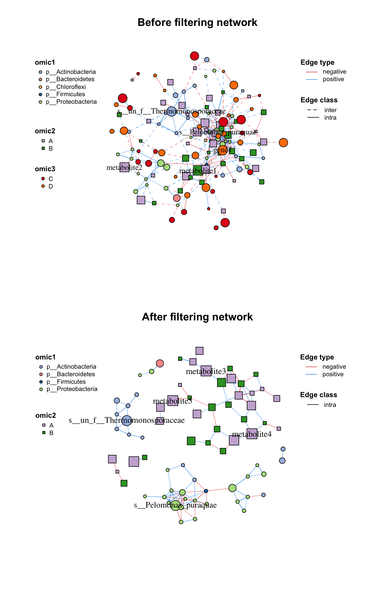
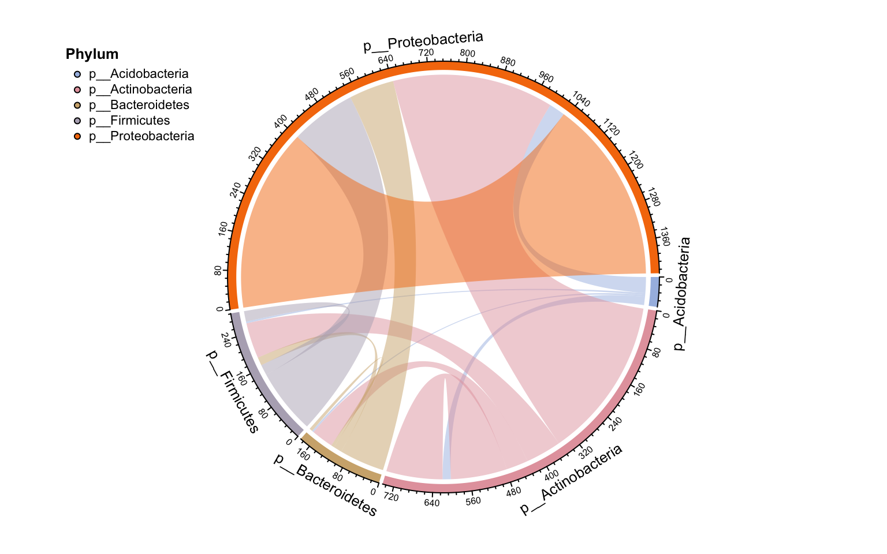
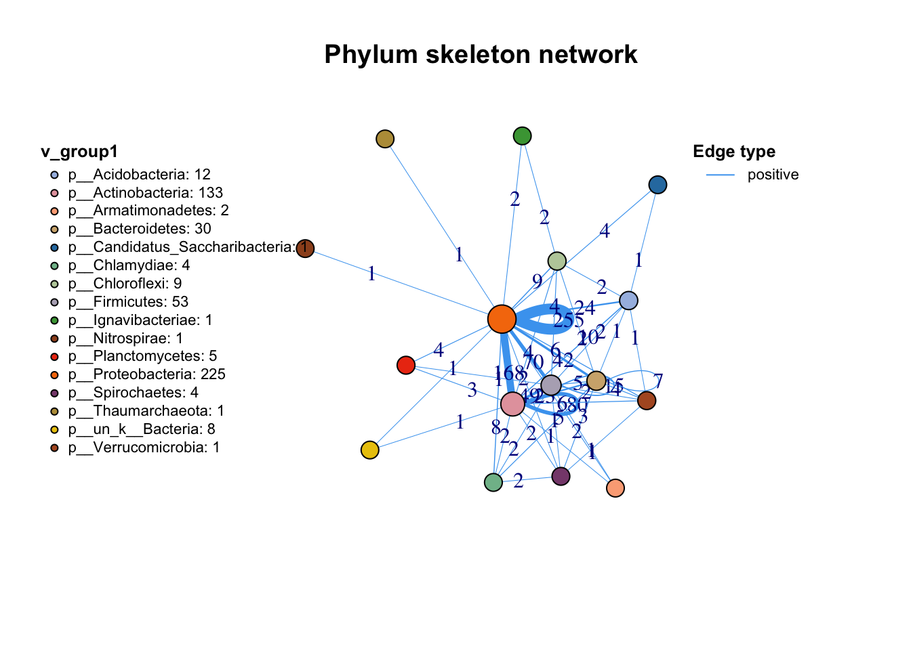
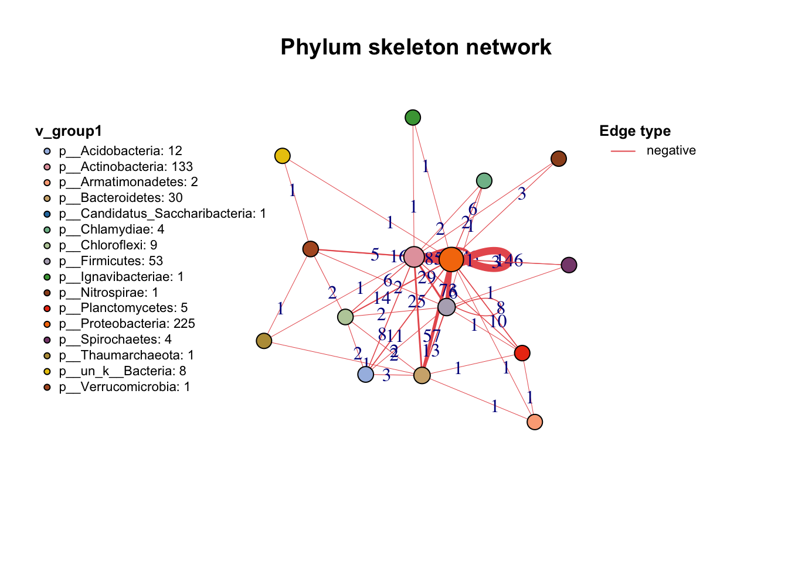

# Manipulation

After we build a network, we can see the class of our network is metanet, which is a derived object from igraph. So all functions used for igraph can also use on our network.


```r
data(otutab,package = "pcutils")
t(otutab) -> totu
c_net_cal(totu,method = "spearman", filename =F, p.adjust.method = NULL) -> corr
c_net_build(corr,r_thres = 0.6,p_thres = 0.05,del_single = T) -> co_net
class(co_net)
#> [1] "metanet" "igraph"
```

Besides, there are some other functions for us to manipulate the metanet easily. 

## Attributes 

We could get the attributes of whole network, each vertex and each edge by `get_*()` as dataframe:


```r
#get network attributes
get_n(co_net)
#>   n_type
#> 1 single
#get vertex attributes
get_v(co_net)%>%head(5)
#>                           name  v_group  v_class size
#> 1 s__un_f__Thermomonosporaceae v_group1 v_class1    4
#> 2        s__Pelomonas_puraquae v_group1 v_class1    4
#> 3     s__Rhizobacter_bergeniae v_group1 v_class1    4
#> 4     s__Flavobacterium_terrae v_group1 v_class1    4
#> 5         s__un_g__Rhizobacter v_group1 v_class1    4
#>                          label  shape   color
#> 1 s__un_f__Thermomonosporaceae circle #a6bce3
#> 2        s__Pelomonas_puraquae circle #a6bce3
#> 3     s__Rhizobacter_bergeniae circle #a6bce3
#> 4     s__Flavobacterium_terrae circle #a6bce3
#> 5         s__un_g__Rhizobacter circle #a6bce3
#get edge attributes
get_e(co_net)%>%head(5)
#>   id                         from
#> 1  1 s__un_f__Thermomonosporaceae
#> 2  2 s__un_f__Thermomonosporaceae
#> 3  3 s__un_f__Thermomonosporaceae
#> 4  4 s__un_f__Thermomonosporaceae
#> 5  5 s__un_f__Thermomonosporaceae
#>                              to    weight       cor
#> 1     s__Actinocorallia_herbida 0.6759546 0.6759546
#> 2       s__Kribbella_catacumbae 0.6742386 0.6742386
#> 3       s__Kineosporia_rhamnosa 0.7378741 0.7378741
#> 4   s__un_f__Micromonosporaceae 0.6236449 0.6236449
#> 5 s__Flavobacterium_saliperosum 0.6045747 0.6045747
#>     e_type     width v_group_from v_group_to e_class
#> 1 positive 0.6759546     v_group1   v_group1   intra
#> 2 positive 0.6742386     v_group1   v_group1   intra
#> 3 positive 0.7378741     v_group1   v_group1   intra
#> 4 positive 0.6236449     v_group1   v_group1   intra
#> 5 positive 0.6045747     v_group1   v_group1   intra
#>     color lty
#> 1 #48A4F0   1
#> 2 #48A4F0   1
#> 3 #48A4F0   1
#> 4 #48A4F0   1
#> 5 #48A4F0   1
```

And we can see, some attributes have been set when we build the network like `v_group`, these are internal attributes of metanet and are related to the following analysis and visualization.

| Attribute name | Description                                                                                                        |
|---------------|---------------------------------------------------------|
| v_group        | the big group for network, usually one omics data produces one group. Related to the vertex shape.                 |
| v_class        | some annotation of vertex, maybe classification or network modules. Related to the vertex color.                   |
| size           | numeric variable assign to the vertex size.                                                                        |
| label          | assign to the vertex label, replace to NA to hide some labels you don't want to display.                           |
| e_type         | the type of edges, often be the positive or negative according to correlation. Related to the edge color.          |
| width          | numeric variable assign to the edge width.                                                                         |
| e_class        | the second type of edges, often be the intra or inter according to two vertex group. Related to the edge line type.|

: (\#tab:4-attribute) Internal attributes of a metanet.

We will talk about how to set these attributes by ourselves for some specific analysis later.

## Annotation

Sometimes we have lots of annotation tables need to add to the network, such as abundance table, taxonomy table and so on, 
we can use `anno_vertex()` and `anno_edge()` to do this. 
The annotation dataframe needs have rowname or a "name" column, `anno_vertex()` will automatically match the vertex name and combine the table.


```r
anno_vertex(co_net, taxonomy)->co_net1
get_v(co_net1)%>%head(5)
#>                           name  v_group  v_class size
#> 1 s__un_f__Thermomonosporaceae v_group1 v_class1    4
#> 2        s__Pelomonas_puraquae v_group1 v_class1    4
#> 3     s__Rhizobacter_bergeniae v_group1 v_class1    4
#> 4     s__Flavobacterium_terrae v_group1 v_class1    4
#> 5         s__un_g__Rhizobacter v_group1 v_class1    4
#>                          label  shape   color     Kingdom
#> 1 s__un_f__Thermomonosporaceae circle #a6bce3 k__Bacteria
#> 2        s__Pelomonas_puraquae circle #a6bce3 k__Bacteria
#> 3     s__Rhizobacter_bergeniae circle #a6bce3 k__Bacteria
#> 4     s__Flavobacterium_terrae circle #a6bce3 k__Bacteria
#> 5         s__un_g__Rhizobacter circle #a6bce3 k__Bacteria
#>              Phylum                  Class
#> 1 p__Actinobacteria      c__Actinobacteria
#> 2 p__Proteobacteria  c__Betaproteobacteria
#> 3 p__Proteobacteria c__Gammaproteobacteria
#> 4  p__Bacteroidetes      c__Flavobacteriia
#> 5 p__Proteobacteria c__Gammaproteobacteria
#>                 Order                 Family
#> 1  o__Actinomycetales f__Thermomonosporaceae
#> 2  o__Burkholderiales      f__Comamonadaceae
#> 3  o__Pseudomonadales    f__Pseudomonadaceae
#> 4 o__Flavobacteriales   f__Flavobacteriaceae
#> 5  o__Pseudomonadales    f__Pseudomonadaceae
#>                          Genus                      Species
#> 1 g__un_f__Thermomonosporaceae s__un_f__Thermomonosporaceae
#> 2                 g__Pelomonas        s__Pelomonas_puraquae
#> 3               g__Rhizobacter     s__Rhizobacter_bergeniae
#> 4            g__Flavobacterium     s__Flavobacterium_terrae
#> 5               g__Rhizobacter         s__un_g__Rhizobacter
```

`anno_edge()` receives the same format annotation dataframe with `anno_vertex()`, it will automatically match the "from" and "to" columns so that you can summary the links.

```r
anno_edge(co_net, select(taxonomy,"Phylum"))->co_net1
get_e(co_net1)%>%head(5)
#>   id                         from
#> 1  1 s__un_f__Thermomonosporaceae
#> 2  2 s__un_f__Thermomonosporaceae
#> 3  3 s__un_f__Thermomonosporaceae
#> 4  4 s__un_f__Thermomonosporaceae
#> 5  5 s__un_f__Thermomonosporaceae
#>                              to    weight       cor
#> 1     s__Actinocorallia_herbida 0.6759546 0.6759546
#> 2       s__Kribbella_catacumbae 0.6742386 0.6742386
#> 3       s__Kineosporia_rhamnosa 0.7378741 0.7378741
#> 4   s__un_f__Micromonosporaceae 0.6236449 0.6236449
#> 5 s__Flavobacterium_saliperosum 0.6045747 0.6045747
#>     e_type     width v_group_from v_group_to e_class
#> 1 positive 0.6759546     v_group1   v_group1   intra
#> 2 positive 0.6742386     v_group1   v_group1   intra
#> 3 positive 0.7378741     v_group1   v_group1   intra
#> 4 positive 0.6236449     v_group1   v_group1   intra
#> 5 positive 0.6045747     v_group1   v_group1   intra
#>     color lty       Phylum_from         Phylum_to
#> 1 #48A4F0   1 p__Actinobacteria p__Actinobacteria
#> 2 #48A4F0   1 p__Actinobacteria p__Actinobacteria
#> 3 #48A4F0   1 p__Actinobacteria p__Actinobacteria
#> 4 #48A4F0   1 p__Actinobacteria p__Actinobacteria
#> 5 #48A4F0   1 p__Actinobacteria  p__Bacteroidetes
```

`MetaNet` provides a function `c_net_set()` for easily annotation if you have more than one table (it's normal when you do a multi-omics analysis).

```r
Abundance_df=data.frame("Abundance"=colSums(totu))
co_net1<-c_net_set(co_net,taxonomy,Abundance_df)
get_v(co_net1)%>%head(5)
#>                           name  v_group  v_class size
#> 1 s__un_f__Thermomonosporaceae v_group1 v_class1    4
#> 2        s__Pelomonas_puraquae v_group1 v_class1    4
#> 3     s__Rhizobacter_bergeniae v_group1 v_class1    4
#> 4     s__Flavobacterium_terrae v_group1 v_class1    4
#> 5         s__un_g__Rhizobacter v_group1 v_class1    4
#>                          label  shape   color     Kingdom
#> 1 s__un_f__Thermomonosporaceae circle #a6bce3 k__Bacteria
#> 2        s__Pelomonas_puraquae circle #a6bce3 k__Bacteria
#> 3     s__Rhizobacter_bergeniae circle #a6bce3 k__Bacteria
#> 4     s__Flavobacterium_terrae circle #a6bce3 k__Bacteria
#> 5         s__un_g__Rhizobacter circle #a6bce3 k__Bacteria
#>              Phylum                  Class
#> 1 p__Actinobacteria      c__Actinobacteria
#> 2 p__Proteobacteria  c__Betaproteobacteria
#> 3 p__Proteobacteria c__Gammaproteobacteria
#> 4  p__Bacteroidetes      c__Flavobacteriia
#> 5 p__Proteobacteria c__Gammaproteobacteria
#>                 Order                 Family
#> 1  o__Actinomycetales f__Thermomonosporaceae
#> 2  o__Burkholderiales      f__Comamonadaceae
#> 3  o__Pseudomonadales    f__Pseudomonadaceae
#> 4 o__Flavobacteriales   f__Flavobacteriaceae
#> 5  o__Pseudomonadales    f__Pseudomonadaceae
#>                          Genus                      Species
#> 1 g__un_f__Thermomonosporaceae s__un_f__Thermomonosporaceae
#> 2                 g__Pelomonas        s__Pelomonas_puraquae
#> 3               g__Rhizobacter     s__Rhizobacter_bergeniae
#> 4            g__Flavobacterium     s__Flavobacterium_terrae
#> 5               g__Rhizobacter         s__un_g__Rhizobacter
#>   Abundance
#> 1     26147
#> 2     25217
#> 3     16592
#> 4     16484
#> 5     13895
```

If you have a vector and you absolutely know it matches the vertex name of network, 
you can use igraph method to annotate (Don't recommend), same as the edge annotate vector: 


```r
co_net1=co_net

#add vertex attribute
V(co_net1)$new_attri=seq_len(length(co_net1))
get_v(co_net1)%>%head(5)
#>                           name  v_group  v_class size
#> 1 s__un_f__Thermomonosporaceae v_group1 v_class1    4
#> 2        s__Pelomonas_puraquae v_group1 v_class1    4
#> 3     s__Rhizobacter_bergeniae v_group1 v_class1    4
#> 4     s__Flavobacterium_terrae v_group1 v_class1    4
#> 5         s__un_g__Rhizobacter v_group1 v_class1    4
#>                          label  shape   color new_attri
#> 1 s__un_f__Thermomonosporaceae circle #a6bce3         1
#> 2        s__Pelomonas_puraquae circle #a6bce3         2
#> 3     s__Rhizobacter_bergeniae circle #a6bce3         3
#> 4     s__Flavobacterium_terrae circle #a6bce3         4
#> 5         s__un_g__Rhizobacter circle #a6bce3         5

#add edge attribute
E(co_net1)$new_attri="new attribute"
get_e(co_net1)%>%head(5)
#>   id                         from
#> 1  1 s__un_f__Thermomonosporaceae
#> 2  2 s__un_f__Thermomonosporaceae
#> 3  3 s__un_f__Thermomonosporaceae
#> 4  4 s__un_f__Thermomonosporaceae
#> 5  5 s__un_f__Thermomonosporaceae
#>                              to    weight       cor
#> 1     s__Actinocorallia_herbida 0.6759546 0.6759546
#> 2       s__Kribbella_catacumbae 0.6742386 0.6742386
#> 3       s__Kineosporia_rhamnosa 0.7378741 0.7378741
#> 4   s__un_f__Micromonosporaceae 0.6236449 0.6236449
#> 5 s__Flavobacterium_saliperosum 0.6045747 0.6045747
#>     e_type     width v_group_from v_group_to e_class
#> 1 positive 0.6759546     v_group1   v_group1   intra
#> 2 positive 0.6742386     v_group1   v_group1   intra
#> 3 positive 0.7378741     v_group1   v_group1   intra
#> 4 positive 0.6236449     v_group1   v_group1   intra
#> 5 positive 0.6045747     v_group1   v_group1   intra
#>     color lty     new_attri
#> 1 #48A4F0   1 new attribute
#> 2 #48A4F0   1 new attribute
#> 3 #48A4F0   1 new attribute
#> 4 #48A4F0   1 new attribute
#> 5 #48A4F0   1 new attribute
```

## Filter (Sub-net)

After setting your network properly, you may need to analysis part of the whole network (especially in the multi-omics analysis), 
`c_net_filter()` can get the sub-net conveniently (Figure \@ref(fig:4-filter)), you can put lots of filter conditions in:


```r
data("multi_net",package = "MetaNet")
multi2=c_net_filter(multi1,v_group%in%c("omic1","omic2"))%>%c_net_filter(.,e_class=="intra",mode = "e")

par(mfrow=c(2,1))
plot(multi1,lty_legend=T,main="Before filtering network")#before filter
plot(multi2,lty_legend=T,main="After filtering network") #after filter
```

<div class="figure">

<p class="caption">(\#fig:4-filter)From a whole network filter a sub-net.</p>
</div>

## Skeleton

If you want to summary the edges source and target according to one group, `summ_2col` is a easy way to get this information. `direct = F` argument means this is a undirected relationship, so "a-b" and "b-a" will summary to one type edge.


```r
anno_edge(co_net, select(taxonomy,"Phylum"))->co_net1
df=get_e(co_net1)[,c("Phylum_from","Phylum_to")]
summ_2col(df,direct = F)%>%arrange(-count)->Phylum_from_to
```


```r
kbl(Phylum_from_to,caption = "Summary of edges according to Phylum") %>%
  kable_paper() %>%
  scroll_box(width = "100%", height = "400px")
```

<div style="border: 1px solid #ddd; padding: 0px; overflow-y: scroll; height:400px; overflow-x: scroll; width:100%; "><table class=" lightable-paper" style='font-family: "Arial Narrow", arial, helvetica, sans-serif; margin-left: auto; margin-right: auto;'>
<caption>(\#tab:4-summ-2col)Summary of edges according to Phylum</caption>
 <thead>
  <tr>
   <th style="text-align:left;position: sticky; top:0; background-color: #FFFFFF;"> Phylum_from </th>
   <th style="text-align:left;position: sticky; top:0; background-color: #FFFFFF;"> Phylum_to </th>
   <th style="text-align:right;position: sticky; top:0; background-color: #FFFFFF;"> count </th>
  </tr>
 </thead>
<tbody>
  <tr>
   <td style="text-align:left;"> p__Proteobacteria </td>
   <td style="text-align:left;"> p__Proteobacteria </td>
   <td style="text-align:right;"> 401 </td>
  </tr>
  <tr>
   <td style="text-align:left;"> p__Actinobacteria </td>
   <td style="text-align:left;"> p__Proteobacteria </td>
   <td style="text-align:right;"> 353 </td>
  </tr>
  <tr>
   <td style="text-align:left;"> p__Firmicutes </td>
   <td style="text-align:left;"> p__Proteobacteria </td>
   <td style="text-align:right;"> 143 </td>
  </tr>
  <tr>
   <td style="text-align:left;"> p__Actinobacteria </td>
   <td style="text-align:left;"> p__Actinobacteria </td>
   <td style="text-align:right;"> 123 </td>
  </tr>
  <tr>
   <td style="text-align:left;"> p__Bacteroidetes </td>
   <td style="text-align:left;"> p__Proteobacteria </td>
   <td style="text-align:right;"> 99 </td>
  </tr>
  <tr>
   <td style="text-align:left;"> p__Actinobacteria </td>
   <td style="text-align:left;"> p__Firmicutes </td>
   <td style="text-align:right;"> 78 </td>
  </tr>
  <tr>
   <td style="text-align:left;"> p__Actinobacteria </td>
   <td style="text-align:left;"> p__Bacteroidetes </td>
   <td style="text-align:right;"> 48 </td>
  </tr>
  <tr>
   <td style="text-align:left;"> p__Acidobacteria </td>
   <td style="text-align:left;"> p__Proteobacteria </td>
   <td style="text-align:right;"> 35 </td>
  </tr>
  <tr>
   <td style="text-align:left;"> p__Chloroflexi </td>
   <td style="text-align:left;"> p__Proteobacteria </td>
   <td style="text-align:right;"> 23 </td>
  </tr>
  <tr>
   <td style="text-align:left;"> p__Firmicutes </td>
   <td style="text-align:left;"> p__Firmicutes </td>
   <td style="text-align:right;"> 23 </td>
  </tr>
  <tr>
   <td style="text-align:left;"> p__Proteobacteria </td>
   <td style="text-align:left;"> p__Verrucomicrobia </td>
   <td style="text-align:right;"> 22 </td>
  </tr>
  <tr>
   <td style="text-align:left;"> p__Acidobacteria </td>
   <td style="text-align:left;"> p__Actinobacteria </td>
   <td style="text-align:right;"> 18 </td>
  </tr>
  <tr>
   <td style="text-align:left;"> p__Bacteroidetes </td>
   <td style="text-align:left;"> p__Firmicutes </td>
   <td style="text-align:right;"> 18 </td>
  </tr>
  <tr>
   <td style="text-align:left;"> p__Chlamydiae </td>
   <td style="text-align:left;"> p__Proteobacteria </td>
   <td style="text-align:right;"> 14 </td>
  </tr>
  <tr>
   <td style="text-align:left;"> p__Planctomycetes </td>
   <td style="text-align:left;"> p__Proteobacteria </td>
   <td style="text-align:right;"> 14 </td>
  </tr>
  <tr>
   <td style="text-align:left;"> p__Actinobacteria </td>
   <td style="text-align:left;"> p__Verrucomicrobia </td>
   <td style="text-align:right;"> 11 </td>
  </tr>
  <tr>
   <td style="text-align:left;"> p__Actinobacteria </td>
   <td style="text-align:left;"> p__Chloroflexi </td>
   <td style="text-align:right;"> 10 </td>
  </tr>
  <tr>
   <td style="text-align:left;"> p__Actinobacteria </td>
   <td style="text-align:left;"> p__Planctomycetes </td>
   <td style="text-align:right;"> 9 </td>
  </tr>
  <tr>
   <td style="text-align:left;"> p__Bacteroidetes </td>
   <td style="text-align:left;"> p__Bacteroidetes </td>
   <td style="text-align:right;"> 7 </td>
  </tr>
  <tr>
   <td style="text-align:left;"> p__Chloroflexi </td>
   <td style="text-align:left;"> p__Firmicutes </td>
   <td style="text-align:right;"> 6 </td>
  </tr>
  <tr>
   <td style="text-align:left;"> p__Bacteroidetes </td>
   <td style="text-align:left;"> p__Chlamydiae </td>
   <td style="text-align:right;"> 5 </td>
  </tr>
  <tr>
   <td style="text-align:left;"> p__Proteobacteria </td>
   <td style="text-align:left;"> p__Spirochaetes </td>
   <td style="text-align:right;"> 5 </td>
  </tr>
  <tr>
   <td style="text-align:left;"> p__Acidobacteria </td>
   <td style="text-align:left;"> p__Bacteroidetes </td>
   <td style="text-align:right;"> 4 </td>
  </tr>
  <tr>
   <td style="text-align:left;"> p__Acidobacteria </td>
   <td style="text-align:left;"> p__Chloroflexi </td>
   <td style="text-align:right;"> 4 </td>
  </tr>
  <tr>
   <td style="text-align:left;"> p__Acidobacteria </td>
   <td style="text-align:left;"> p__Firmicutes </td>
   <td style="text-align:right;"> 4 </td>
  </tr>
  <tr>
   <td style="text-align:left;"> p__Actinobacteria </td>
   <td style="text-align:left;"> p__Chlamydiae </td>
   <td style="text-align:right;"> 4 </td>
  </tr>
  <tr>
   <td style="text-align:left;"> p__Bacteroidetes </td>
   <td style="text-align:left;"> p__Chloroflexi </td>
   <td style="text-align:right;"> 4 </td>
  </tr>
  <tr>
   <td style="text-align:left;"> p__Bacteroidetes </td>
   <td style="text-align:left;"> p__Verrucomicrobia </td>
   <td style="text-align:right;"> 4 </td>
  </tr>
  <tr>
   <td style="text-align:left;"> p__Candidatus_Saccharibacteria </td>
   <td style="text-align:left;"> p__Proteobacteria </td>
   <td style="text-align:right;"> 4 </td>
  </tr>
  <tr>
   <td style="text-align:left;"> p__Firmicutes </td>
   <td style="text-align:left;"> p__Verrucomicrobia </td>
   <td style="text-align:right;"> 4 </td>
  </tr>
  <tr>
   <td style="text-align:left;"> p__Nitrospirae </td>
   <td style="text-align:left;"> p__Proteobacteria </td>
   <td style="text-align:right;"> 4 </td>
  </tr>
  <tr>
   <td style="text-align:left;"> p__Actinobacteria </td>
   <td style="text-align:left;"> p__Spirochaetes </td>
   <td style="text-align:right;"> 3 </td>
  </tr>
  <tr>
   <td style="text-align:left;"> p__Armatimonadetes </td>
   <td style="text-align:left;"> p__Proteobacteria </td>
   <td style="text-align:right;"> 3 </td>
  </tr>
  <tr>
   <td style="text-align:left;"> p__Bacteroidetes </td>
   <td style="text-align:left;"> p__Spirochaetes </td>
   <td style="text-align:right;"> 3 </td>
  </tr>
  <tr>
   <td style="text-align:left;"> p__Chlamydiae </td>
   <td style="text-align:left;"> p__Firmicutes </td>
   <td style="text-align:right;"> 3 </td>
  </tr>
  <tr>
   <td style="text-align:left;"> p__Ignavibacteriae </td>
   <td style="text-align:left;"> p__Proteobacteria </td>
   <td style="text-align:right;"> 3 </td>
  </tr>
  <tr>
   <td style="text-align:left;"> p__Actinobacteria </td>
   <td style="text-align:left;"> p__Nitrospirae </td>
   <td style="text-align:right;"> 2 </td>
  </tr>
  <tr>
   <td style="text-align:left;"> p__Chlamydiae </td>
   <td style="text-align:left;"> p__Spirochaetes </td>
   <td style="text-align:right;"> 2 </td>
  </tr>
  <tr>
   <td style="text-align:left;"> p__Chloroflexi </td>
   <td style="text-align:left;"> p__Ignavibacteriae </td>
   <td style="text-align:right;"> 2 </td>
  </tr>
  <tr>
   <td style="text-align:left;"> p__Chloroflexi </td>
   <td style="text-align:left;"> p__Verrucomicrobia </td>
   <td style="text-align:right;"> 2 </td>
  </tr>
  <tr>
   <td style="text-align:left;"> p__Firmicutes </td>
   <td style="text-align:left;"> p__Planctomycetes </td>
   <td style="text-align:right;"> 2 </td>
  </tr>
  <tr>
   <td style="text-align:left;"> p__Firmicutes </td>
   <td style="text-align:left;"> p__Spirochaetes </td>
   <td style="text-align:right;"> 2 </td>
  </tr>
  <tr>
   <td style="text-align:left;"> p__Proteobacteria </td>
   <td style="text-align:left;"> p__un_k__Bacteria </td>
   <td style="text-align:right;"> 2 </td>
  </tr>
  <tr>
   <td style="text-align:left;"> p__Acidobacteria </td>
   <td style="text-align:left;"> p__Candidatus_Saccharibacteria </td>
   <td style="text-align:right;"> 1 </td>
  </tr>
  <tr>
   <td style="text-align:left;"> p__Acidobacteria </td>
   <td style="text-align:left;"> p__Verrucomicrobia </td>
   <td style="text-align:right;"> 1 </td>
  </tr>
  <tr>
   <td style="text-align:left;"> p__Actinobacteria </td>
   <td style="text-align:left;"> p__Armatimonadetes </td>
   <td style="text-align:right;"> 1 </td>
  </tr>
  <tr>
   <td style="text-align:left;"> p__Actinobacteria </td>
   <td style="text-align:left;"> p__Ignavibacteriae </td>
   <td style="text-align:right;"> 1 </td>
  </tr>
  <tr>
   <td style="text-align:left;"> p__Actinobacteria </td>
   <td style="text-align:left;"> p__Thaumarchaeota </td>
   <td style="text-align:right;"> 1 </td>
  </tr>
  <tr>
   <td style="text-align:left;"> p__Actinobacteria </td>
   <td style="text-align:left;"> p__un_k__Bacteria </td>
   <td style="text-align:right;"> 1 </td>
  </tr>
  <tr>
   <td style="text-align:left;"> p__Armatimonadetes </td>
   <td style="text-align:left;"> p__Bacteroidetes </td>
   <td style="text-align:right;"> 1 </td>
  </tr>
  <tr>
   <td style="text-align:left;"> p__Armatimonadetes </td>
   <td style="text-align:left;"> p__Firmicutes </td>
   <td style="text-align:right;"> 1 </td>
  </tr>
  <tr>
   <td style="text-align:left;"> p__Armatimonadetes </td>
   <td style="text-align:left;"> p__Planctomycetes </td>
   <td style="text-align:right;"> 1 </td>
  </tr>
  <tr>
   <td style="text-align:left;"> p__Bacteroidetes </td>
   <td style="text-align:left;"> p__Planctomycetes </td>
   <td style="text-align:right;"> 1 </td>
  </tr>
  <tr>
   <td style="text-align:left;"> p__Bacteroidetes </td>
   <td style="text-align:left;"> p__Thaumarchaeota </td>
   <td style="text-align:right;"> 1 </td>
  </tr>
  <tr>
   <td style="text-align:left;"> p__Proteobacteria </td>
   <td style="text-align:left;"> p__Thaumarchaeota </td>
   <td style="text-align:right;"> 1 </td>
  </tr>
  <tr>
   <td style="text-align:left;"> p__Spirochaetes </td>
   <td style="text-align:left;"> p__Verrucomicrobia </td>
   <td style="text-align:right;"> 1 </td>
  </tr>
  <tr>
   <td style="text-align:left;"> p__Thaumarchaeota </td>
   <td style="text-align:left;"> p__Verrucomicrobia </td>
   <td style="text-align:right;"> 1 </td>
  </tr>
  <tr>
   <td style="text-align:left;"> p__un_k__Bacteria </td>
   <td style="text-align:left;"> p__Verrucomicrobia </td>
   <td style="text-align:right;"> 1 </td>
  </tr>
</tbody>
</table></div>


Then you can use sankey plot to display the links.

```r
pcutils::my_sankey(Phylum_from_to,dragY =T,fontSize = 10,width=600,numberFormat = ",.4")
```

<div class="figure">

```{=html}
<div id="htmlwidget-62172a946530eb57cc9a" style="width:600px;height:480px;" class="sankeyNetwork html-widget "></div>
<script type="application/json" data-for="htmlwidget-62172a946530eb57cc9a">{"x":{"links":{"source":[0,0,0,0,0,0,0,1,1,1,1,1,1,1,1,1,1,1,1,1,1,2,2,2,2,3,3,3,3,3,3,3,3,3,4,5,5,5,6,6,6,6,7,7,7,7,7,8,9,10,11,11,11,11,11,12,13,14],"target":[15,16,17,18,19,20,21,15,22,16,23,18,19,24,25,26,20,27,28,21,29,16,19,26,20,16,23,18,19,26,20,27,28,21,20,19,20,27,19,24,20,21,19,26,20,27,21,20,20,20,20,27,28,21,29,21,21,21],"value":[18,4,1,4,4,35,1,123,1,48,4,10,78,1,2,9,353,3,1,11,1,1,1,1,3,7,5,4,18,1,99,3,1,4,4,3,14,2,6,2,23,2,23,2,143,2,4,3,4,14,401,5,1,22,2,1,1,1]},"nodes":{"name":["p__Acidobacteria","p__Actinobacteria","p__Armatimonadetes","p__Bacteroidetes","p__Candidatus_Saccharibacteria","p__Chlamydiae","p__Chloroflexi","p__Firmicutes","p__Ignavibacteriae","p__Nitrospirae","p__Planctomycetes","p__Proteobacteria","p__Spirochaetes","p__Thaumarchaeota","p__un_k__Bacteria","p__Actinobacteria ","p__Bacteroidetes ","p__Candidatus_Saccharibacteria ","p__Chloroflexi ","p__Firmicutes ","p__Proteobacteria ","p__Verrucomicrobia ","p__Armatimonadetes ","p__Chlamydiae ","p__Ignavibacteriae ","p__Nitrospirae ","p__Planctomycetes ","p__Spirochaetes ","p__Thaumarchaeota ","p__un_k__Bacteria "],"group":["p__Acidobacteria","p__Actinobacteria","p__Armatimonadetes","p__Bacteroidetes","p__Candidatus_Saccharibacteria","p__Chlamydiae","p__Chloroflexi","p__Firmicutes","p__Ignavibacteriae","p__Nitrospirae","p__Planctomycetes","p__Proteobacteria","p__Spirochaetes","p__Thaumarchaeota","p__un_k__Bacteria","p__Actinobacteria ","p__Bacteroidetes ","p__Candidatus_Saccharibacteria ","p__Chloroflexi ","p__Firmicutes ","p__Proteobacteria ","p__Verrucomicrobia ","p__Armatimonadetes ","p__Chlamydiae ","p__Ignavibacteriae ","p__Nitrospirae ","p__Planctomycetes ","p__Spirochaetes ","p__Thaumarchaeota ","p__un_k__Bacteria "]},"options":{"NodeID":"name","NodeGroup":"name","LinkGroup":null,"colourScale":"d3.scaleOrdinal().range(d3.schemeCategory20)","fontSize":10,"fontFamily":null,"fontColor":null,"nodeWidth":10,"nodePadding":10,"nodeStrokeWidth":1,"nodeCornerRadius":0,"dragX":false,"dragY":true,"numberFormat":",.4","orderByPath":false,"units":"TWh","margin":{"top":null,"right":null,"bottom":null,"left":null},"iterations":32,"zoom":false,"linkType":"bezier","curvature":0.5,"highlightChildLinks":false,"doubleclickTogglesChildren":false,"showNodeValues":true,"align":"justify","xAxisDomain":["Phylum_from","Phylum_to"],"title":null,"nodeLabelMargin":2,"linkColor":"#A0A0A0","linkOpacity":0.5,"linkGradient":false,"nodeShadow":false,"scaleNodeBreadthsByString":false,"xScalingFactor":1,"yOrderComparator":null}},"evals":[],"jsHooks":[]}</script>
```

<p class="caption">(\#fig:4-sankey)Sankey plot display edges according to Phylum</p>
</div>

Or use the circlize plot to display. `link_stat()` have more arguments than `summ_2col()` for summary edges.

```r
anno_vertex(co_net, select(taxonomy,"Phylum"))->co_net1
links_stat(co_net1,topN = 5,group = "Phylum",inter = "all")
```

<div class="figure">

<p class="caption">(\#fig:4-circlize)Circlize plot display edges according to Phylum</p>
</div>

Other important action for a network is extracting the skeleton according to one group, which I call get skeleton plot. 
`get_group_skeleton()` can annotate all nodes with a group then combine each group nodes as a big node, 
and calculate new links between all groups. This plot shows the flows between different groups clearly. 
By the way, the result will display by different edge types, if you just want summary all edges, set the e_type as one same character (use `c_net_set()` as \@ref(set-attri)).


```r
get_group_skeleton(co_net1,Group = "Phylum")->ske_net
plot(ske_net,vertex.label=NA,legend_position=c(left_leg_x=-2.5))
```

<div class="figure">

<p class="caption">(\#fig:4-skeleton-1)Skeleton plot according to the Phylum.</p>
</div><div class="figure">

<p class="caption">(\#fig:4-skeleton-2)Skeleton plot according to the Phylum.</p>
</div>

## Export
MetaNet also support to export various format network files (dataframe, graphml,...) for following analysis in other softwares (Cytoscape, Gephi...).

```r
c_net_save(co_net,filename = "My_net",format = "data.frame")

c_net_save(co_net,filename = "My_net",format = "graphml")
```
