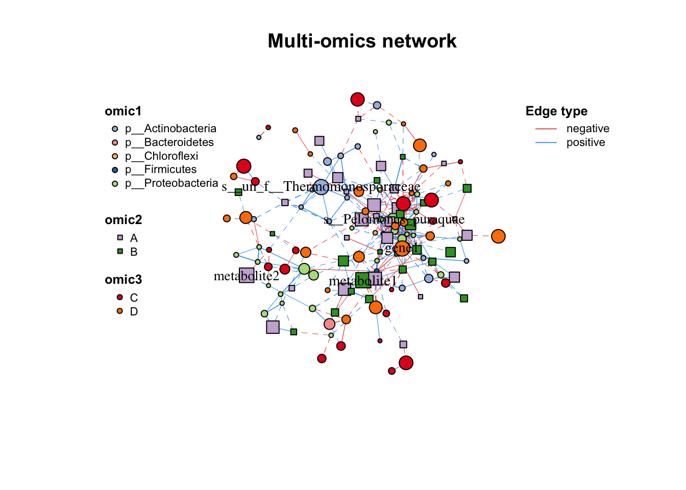
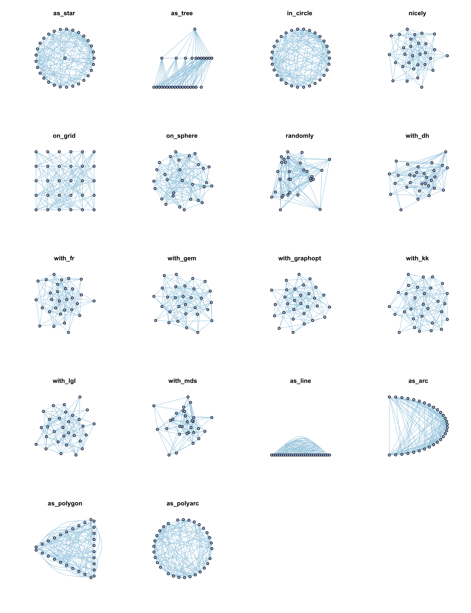
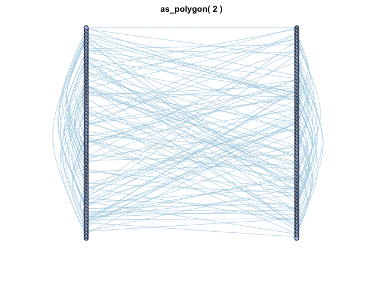
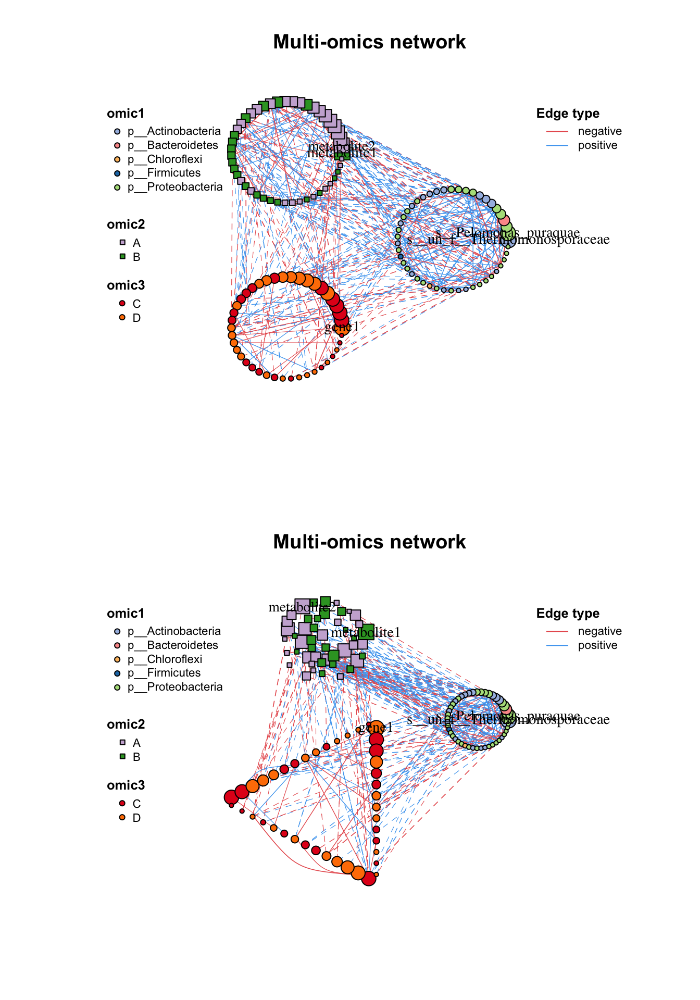
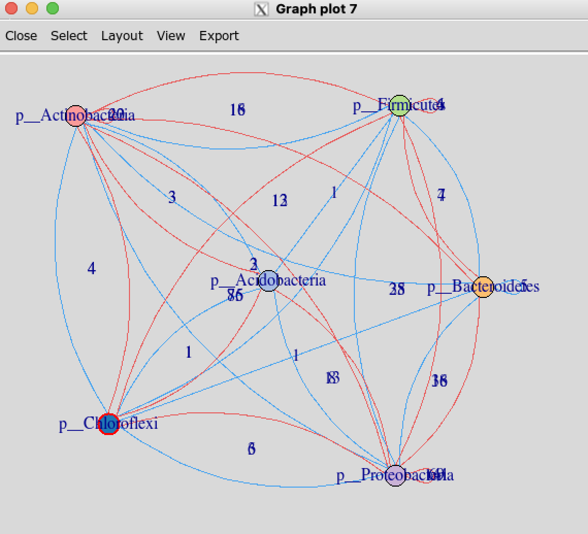
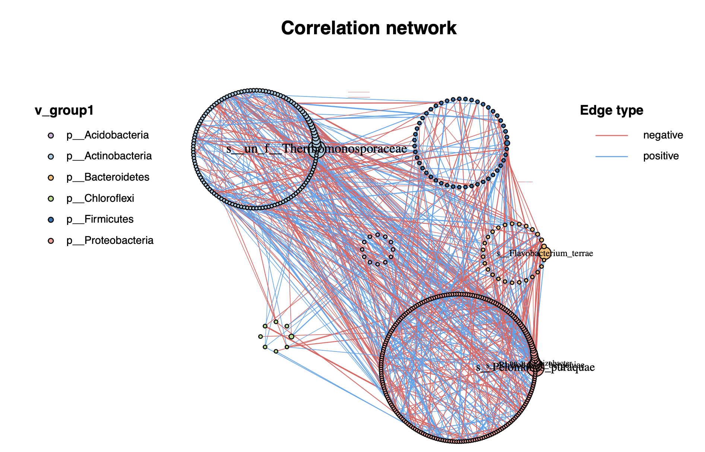
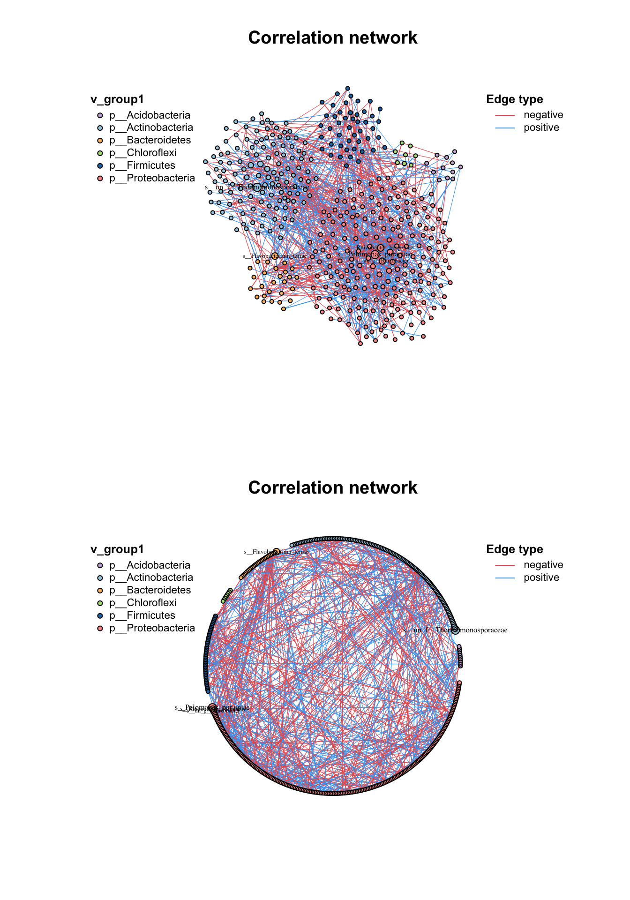
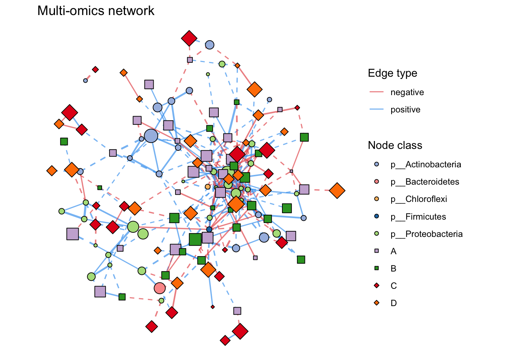

# Visualization

MetaNet supports basic R plot and provides some interfaces for other software (Gephi, Cytoscape, ggplot, networkD3) to do visualization, 
while there are also a lot of layout methods for better display.

## Basic plot

### Set attributes {#set-attri}

As we mentioned earlier, there are some internal attributes have been set when building network, which are related to the network visualization (Table \@ref(tab:4-attribute)). 
So you can use `c_net_set()` to custom these attributes fitting to your research needs. 
Give the network various annotate tables and determine which columns use to set, 
you can give the columns name (one or more) to `vertex_group, vertex_class, vertex_size, edge_type, edge_class, edge_width`. 
Colors, linetypes, shapes and legends will be assigned automatically, just use `plot()` to get the basic metanet figure.


```r
data("multi_test",package = "MetaNet")
data("c_net",package = "MetaNet")
#build a multi-network
multi_net_build(micro,metab,transc)->multi1
#> Calculating 18 samples and 150 objects of 3 groups.
#v_group is default, three different table

#set vertex_class
multi1=c_net_set(multi1,micro_g,metab_g,transc_g,vertex_class = c("Phylum","kingdom","type"))
#set vertex_size
multi1=c_net_set(multi1,
                 data.frame("Abundance1"=colSums(micro)),
                 data.frame("Abundance2"=colSums(metab)),
                 data.frame("Abundance3"=colSums(transc)),vertex_size =paste0("Abundance",1:3))

plot(multi1)
```

<div class="figure">

<p class="caption">(\#fig:5-basic)Basic plot function</p>
</div>

### Plot setting

If you want to custom the network plot flexibility, use the `c_net_plot()` which contains igraph arguments and some other arguments. 
The arguments of `c_net_plot()` show in the Table 5.1, some are different to the igraph original definition.

<div style="border: 1px solid #ddd; padding: 0px; overflow-y: scroll; height:600px; overflow-x: scroll; width:100%; "><table class="table" style="font-size: 13px; margin-left: auto; margin-right: auto;">
<caption style="font-size: initial !important;">(\#tab:unnamed-chunk-2)Description of `c_net_plot()` arguments.</caption>
 <thead>
  <tr>
   <th style="text-align:left;position: sticky; top:0; background-color: #FFFFFF;"> Arguments </th>
   <th style="text-align:left;position: sticky; top:0; background-color: #FFFFFF;"> Description </th>
  </tr>
 </thead>
<tbody>
  <tr>
   <td style="text-align:left;width: 5em; font-weight: bold;border-right:1px solid;"> coors </td>
   <td style="text-align:left;"> 1. cooridnates dataframe 
2. layout function (e.g. as_star(), as_tree(), in_circle(), nicely()... see help(c_net_lay)) </td>
  </tr>
  <tr>
   <td style="text-align:left;width: 5em; font-weight: bold;border-right:1px solid;background-color: #93aec1 !important;"> vertex.color </td>
   <td style="text-align:left;background-color: #93aec1 !important;"> color of nodes, receive vector (1. length same to number of nodes; 2. length same to numbers of v_class; 3. named verctor like c(A="red",B="blue")) </td>
  </tr>
  <tr>
   <td style="text-align:left;width: 5em; font-weight: bold;border-right:1px solid;background-color: #93aec1 !important;"> vertex. shape </td>
   <td style="text-align:left;background-color: #93aec1 !important;"> shape of nodes, receive vector (1. length same to number of nodes; 2. length same to numbers of v_group; 3. named verctor like c(v_group1="circle",B="square"))shape list: none, circle, square, csquare, rectangle, crectangle, vrectangle, pie, raster, or sphere </td>
  </tr>
  <tr>
   <td style="text-align:left;width: 5em; font-weight: bold;border-right:1px solid;background-color: #93aec1 !important;"> vertex.size </td>
   <td style="text-align:left;background-color: #93aec1 !important;"> size of nodes, receive numerical vector (length same to number of nodes)please use mmscale to control vertex.size, don't be too large. </td>
  </tr>
  <tr>
   <td style="text-align:left;width: 5em; font-weight: bold;border-right:1px solid;background-color: #93aec1 !important;"> vertex_size_range </td>
   <td style="text-align:left;background-color: #93aec1 !important;"> the vertex size range, e.g. c(1,10) </td>
  </tr>
  <tr>
   <td style="text-align:left;width: 5em; font-weight: bold;border-right:1px solid;background-color: #93aec1 !important;"> labels_num </td>
   <td style="text-align:left;background-color: #93aec1 !important;"> show how many labels,&gt;1 indicates number, &lt;1 indicates fraction ,default: 5, according to the vertex.size </td>
  </tr>
  <tr>
   <td style="text-align:left;width: 5em; font-weight: bold;border-right:1px solid;background-color: #93aec1 !important;"> vertex.label </td>
   <td style="text-align:left;background-color: #93aec1 !important;"> the label of nodes, NA indicates no label </td>
  </tr>
  <tr>
   <td style="text-align:left;width: 5em; font-weight: bold;border-right:1px solid;background-color: #93aec1 !important;"> vertex.label.family </td>
   <td style="text-align:left;background-color: #93aec1 !important;"> label font family </td>
  </tr>
  <tr>
   <td style="text-align:left;width: 5em; font-weight: bold;border-right:1px solid;background-color: #93aec1 !important;"> vertex.label.font </td>
   <td style="text-align:left;background-color: #93aec1 !important;"> label font, 1 plain, 2 bold, 3 italic, 4 bold italic, 5 symbol </td>
  </tr>
  <tr>
   <td style="text-align:left;width: 5em; font-weight: bold;border-right:1px solid;background-color: #93aec1 !important;"> vertex.label.cex </td>
   <td style="text-align:left;background-color: #93aec1 !important;"> label size </td>
  </tr>
  <tr>
   <td style="text-align:left;width: 5em; font-weight: bold;border-right:1px solid;background-color: #93aec1 !important;"> vertex.label.dist </td>
   <td style="text-align:left;background-color: #93aec1 !important;"> distance from label to nodes </td>
  </tr>
  <tr>
   <td style="text-align:left;width: 5em; font-weight: bold;border-right:1px solid;background-color: #93aec1 !important;"> vertex.label.degree </td>
   <td style="text-align:left;background-color: #93aec1 !important;"> 0:right, pi: left, pi/2:below, -pi/2:above </td>
  </tr>
  <tr>
   <td style="text-align:left;width: 5em; font-weight: bold;border-right:1px solid;background-color: #93aec1 !important;"> vertex.frame.color </td>
   <td style="text-align:left;background-color: #93aec1 !important;"> color of nodes frame </td>
  </tr>
  <tr>
   <td style="text-align:left;width: 5em; font-weight: bold;border-right:1px solid;background-color: #93aec1 !important;"> plot_module </td>
   <td style="text-align:left;background-color: #93aec1 !important;"> use module as the v_class </td>
  </tr>
  <tr>
   <td style="text-align:left;width: 5em; font-weight: bold;border-right:1px solid;background-color: #93aec1 !important;"> mark_module </td>
   <td style="text-align:left;background-color: #93aec1 !important;"> logical, mark the modules? </td>
  </tr>
  <tr>
   <td style="text-align:left;width: 5em; font-weight: bold;border-right:1px solid;background-color: #93aec1 !important;"> mark_color </td>
   <td style="text-align:left;background-color: #93aec1 !important;"> color of mark.groups </td>
  </tr>
  <tr>
   <td style="text-align:left;width: 5em; font-weight: bold;border-right:1px solid;background-color: #f8b042 !important;"> edge.color </td>
   <td style="text-align:left;background-color: #f8b042 !important;"> color of edges, receive vector (1. length same to number of edges; 2. length same to numbers of e_type; 3. named verctor like c(A="red",B="blue")) </td>
  </tr>
  <tr>
   <td style="text-align:left;width: 5em; font-weight: bold;border-right:1px solid;background-color: #f8b042 !important;"> edge.width </td>
   <td style="text-align:left;background-color: #f8b042 !important;"> width of edge, receive numerical vector (length same to number of edges)please use mmscale to control vertex.size, don't be too large. </td>
  </tr>
  <tr>
   <td style="text-align:left;width: 5em; font-weight: bold;border-right:1px solid;background-color: #f8b042 !important;"> edge.lty </td>
   <td style="text-align:left;background-color: #f8b042 !important;"> linetype of edge, receive vector (1. length same to number of edges; 2. length same to numbers of e_class; 3. named verctor like c(A="red",B="blue")) </td>
  </tr>
  <tr>
   <td style="text-align:left;width: 5em; font-weight: bold;border-right:1px solid;background-color: #f8b042 !important;"> edge.arrow.size </td>
   <td style="text-align:left;background-color: #f8b042 !important;"> arrow size for directed network </td>
  </tr>
  <tr>
   <td style="text-align:left;width: 5em; font-weight: bold;border-right:1px solid;background-color: #f8b042 !important;"> edge.arrow.width </td>
   <td style="text-align:left;background-color: #f8b042 !important;"> arrow width for directed network </td>
  </tr>
  <tr>
   <td style="text-align:left;width: 5em; font-weight: bold;border-right:1px solid;background-color: #f8b042 !important;"> arrow.mode </td>
   <td style="text-align:left;background-color: #f8b042 !important;"> arrow mode, 0 no arrow, 1 back, 2 forward, 3 both </td>
  </tr>
  <tr>
   <td style="text-align:left;width: 5em; font-weight: bold;border-right:1px solid;background-color: #f8b042 !important;"> edge.label </td>
   <td style="text-align:left;background-color: #f8b042 !important;"> the label of edges, NA indicates no label </td>
  </tr>
  <tr>
   <td style="text-align:left;width: 5em; font-weight: bold;border-right:1px solid;background-color: #f8b042 !important;"> edge.label.family </td>
   <td style="text-align:left;background-color: #f8b042 !important;"> label font family </td>
  </tr>
  <tr>
   <td style="text-align:left;width: 5em; font-weight: bold;border-right:1px solid;background-color: #f8b042 !important;"> edge.label. font </td>
   <td style="text-align:left;background-color: #f8b042 !important;"> label font, 1 plain, 2 bold, 3 italic, 4 bold italic, 5 symbol </td>
  </tr>
  <tr>
   <td style="text-align:left;width: 5em; font-weight: bold;border-right:1px solid;background-color: #f8b042 !important;"> edge.label.cex </td>
   <td style="text-align:left;background-color: #f8b042 !important;"> label size </td>
  </tr>
  <tr>
   <td style="text-align:left;width: 5em; font-weight: bold;border-right:1px solid;background-color: #f8b042 !important;"> edge.label.x </td>
   <td style="text-align:left;background-color: #f8b042 !important;"> label x-axis </td>
  </tr>
  <tr>
   <td style="text-align:left;width: 5em; font-weight: bold;border-right:1px solid;background-color: #f8b042 !important;"> edge.label.y </td>
   <td style="text-align:left;background-color: #f8b042 !important;"> label y-axis </td>
  </tr>
  <tr>
   <td style="text-align:left;width: 5em; font-weight: bold;border-right:1px solid;background-color: #f8b042 !important;"> edge.label.color </td>
   <td style="text-align:left;background-color: #f8b042 !important;"> label color </td>
  </tr>
  <tr>
   <td style="text-align:left;width: 5em; font-weight: bold;border-right:1px solid;background-color: #f8b042 !important;"> edge.curved </td>
   <td style="text-align:left;background-color: #f8b042 !important;"> The curvature of the body, on a scale of 0-1, FALSE means 0, TRUE means 0.5 </td>
  </tr>
  <tr>
   <td style="text-align:left;width: 5em; font-weight: bold;border-right:1px solid;background-color: #9dbdba !important;"> legend </td>
   <td style="text-align:left;background-color: #9dbdba !important;"> show any legend? FALSE means close all legends </td>
  </tr>
  <tr>
   <td style="text-align:left;width: 5em; font-weight: bold;border-right:1px solid;background-color: #9dbdba !important;"> legend_cex </td>
   <td style="text-align:left;background-color: #9dbdba !important;"> character expansion factor relative to current par('cex'), default: 1 </td>
  </tr>
  <tr>
   <td style="text-align:left;width: 5em; font-weight: bold;border-right:1px solid;background-color: #9dbdba !important;"> legend_position </td>
   <td style="text-align:left;background-color: #9dbdba !important;"> legend_position, default: c(left_leg_x=-1.9,left_leg_y=1,right_leg_x=1.2,right_leg_y=1) </td>
  </tr>
  <tr>
   <td style="text-align:left;width: 5em; font-weight: bold;border-right:1px solid;background-color: #9dbdba !important;"> legend_number </td>
   <td style="text-align:left;background-color: #9dbdba !important;"> add numbers in legend? (v_class number, e_type number...) </td>
  </tr>
  <tr>
   <td style="text-align:left;width: 5em; font-weight: bold;border-right:1px solid;background-color: #9dbdba !important;"> lty_legend, lty_legend_title </td>
   <td style="text-align:left;background-color: #9dbdba !important;"> show lty_legend? and the title </td>
  </tr>
  <tr>
   <td style="text-align:left;width: 5em; font-weight: bold;border-right:1px solid;background-color: #9dbdba !important;"> size_legend, size_legend_tiltle </td>
   <td style="text-align:left;background-color: #9dbdba !important;"> show size_legend? and the title </td>
  </tr>
  <tr>
   <td style="text-align:left;width: 5em; font-weight: bold;border-right:1px solid;background-color: #9dbdba !important;"> edge_legend, edge_legend_title, edge_legend_order </td>
   <td style="text-align:left;background-color: #9dbdba !important;"> show edge_legend? and the title, the order of legend receives a vector </td>
  </tr>
  <tr>
   <td style="text-align:left;width: 5em; font-weight: bold;border-right:1px solid;background-color: #9dbdba !important;"> width_legend, width_legend_title </td>
   <td style="text-align:left;background-color: #9dbdba !important;"> show width_legend? and the title </td>
  </tr>
  <tr>
   <td style="text-align:left;width: 5em; font-weight: bold;border-right:1px solid;background-color: #9dbdba !important;"> col_legend, col_legend_order </td>
   <td style="text-align:left;background-color: #9dbdba !important;"> show col_legend? and the title, the order of legend receives a vector </td>
  </tr>
  <tr>
   <td style="text-align:left;width: 5em; font-weight: bold;border-right:1px solid;background-color: #9dbdba !important;"> group_legend_title, group_legend_order </td>
   <td style="text-align:left;background-color: #9dbdba !important;"> the title of group, the order of legend receives a vector </td>
  </tr>
  <tr>
   <td style="text-align:left;width: 5em; font-weight: bold;border-right:1px solid;background-color: #f3b7ad !important;"> margin </td>
   <td style="text-align:left;background-color: #f3b7ad !important;"> margin, a vector whose length =4 </td>
  </tr>
  <tr>
   <td style="text-align:left;width: 5em; font-weight: bold;border-right:1px solid;background-color: #f3b7ad !important;"> rescale </td>
   <td style="text-align:left;background-color: #f3b7ad !important;"> scale the coors to [-1,1], default T </td>
  </tr>
  <tr>
   <td style="text-align:left;width: 5em; font-weight: bold;border-right:1px solid;background-color: #f3b7ad !important;"> asp </td>
   <td style="text-align:left;background-color: #f3b7ad !important;"> y/x ratio </td>
  </tr>
  <tr>
   <td style="text-align:left;width: 5em; font-weight: bold;border-right:1px solid;background-color: #f3b7ad !important;"> frame </td>
   <td style="text-align:left;background-color: #f3b7ad !important;"> if T, add frame </td>
  </tr>
  <tr>
   <td style="text-align:left;width: 5em; font-weight: bold;border-right:1px solid;background-color: #f3b7ad !important;"> main </td>
   <td style="text-align:left;background-color: #f3b7ad !important;"> the main title of graph </td>
  </tr>
  <tr>
   <td style="text-align:left;width: 5em; font-weight: bold;border-right:1px solid;background-color: #f3b7ad !important;"> sub </td>
   <td style="text-align:left;background-color: #f3b7ad !important;"> subtitle </td>
  </tr>
  <tr>
   <td style="text-align:left;width: 5em; font-weight: bold;border-right:1px solid;background-color: #f3b7ad !important;"> xlab </td>
   <td style="text-align:left;background-color: #f3b7ad !important;"> x-axis label </td>
  </tr>
  <tr>
   <td style="text-align:left;width: 5em; font-weight: bold;border-right:1px solid;background-color: #f3b7ad !important;"> ylab </td>
   <td style="text-align:left;background-color: #f3b7ad !important;"> y-axis label </td>
  </tr>
</tbody>
</table></div>


## Layout

Layout is an important part of network visualization, a good layout will present information clearly. 
So, in `MetaNet`, we always use a dataframe to store the coordinates of a layout. 
`coors` is a three-columns dataframe contains `name, X, Y`.

### Basic layout

Use `c_net_lay()` to get coordinates with specific layout methods. 
The method can be one of `as_line(), as_arc(), as_polygon(), as_polyarc()`, 
or other graph layouts in **igraph** like `as_star(),  as_tree(),  in_circle(),  nicely(),  on_grid(),  on_sphere(),  randomly(),  with_dh(),  with_fr(),  with_gem(),  with_graphopt(),  with_kk(),  with_lgl(),  with_mds()`.

<div class="figure">

<p class="caption">(\#fig:layout-methods)Layout methods for c_net_lay()</p>
</div>


And for each method, you can add some arguments in it:


```r
#get a metanet
go=erdos.renyi.game(30,0.25)
go=c_net_update(go)

plot(go,coors=with_fr())
plot(go,coors=with_fr(niter = 99,grid = "nogrid"))
```

The `as_polygon()` is interesting:


<div class="figure">

<p class="caption">(\#fig:5-multiangle)Layout of as_polygon() in c_net_lay</p>
</div>

### Group layout

Beside the `c_net_lay()`, we provide an advanced layout method for a network with group variable: `g_lay()`. 
It is easy to use `g_lay()` to control each group position and layout of each group. 

* First, assign a group variable.
* Give a layout1 for group position, one of
  1.a dataframe or matrix: rowname is group, two columns are X and Y
  2.function: layout method for `c_net_lay()` default: in_circle()
* Adjust the zoom1 of layout1.
* Give a layout2 (layout method for `c_net_lay()`) for each group layout, or use a list contains functions match each group.
* Adjust the zoom2 of layout2. you can use a vector to adjust each group zoom.
* use show_big_lay = T to look the layout1 distribution.


```r
par(mfrow=c(2,1))
#set circle layout
g_lay(multi1,group ="v_group",layout1 =in_circle(), zoom1=10,layout2 =in_circle(),zoom2 = 5)->g_coors
plot(multi1,coors=g_coors)
#set different layout for each group
g_lay(multi1,group ="v_group",layout1 =in_circle(), zoom1=10,layout2 =list(in_circle(),with_fr(),as_polygon()),zoom2 = 3:5)->g_coors
plot(multi1,coors=g_coors)
```

<div class="figure">

<p class="caption">(\#fig:5-g-lay)Simple usage of g_lay()</p>
</div>

As layout1 also receive a matrix or dataframe, so we can use the group skeleton of network to adjust the layout.


```r
g_lay(co_net,group ="v_class",layout1 =in_circle(), zoom1=10,
      layout2 =in_circle(),zoom2 = c(1,5,2,1,3,7))->g_coors
plot(co_net,coors=g_coors)

#firstly get the skeleton plot
get_group_skeleton(co_net,"v_class")->s_net
V(s_net)$size=10;E(s_net)$width=1
#then use tkplot to do manual adjustment.
x <- igraph::tkplot(s_net)
#Here: Move nodes within the tkplot window to a layout you like!
da <- igraph::tkplot.getcoords(x)
#close the window
igraph::tkplot.close(x)
#pass the da to layout1
g_lay(co_net,group ="v_class",layout1 =da, zoom1=20,
      layout2 =in_circle(),zoom2 = c(1,4,2,1,3,5))->g_coors
plot(co_net,coors=g_coors)
```

<div class="figure">

<p class="caption">(\#fig:5-tkplot)Use tkplot to adjust big layout.</p>
</div>
<div class="figure">

<p class="caption">(\#fig:5-tkplot2)Use tkplot to adjust big layout.</p>
</div>

By the way, `g_lay_nice(), g_lay_polyarc(), g_lay_polygon()` are also good group layout method.


```r
par(mfrow=c(2,1))
g_lay_nice(co_net,group = "v_class")->g_coors
plot(co_net,coors=g_coors)
g_lay_polyarc(co_net,group = "v_class",group2_order = "size")->g_coors
plot(co_net,coors=g_coors)
```

<div class="figure">

<p class="caption">(\#fig:5-g-lay-2)Usage of g_lay_nice() and g_lay_polyarc()</p>
</div>

You can plot some more complex module-plot.

```r
#plot_gg_circle(multi1)
```

## Other styles

### ggplot

If you are more familiar with `ggplot2`, use the function `to.ggig()` transfer the basic R plot to ggplot2 style, so that you can use some convient function like `labs()`, `theme()`, `ggsave()`, `cowplot::plot_grid()` to make better figure.


```r
to.ggig(multi1)->ggig
plot(ggig)
```

<div class="figure">

<p class="caption">(\#fig:5-ggig)Plot a network in ggplot2 style</p>
</div>

### Gephi

If you are dealing with some big dataset, We recommend to use Gephi to layout. 
We provide a interface to Gephi by `graphml` format file, you can use the algorithm then export a graphml file.


```r
plot(co_net)
c_net_save(co_net,filename = "test",format = "graphml")
#then input test.graphml to Gephi and do a layout

#and export a graphml file from Gephi: test2.graphml, So you can re-draw it in MetaNet
input_gephi("test2.graphml")->gephi

c_net_plot(co_net,coors = gephi$coors,legend_number = T,group_legend_title = "Phylum")
```

### Cytoscape

Cytoscape is also a pretty software for network visualization which contains lots of plugins. Use the "data.frame" format to transfer network.


```r
c_net_save(co_net,filename = "test",format = "data.frame")
#then input test_nodes.csv and test_edge.csv to Cytoscape.
```

### NetworkD3

NetworkD3 can produce interactive network plot based on JavaScript, 
the output object is a htmlwidgets which are suitable for website.


```r
netD3plot(multi1)
```

<div class="figure">

```{=html}
<div class="forceNetwork html-widget html-fill-item-overflow-hidden html-fill-item" id="htmlwidget-1b4ff99564eb6e8884a5" style="width:100%;height:480px;"></div>
<script type="application/json" data-for="htmlwidget-1b4ff99564eb6e8884a5">{"x":{"links":{"source":[0,0,0,0,1,1,1,1,1,1,1,1,1,1,1,1,1,1,1,1,1,1,2,2,2,2,2,2,2,3,3,3,3,4,4,4,5,5,5,5,5,5,5,5,5,5,5,5,5,5,5,5,5,5,6,6,6,6,6,7,7,8,8,8,9,9,9,9,9,9,9,9,9,9,9,9,9,9,9,9,10,10,10,11,11,11,12,12,12,12,13,13,14,14,14,15,16,16,16,17,17,17,17,17,17,17,18,18,18,18,18,18,19,19,19,20,20,20,20,20,20,20,20,20,20,20,21,21,21,21,22,22,22,22,22,22,23,23,24,25,26,26,26,26,26,26,26,26,27,27,28,28,29,30,30,30,30,30,31,31,31,31,31,31,31,32,32,32,33,33,33,33,33,33,33,33,33,34,34,34,34,35,35,35,36,36,36,36,37,38,38,38,38,38,38,38,38,38,38,39,40,40,40,41,41,41,41,41,41,41,41,41,41,41,42,43,43,43,43,43,43,43,43,43,43,43,44,44,45,46,47,47,48,49,49,49,49,50,50,50,50,50,50,50,51,51,51,51,51,52,53,53,54,54,54,54,54,55,55,55,55,55,56,56,56,57,58,59,59,60,60,60,60,61,61,61,61,61,61,61,61,63,65,65,65,65,65,65,65,65,66,66,66,66,67,68,68,68,69,69,69,69,70,71,72,72,73,74,75,75,76,77,78,78,79,81,81,83,84,85,85,85,86,87,87,87,88,89,90,91,91,91,93,94,94,95,95,96,96,96,96,98,101,102,106,108,112,113,115,116,116,116,117,127],"target":[14,18,24,34,5,9,17,20,33,38,41,43,54,55,56,61,69,78,83,104,107,115,25,26,27,28,82,104,114,11,53,108,109,82,104,106,9,20,21,26,33,38,41,43,54,61,62,65,69,83,90,112,115,116,13,57,65,94,110,14,24,84,100,133,17,20,22,33,38,41,43,54,55,56,61,69,83,85,90,104,28,40,52,44,53,108,65,74,94,110,47,94,15,24,84,81,27,77,118,22,55,69,78,102,115,125,24,34,47,51,77,88,84,87,133,33,43,46,54,61,63,66,69,83,88,90,26,29,41,115,41,55,61,96,115,129,25,27,94,27,31,41,43,50,73,101,104,121,103,114,40,82,39,51,58,96,116,129,41,43,50,60,79,85,115,53,66,97,38,39,43,54,61,65,69,73,112,36,58,77,126,70,80,111,67,77,86,107,129,43,54,61,65,69,85,94,112,115,116,93,52,80,105,43,50,55,59,61,72,73,90,93,104,115,130,50,54,55,56,61,69,83,86,90,115,119,48,126,63,54,101,121,126,56,66,96,105,53,73,90,101,104,108,132,58,85,96,116,129,80,70,71,61,69,73,83,90,56,61,69,78,107,69,72,78,65,64,93,99,79,116,122,128,65,69,83,86,96,115,116,119,66,70,85,94,96,110,116,124,129,87,96,97,117,86,93,97,134,78,81,83,115,79,79,73,110,132,110,98,121,103,113,115,125,128,86,115,86,100,92,94,116,131,96,117,133,90,129,132,103,105,122,97,96,116,113,123,116,117,124,129,120,135,133,122,109,116,123,116,119,124,129,134,131],"colour":["#48A4F0","#48A4F0","#48A4F0","#48A4F0","#48A4F0","#48A4F0","#E85D5D","#48A4F0","#48A4F0","#48A4F0","#48A4F0","#E85D5D","#48A4F0","#E85D5D","#48A4F0","#E85D5D","#48A4F0","#E85D5D","#48A4F0","#48A4F0","#E85D5D","#E85D5D","#48A4F0","#E85D5D","#48A4F0","#48A4F0","#48A4F0","#48A4F0","#48A4F0","#48A4F0","#48A4F0","#E85D5D","#48A4F0","#48A4F0","#48A4F0","#48A4F0","#48A4F0","#48A4F0","#48A4F0","#E85D5D","#48A4F0","#48A4F0","#48A4F0","#E85D5D","#48A4F0","#E85D5D","#48A4F0","#E85D5D","#48A4F0","#48A4F0","#48A4F0","#48A4F0","#E85D5D","#48A4F0","#48A4F0","#48A4F0","#48A4F0","#48A4F0","#E85D5D","#48A4F0","#48A4F0","#E85D5D","#48A4F0","#E85D5D","#E85D5D","#48A4F0","#E85D5D","#48A4F0","#48A4F0","#48A4F0","#E85D5D","#48A4F0","#E85D5D","#48A4F0","#E85D5D","#48A4F0","#48A4F0","#48A4F0","#48A4F0","#48A4F0","#48A4F0","#48A4F0","#48A4F0","#48A4F0","#48A4F0","#E85D5D","#E85D5D","#48A4F0","#E85D5D","#48A4F0","#48A4F0","#48A4F0","#48A4F0","#48A4F0","#E85D5D","#E85D5D","#E85D5D","#48A4F0","#48A4F0","#48A4F0","#48A4F0","#E85D5D","#48A4F0","#48A4F0","#48A4F0","#48A4F0","#48A4F0","#48A4F0","#48A4F0","#48A4F0","#48A4F0","#48A4F0","#48A4F0","#48A4F0","#48A4F0","#48A4F0","#E85D5D","#48A4F0","#48A4F0","#E85D5D","#48A4F0","#48A4F0","#48A4F0","#48A4F0","#E85D5D","#48A4F0","#E85D5D","#48A4F0","#48A4F0","#E85D5D","#E85D5D","#48A4F0","#48A4F0","#48A4F0","#48A4F0","#E85D5D","#48A4F0","#48A4F0","#48A4F0","#48A4F0","#E85D5D","#E85D5D","#48A4F0","#E85D5D","#E85D5D","#48A4F0","#E85D5D","#48A4F0","#E85D5D","#48A4F0","#48A4F0","#48A4F0","#48A4F0","#48A4F0","#48A4F0","#48A4F0","#E85D5D","#E85D5D","#48A4F0","#E85D5D","#48A4F0","#48A4F0","#48A4F0","#48A4F0","#E85D5D","#48A4F0","#E85D5D","#E85D5D","#48A4F0","#48A4F0","#E85D5D","#48A4F0","#E85D5D","#E85D5D","#48A4F0","#48A4F0","#48A4F0","#48A4F0","#48A4F0","#48A4F0","#48A4F0","#48A4F0","#E85D5D","#E85D5D","#E85D5D","#48A4F0","#48A4F0","#48A4F0","#48A4F0","#E85D5D","#48A4F0","#E85D5D","#E85D5D","#48A4F0","#48A4F0","#E85D5D","#48A4F0","#E85D5D","#48A4F0","#E85D5D","#48A4F0","#48A4F0","#48A4F0","#E85D5D","#48A4F0","#E85D5D","#48A4F0","#E85D5D","#48A4F0","#48A4F0","#48A4F0","#E85D5D","#48A4F0","#E85D5D","#E85D5D","#E85D5D","#E85D5D","#48A4F0","#E85D5D","#48A4F0","#E85D5D","#E85D5D","#48A4F0","#E85D5D","#48A4F0","#E85D5D","#48A4F0","#E85D5D","#48A4F0","#48A4F0","#E85D5D","#E85D5D","#E85D5D","#48A4F0","#48A4F0","#E85D5D","#E85D5D","#48A4F0","#48A4F0","#48A4F0","#E85D5D","#48A4F0","#E85D5D","#E85D5D","#48A4F0","#E85D5D","#48A4F0","#E85D5D","#E85D5D","#48A4F0","#48A4F0","#E85D5D","#E85D5D","#48A4F0","#48A4F0","#48A4F0","#48A4F0","#E85D5D","#48A4F0","#E85D5D","#48A4F0","#48A4F0","#48A4F0","#48A4F0","#E85D5D","#48A4F0","#48A4F0","#E85D5D","#E85D5D","#48A4F0","#48A4F0","#E85D5D","#48A4F0","#48A4F0","#E85D5D","#E85D5D","#48A4F0","#48A4F0","#48A4F0","#E85D5D","#E85D5D","#48A4F0","#E85D5D","#E85D5D","#48A4F0","#48A4F0","#E85D5D","#E85D5D","#E85D5D","#E85D5D","#48A4F0","#E85D5D","#48A4F0","#48A4F0","#E85D5D","#E85D5D","#48A4F0","#E85D5D","#E85D5D","#E85D5D","#48A4F0","#E85D5D","#48A4F0","#E85D5D","#48A4F0","#48A4F0","#E85D5D","#48A4F0","#E85D5D","#48A4F0","#48A4F0","#48A4F0","#48A4F0","#48A4F0","#48A4F0","#48A4F0","#48A4F0","#E85D5D","#E85D5D","#E85D5D","#E85D5D","#48A4F0","#48A4F0","#E85D5D","#48A4F0","#48A4F0","#E85D5D","#E85D5D","#E85D5D","#E85D5D","#E85D5D","#48A4F0","#E85D5D","#48A4F0","#E85D5D","#48A4F0","#E85D5D","#E85D5D","#E85D5D","#E85D5D","#E85D5D","#48A4F0","#48A4F0","#E85D5D","#E85D5D","#E85D5D","#48A4F0","#E85D5D","#E85D5D","#48A4F0","#48A4F0","#48A4F0","#E85D5D","#E85D5D"]},"nodes":{"name":["s__un_f__Thermomonosporaceae","s__Pelomonas_puraquae","s__Rhizobacter_bergeniae","s__Flavobacterium_terrae","s__un_g__Rhizobacter","s__un_o__Burkholderiales","s__un_g__Streptomyces","s__Lentzea_flaviverrucosa","s__un_g__Actinoplanes","s__un_g__Rhizobium","s__un_g__Noviherbaspirillum","s__un_f__Comamonadaceae","s__Bradyrhizobium_neotropicale","s__Streptomyces_ederensis","s__Actinocorallia_herbida","s__un_g__Amycolatopsis","s__Actinophytocola_burenkhanensis","s__un_p__Proteobacteria","s__Kribbella_catacumbae","s__un_o__Rhizobiales","s__un_g__Sphingomonas","s__Amycolatopsis_keratiniphila_subsp._keratiniphila","s__Kinneretia_asaccharophila","s__un_f__Burkholderiales_incertae_sedis","s__Kineosporia_rhamnosa","s__un_f__Oxalobacteraceae","s__un_g__Bacillus","s__Pseudoduganella_violaceinigra","s__Piscinibacter_aquaticus","s__un_g__Lentzea","s__Steroidobacter_denitrificans","s__Sphingopyxis_soli","s__un_g__Herpetosiphon","s__Phenylobacterium_composti","s__un_f__Micromonosporaceae","s__un_g__Ensifer","s__un_g__Agromyces","s__un_g__Nocardioides","s__un_g__Devosia","s__un_f__Bradyrhizobiaceae","s__Noviherbaspirillum_suwonense","s__un_c__Deltaproteobacteria","s__Kibdelosporangium_phytohabitans","s__Dongia_mobilis","s__un_g__Pseudomonas","s__Pseudoxanthomonas_gei","s__un_f__Xanthomonadaceae","metabolite1","metabolite2","metabolite3","metabolite4","metabolite5","metabolite6","metabolite7","metabolite8","metabolite9","metabolite10","metabolite12","metabolite13","metabolite14","metabolite15","metabolite16","metabolite17","metabolite18","metabolite19","metabolite20","metabolite21","metabolite22","metabolite23","metabolite24","metabolite25","metabolite26","metabolite27","metabolite28","metabolite29","metabolite30","metabolite31","metabolite32","metabolite34","metabolite35","metabolite36","metabolite37","metabolite38","metabolite39","metabolite41","metabolite42","metabolite43","metabolite44","metabolite45","metabolite46","metabolite47","metabolite48","metabolite49","metabolite50","gene1","gene2","gene3","gene5","gene6","gene7","gene8","gene10","gene11","gene12","gene14","gene15","gene18","gene19","gene20","gene21","gene22","gene23","gene24","gene25","gene27","gene28","gene29","gene30","gene32","gene33","gene34","gene35","gene36","gene37","gene38","gene40","gene41","gene42","gene43","gene44","gene45","gene46","gene47","gene48","gene49","gene50"],"group":["p__Actinobacteria","p__Proteobacteria","p__Proteobacteria","p__Bacteroidetes","p__Proteobacteria","p__Proteobacteria","p__Actinobacteria","p__Actinobacteria","p__Actinobacteria","p__Proteobacteria","p__Proteobacteria","p__Proteobacteria","p__Proteobacteria","p__Actinobacteria","p__Actinobacteria","p__Actinobacteria","p__Actinobacteria","p__Proteobacteria","p__Actinobacteria","p__Proteobacteria","p__Proteobacteria","p__Actinobacteria","p__Proteobacteria","p__Proteobacteria","p__Actinobacteria","p__Proteobacteria","p__Firmicutes","p__Proteobacteria","p__Proteobacteria","p__Actinobacteria","p__Proteobacteria","p__Proteobacteria","p__Chloroflexi","p__Proteobacteria","p__Actinobacteria","p__Proteobacteria","p__Actinobacteria","p__Actinobacteria","p__Proteobacteria","p__Proteobacteria","p__Proteobacteria","p__Proteobacteria","p__Actinobacteria","p__Proteobacteria","p__Proteobacteria","p__Proteobacteria","p__Proteobacteria","B","A","A","A","A","A","A","A","A","B","A","A","A","B","A","B","A","A","B","A","A","B","B","B","B","B","B","B","A","B","A","B","B","B","B","A","A","A","B","A","B","A","A","B","B","A","A","D","C","C","C","C","D","C","D","D","D","D","D","C","D","D","C","C","C","D","C","C","D","D","D","D","D","C","C","C","D","C","D","C","D","D","D","C","D","C","D","C","C"],"nodesize":[40,38.6323000116104,25.947985603158,25.789155927087,21.981655636828,17.6314872866597,17.4491272882077,15.5299353690158,14.0739966716978,13.0018963582182,11.6606679825071,11.350361856109,10.7076899260807,9.99883896435621,8.65319865319865,7.94287704632532,7.15755253686288,7.11931576299392,7.02813576376795,6.85312899106003,6.68694608924494,6.55752931615001,6.19427996439491,6.17810286775804,6.13398351329386,6.07956964278803,5.66484771082472,5.62661093695576,5.55601996981307,5.43395642246217,5.42072061612292,5.36630674561709,5.08100158674871,5.0765896513023,5.02070513564767,4.95305545880259,4.58980610704749,4.4471535276133,4.44568288246449,4.40744610859553,4.15302449785208,3.96478191880491,3.89272030651341,3.80006966213863,3.64271063121638,3.59270869615697,3.54711869654398,3.54417740624637,3.46917450365726,3.29269708580053,3.27651998916367,3.26769611827083,3.23828321529471,3.21034095746739,3.06915902318201,3.0662177328844,3.02651031386664,2.97797902395604,2.97209644336081,2.96768450791439,2.96621386276559,2.91621192770618,2.90444676651573,2.88826966987887,2.84267967026588,2.81767870273617,2.77061805797438,2.73238128410542,2.7264987035102,2.70885096172452,2.68090870389721,2.66767289755796,2.65590773636751,2.64561322032586,2.63825999458183,2.59708193041526,2.58531676922482,2.5573745113975,2.54266805990944,2.52354967297496,2.50590193118929,2.47795967336197,2.46913580246914,2.46619451217152,2.39119160958241,2.38089709354077,2.37942644839197,2.37795580324316,2.37648515809435,2.35736677115987,2.34560160996943,2.33383644877898,2.32795386818375,2.30589419095166,2.28677580401718,2.25883354618987,2.25883354618987,2.25295096559464,2.24853903014823,2.24559773985061,2.23971515925539,2.22353806261852,2.22206741746972,2.20441967568404,2.17500677270792,2.15882967607106,2.15000580517822,2.14265257943419,2.11912225705329,2.11618096675568,2.11323967645807,2.11323967645807,2.11029838616045,2.09853322497001,2.09412128952359,2.08823870892836,2.08823870892836,2.08529741863075,2.0720616122915,2.0720616122915,2.06912032199389,2.06617903169627,2.06470838654747,2.06176709624985,2.06176709624985,2.02794225782732,2.0250009675297,2.0235303223809,2.02205967723209,2.01911838693448,2.01176516119045,2.01176516119045,2.00441193544642,2.00441193544642,2.00294129029761,2]},"options":{"NodeID":"name","Group":"group","colourScale":"d3.scaleOrdinal([`#a6bce3`,`#b2df8a`,`#fb9a99`,`#1f78b4`,`#fdbf6f`,`#33a02c`,`#cab2d6`,`#ff7f00`,`#e31a1c`])","fontSize":7,"fontFamily":"serif","clickTextSize":17.5,"linkDistance":20,"linkWidth":"function(d) { return (d.width); }","charge":-5,"opacity":0.6,"zoom":false,"legend":true,"arrows":false,"nodesize":true,"radiusCalculation":" Math.sqrt(d.nodesize)+6","bounded":false,"opacityNoHover":0,"clickAction":null}},"evals":[],"jsHooks":[]}</script>
```

<p class="caption">(\#fig:5-netd3)Plot a network in NetworkD3 style</p>
</div>

