# Topology

## Complex network

The microbial co-occurrence network we study is a complex network, which generally has the following characteristics, scale-free, small-world attributes, modularity and hierarchy.

<table>
<caption>(\#tab:unnamed-chunk-2)Common characteristic</caption>
 <thead>
  <tr>
   <th style="text-align:left;"> Terminology </th>
   <th style="text-align:left;"> Explanation </th>
  </tr>
 </thead>
<tbody>
  <tr>
   <td style="text-align:left;width: 5em; font-weight: bold;border-right:1px solid;"> Scale-free </td>
   <td style="text-align:left;"> Scale-free It is a most notable characteristic in complex systems. It was used to desibe the finding that most nodes in a network have few neighbors while few nodes have large amount of neighbors. In most cases, the connectivity distribution asymptotically follows a power law. It can be expressed in , where $P(k) \sim k^{-y}$ ,P(k) is the number of nodes with k degrees, k is connectivity/degrees andγis a constant. </td>
  </tr>
  <tr>
   <td style="text-align:left;width: 5em; font-weight: bold;border-right:1px solid;"> Small-world </td>
   <td style="text-align:left;"> Small-world It is a terminology in network analyses to depict the average distance between nodes in a network is short, usually logarithmically with the total number of nodes. It means the network nodes are always closely related with each other. </td>
  </tr>
  <tr>
   <td style="text-align:left;width: 5em; font-weight: bold;border-right:1px solid;"> Modularity </td>
   <td style="text-align:left;"> The modularity of a graph with respect to some division (or vertex types) measures how good the division is, or how separated are the different vertex types from each other. It defined as $Q=\frac{1}{2m} \sum_{i,j} (A_{ij}-\gamma\frac{k_i k_j}{2m})\delta(c_i,c_j)$ ,here mm is the number of edges, $A_{ij}$ is the element of the A adjacency matrix in row i and column j, $k_i$ is the degree of i, $k_j$ is the degree of j, $c_i$ is the type (or component) of i, $c_j$ that of j, the sum goes over all i and j pairs of vertices, and $\delta(x,y)$ is 1 if x=y and 0 otherwise. The resolution parameter $\gamma$ allows weighting the random null model, which might be useful when finding partitions with a high modularity.The original definition of modularity is retrieved when setting $\gamma$ to 1 @newmanModularityCommunityStructure2006. </td>
  </tr>
  <tr>
   <td style="text-align:left;width: 5em; font-weight: bold;border-right:1px solid;"> Hierarchy </td>
   <td style="text-align:left;"> Hierarchy It was used to depict the networks which could be arranged into a hierarchy of groups representing in a tree structure. Several studies demonstrated that metabolic networks are usually accompanied by a hierarchical modularity. </td>
  </tr>
</tbody>
</table>


`fit_power()` is used to prove the scale-free. `smallworldness()` can calculate the smallworld index.


```r
data("c_net",package = "MetaNet")

fit_power(co_net)
```

<div class="figure">
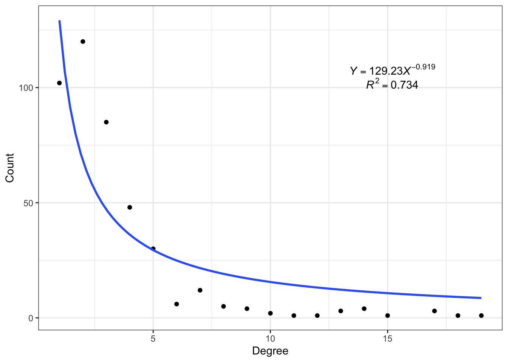
<p class="caption">(\#fig:6-power)Fit power-law distribution for a network.</p>
</div>


```r
smallworldness(co_net)
## 43.09368
```

## Modules

A community is a subgraph containing nodes which are more densely linked to each other than to the rest of the graph or equivalently, 
a graph has a community structure if the number of links into any subgraph is higher than the number of links between those subgraphs.

Use `modu_net()` to generate a n-modules network and do some modules analysis test.


```r
test_modu_net=modu_net(n_modu = 3,n_node_in_modu = 30)
plot(test_modu_net,mark_module=T)
```

<div class="figure">
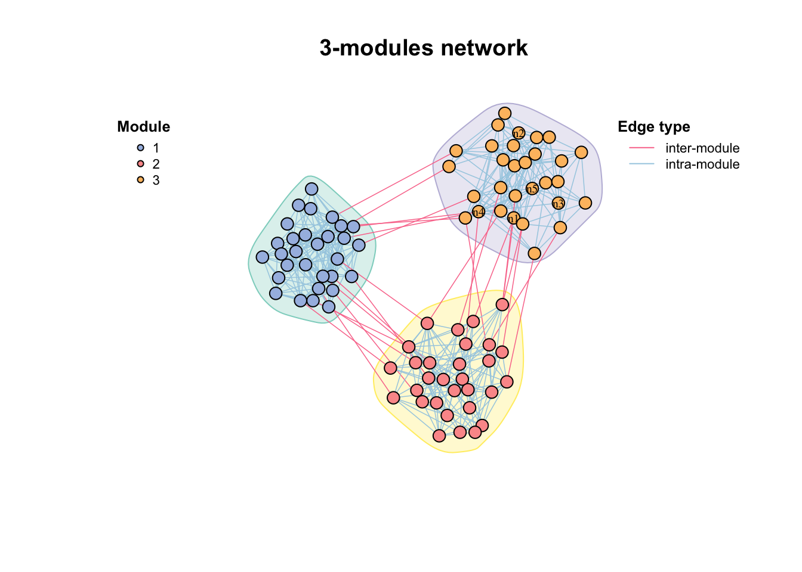
<p class="caption">(\#fig:unnamed-chunk-4)A 3-modules network generated by modu_net()</p>
</div>

### Module detection

Algorithms:

-   short random walks

-   leading eigenvector of the community matrix

-   simulated annealing approach

-   greedy modularity optimization

-   ...

You can get network modules by `modu_dect()` with various methods. 
But we sometimes just focus on several modules instead of all, 
so we can use `filter_n_modu()` to get modules which have more than n nodes, or keep some other modules by ids.


```r
par(mfrow=c(2,2),mai=rep(1,4))
#module detection
modu_dect(co_net,method = "cluster_fast_greedy") -> co_net_modu
get_v(co_net_modu)[,c("name","module")]%>%head()
#>                           name module
#> 1 s__un_f__Thermomonosporaceae      9
#> 2        s__Pelomonas_puraquae      1
#> 3     s__Rhizobacter_bergeniae      4
#> 4     s__Flavobacterium_terrae     11
#> 5         s__un_g__Rhizobacter      6
#> 6     s__un_o__Burkholderiales      1

plot(co_net_modu,plot_module=T,mark_module=T,legend_position=c(-1.8,1.6,1.1,1.3))
table(V(co_net_modu)$module)
#> 
#>  1 10 11 12 13 14 15 16 17 18 19  2 20 21 22 23 24 25 26 27 
#> 61 28 18 14 16 21 15  8  6  2  4 42  3  3  2  2  2  2  2  3 
#> 28 29  3 30  4  5  6  7  8  9 
#>  2  3 30  2 31 24 18 21 28 16

#keep some modules
co_net_modu2=filter_n_modu(co_net_modu,n_modu = 30,keep_id = 10)
plot(co_net_modu2,plot_module=T,mark_module=T,legend_position=c(-1.8,1.3,1.1,1.3))

#change group layout
g_lay_nice(co_net_modu,group = "module")->coors
plot(co_net_modu2,coors=coors,plot_module=T,mark_module=T)

#extract some modules, delete =T will delete other modules.
co_net_modu3=filter_n_modu(co_net_modu,n_modu = 30,keep_id = 10,delete = T)
plot(co_net_modu3,coors,plot_module=T)
```

<div class="figure">
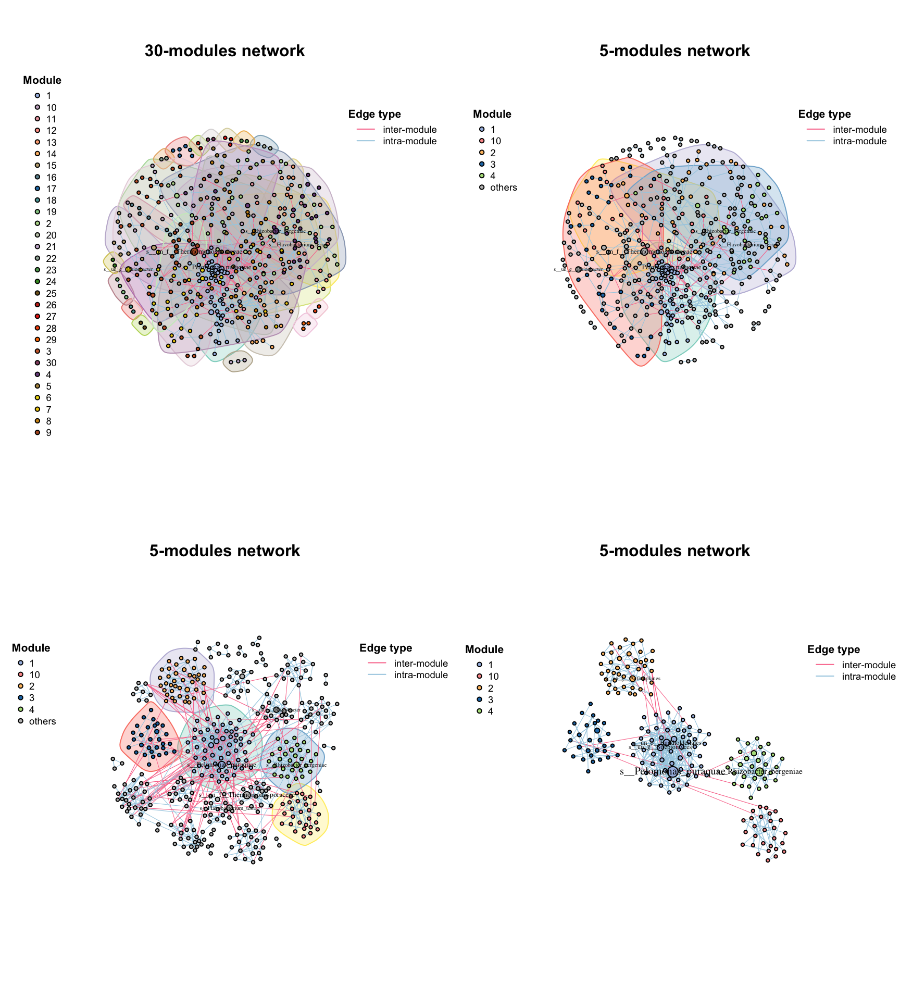
<p class="caption">(\#fig:6-modules)Module detection results by modu_dect()</p>
</div>

Look at the components of the network, some too small sub_graphs will effect the modules, 
if you do not care about these small components, you can just filter out them.

```r
table(V(co_net_modu)$components)
#> 
#>   1  10  11  12  13  14  15   2   3   4   5   6   7   8   9 
#> 391   2   3   3   2   2   2   2   6   4   2   2   3   2   3
co_net_modu4=c_net_filter(co_net_modu,components==1)

#re-do a module detection
co_net_modu4=modu_dect(co_net_modu4)
g_lay_nice(co_net_modu4,group = "module")->coors
plot(co_net_modu4,coors,plot_module=T)
```

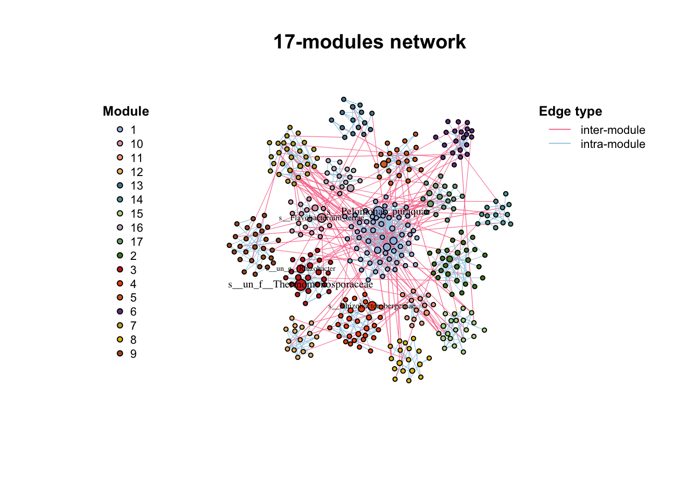

Use `plot_module_tree()` can display the relationship of nodes, and `combine_n_modu()` can change the module numbers to a 
specific number (can not be too big or too small if there are some small small sub_graphs)


```r
p1=plot_module_tree(co_net_modu4,label.size = 0.6)
#combine 17 modules to 5.
co_net_modu5=combine_n_modu(co_net_modu4,5)
p2=plot_module_tree(co_net_modu5,label.size = 0.6)
p1+p2
```

<div class="figure">
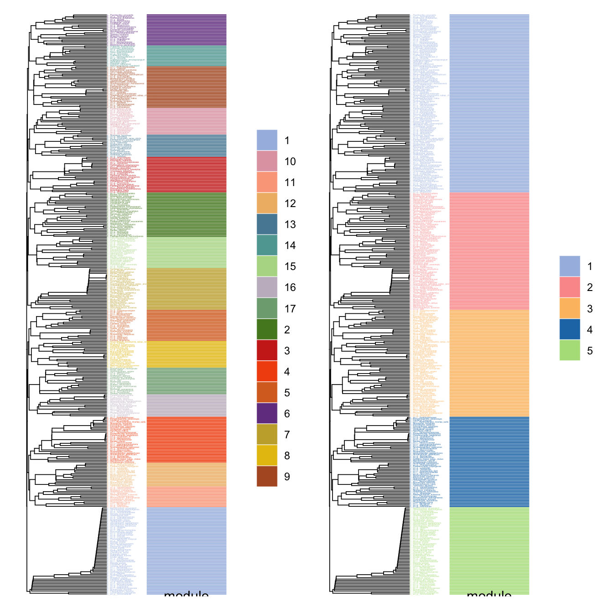
<p class="caption">(\#fig:unnamed-chunk-5)Modules tree</p>
</div>

We could also use this network module indicates some cluster which have similar expression. 
But we should filter the __positive__ edges firstly as the module detection only consider topology structure rather than the edge type. 
After filtering the __positive__ edges and module detection will find some modules like WGCNA gene modules, 
and we can also get the "eigengene" using `module_eigen()` and have a general look at each module expression by `module_expression()`.

```r
data("otutab",package = "pcutils")
totu=t(otutab)
#filter positive edges
c_net_filter(co_net,e_type=="positive",mode = "e")->co_net_pos
co_net_pos_modu=modu_dect(co_net_pos,n_modu = 10,delete = T)

g_lay_nice(co_net_pos_modu,group = "module")->coors1
plot(co_net_pos_modu,coors1,plot_module=T)
```

<div class="figure">
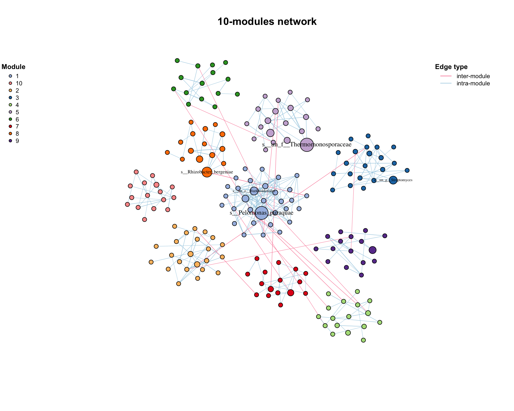
<p class="caption">(\#fig:6-modu)Filter positive modules.</p>
</div>


```r
#map the original abundance table
module_eigen(co_net_pos_modu,totu)->co_net_pos_modu

#plot the expression pattern
p1=module_expression(co_net_pos_modu,totu,cor = 0.6,facet_param = list(ncol=4),plot_eigen = T)+
  theme(axis.text.x = element_text(size=5,angle = 90,vjust = 0.5))

#correlate to metadata
env=metadata[,3:8]
p2=cor_plot(get_module_eigen(co_net_pos_modu),env)+coord_flip()

p1/p2+patchwork::plot_layout(heights = c(2,1.4))
```

<div class="figure">
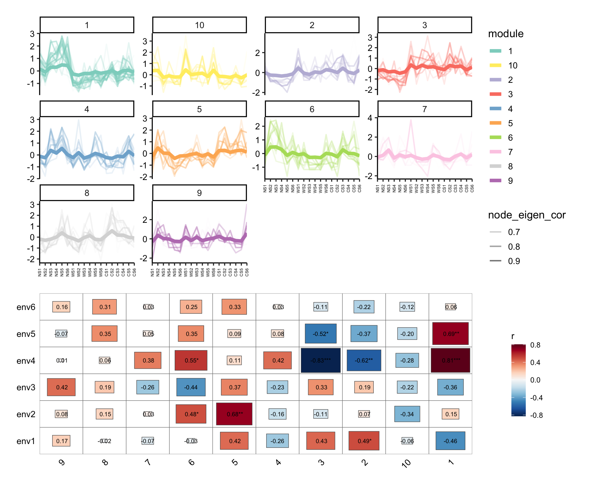
<p class="caption">(\#fig:6-modu-exp)Module eigenvalue of positive cluster.</p>
</div>


```r
#summary some variable according to modules.
p3=summ_module(co_net_pos_modu,var = "Phylum")
p4=summ_module(co_net_pos_modu,var = "node_eigen_cor")
p3+p4
```

<div class="figure">
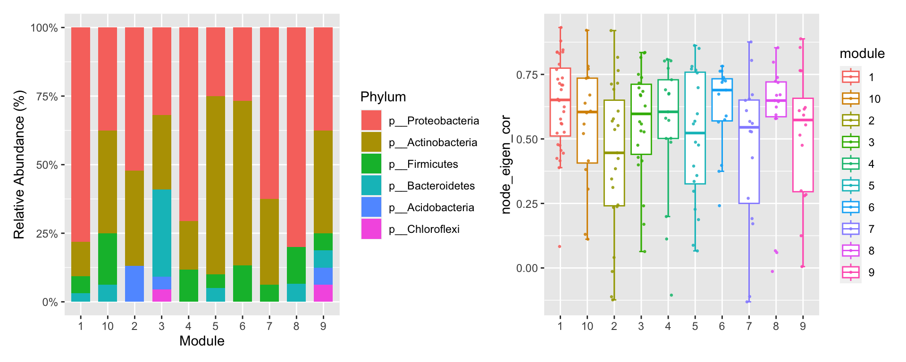
<p class="caption">(\#fig:6-modu-summ)Summary of some variables in each modules.</p>
</div>


Use `links_stat()` to summary the edges and find most edges are from a module to the same module (means module detection is OK).

```r
links_stat(co_net_modu2,group = "module",legend_number = T)
```

<div class="figure">
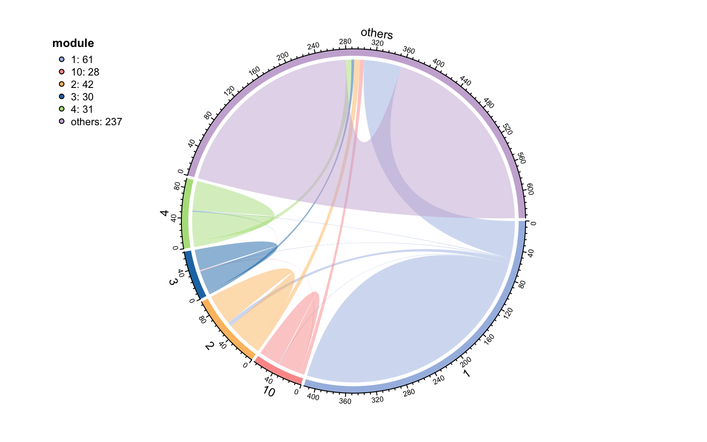
<p class="caption">(\#fig:unnamed-chunk-6)Summary of edges in each modules</p>
</div>


### Keystone

After we determine these modules of network, the topological role of each node can be calculated according to Zi-Pi @guimeraFunctionalCartographyComplex2005. Within-module connectivity (Zi):

$Z_i= \frac{\kappa_i-\overline{\kappa_si}}{\sigma_{\kappa_{si}}}$ Where $κ_i$ is the number of links of node i to other nodes in its module si, $\overline{\kappa_{si}}$ is the average of k over all the nodes in si, and $\sigma_{\kappa_{si}}$ is the standard deviation of κ in si.

Among-module connectivity (Pi):

$P_i=1-\sum_{s=1}^{N_m}{\left( {\frac{\kappa_{is}}{k_i}} \right)^2}$ where $κ_{is}$ is the number of links of node i to nodes in module s, and $k_i$ is the total degree of node i.

And researchers often divide module roles into four categories:

<table class="table" style="margin-left: auto; margin-right: auto;">
<caption>(\#tab:unnamed-chunk-7)The topological role of individual node</caption>
 <thead>
  <tr>
   <th style="text-align:left;">  </th>
   <th style="text-align:left;"> Zi
   </th>
<th style="text-align:left;"> Zi&gt;2.5 </th>
  </tr>
 </thead>
<tbody>
  <tr>
   <td style="text-align:left;font-weight: bold;border-right:1px solid;"> Pi
   </td>
<td style="text-align:left;"> peripherals </td>
   <td style="text-align:left;"> <span style="     color: red !important;">module hubs</span> </td>
  </tr>
  <tr>
   <td style="text-align:left;font-weight: bold;border-right:1px solid;"> Pi&gt;0.62 </td>
   <td style="text-align:left;"> <span style="     color: red !important;">connectors</span> </td>
   <td style="text-align:left;"> <span style="     color: red !important;">network hubs</span> </td>
  </tr>
</tbody>
</table>


And some articles define these red categories as keystone of network @liuEcologicalStabilityMicrobial2022.

Use `zp_analyse()` to get module roles and store in the vertex attributes, then we can use `zp_plot()` to visualize. 
We can see the module hubs are center of a module while connector are often mediate the connection of different modules.


```r
zp_analyse(co_net_modu4)->co_net_modu4
get_v(co_net_modu4)[,c(1,16:21)]%>%head
#>                           name components module
#> 1 s__un_f__Thermomonosporaceae          1      3
#> 2        s__Pelomonas_puraquae          1      1
#> 3     s__Rhizobacter_bergeniae          1      4
#> 4     s__Flavobacterium_terrae          1     10
#> 5         s__un_g__Rhizobacter          1      3
#> 6     s__un_o__Burkholderiales          1      1
#>   origin_module Ki         Zi        Pi
#> 1             3  3  0.4531635 0.3750000
#> 2             1 16  2.2142712 0.2770083
#> 3             4  4  1.0183901 0.5714286
#> 4            10  4  1.8439089 0.0000000
#> 5             3  1 -1.3594905 0.0000000
#> 6             1 16  2.2142712 0.2037037
#color map to roles
co_net_modu6=c_net_set(co_net_modu4,vertex_class = "roles")
plot(co_net_modu6,coors,mark_module=T,labels_num=0,group_legend_title="Roles")
```

<div class="figure">
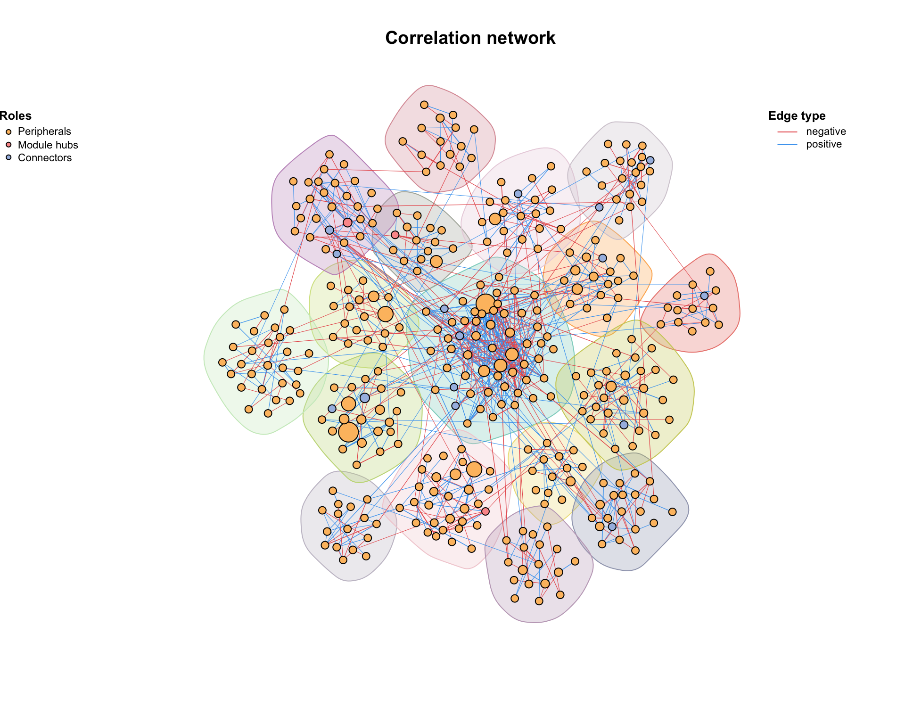
<p class="caption">(\#fig:6-zp-1)Nodes roles of a modular network.</p>
</div>


```r
library(patchwork)
zp_plot(co_net_modu4,mode = 1)+zp_plot(co_net_modu4,mode = 3)
```

<div class="figure">
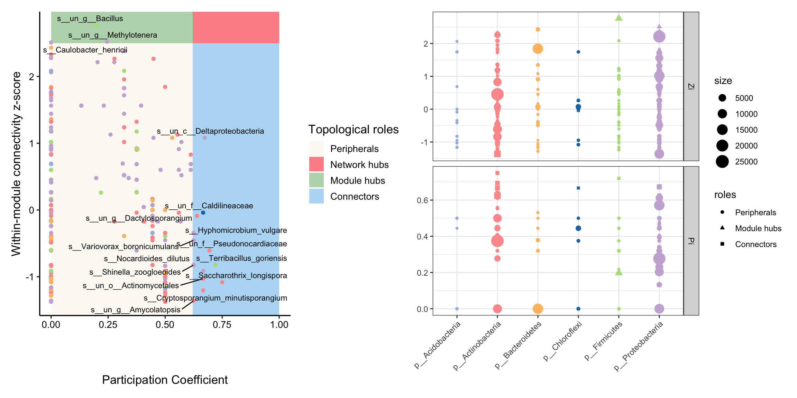
<p class="caption">(\#fig:6-zp)Zi-Pi analysis of a modular network.</p>
</div>

## Topology indexes

There are lots of topology indexes for network analysis, we collected many indexes often used for biological research. 
First part is topology indexes for **individual nodes**.

<table class="table" style="font-size: 12px; margin-left: auto; margin-right: auto;">
<caption style="font-size: initial !important;">(\#tab:unnamed-chunk-8)Topology indexes for individual nodes</caption>
 <thead>
  <tr>
   <th style="text-align:left;"> Indexes </th>
   <th style="text-align:left;"> Formula </th>
   <th style="text-align:left;"> Note </th>
   <th style="text-align:left;"> Description </th>
  </tr>
 </thead>
<tbody>
  <tr>
   <td style="text-align:left;width: 3em; font-weight: bold;border-right:1px solid;"> Connectivity/ Degree (centrality) </td>
   <td style="text-align:left;"> $k_i=\sum_{j\neq i}a_{ij}$ </td>
   <td style="text-align:left;"> 𝑎𝑖𝑗 is the connection strength between nodes i and j. when 𝑎𝑖𝑗=1, ki is the unweighted degree </td>
   <td style="text-align:left;"> It is also called node degree. It is the most commonly used concept for describing the topological property of a node in a network. </td>
  </tr>
  <tr>
   <td style="text-align:left;width: 3em; font-weight: bold;border-right:1px solid;"> Betweenness centrality </td>
   <td style="text-align:left;"> $B_i=\sum_{j,k}\frac{\sigma(i,j,k)}{\sigma(j,k)}$ </td>
   <td style="text-align:left;"> 𝜎(𝑗,𝑖,𝑘) is the number of shortest paths between nodes j and k that pass through node i. 𝜎(𝑗,𝑘) is the total number of shortest paths between j and k. </td>
   <td style="text-align:left;"> It is used to describe the ratio of paths that pass through the ith node. High Betweenness node can serve as a broker similar to stress centrality. </td>
  </tr>
  <tr>
   <td style="text-align:left;width: 3em; font-weight: bold;border-right:1px solid;"> Closeness centrality </td>
   <td style="text-align:left;"> $Ci=1/\sum_{i\neq j}d_{ij}$ </td>
   <td style="text-align:left;"> The closeness centrality of a vertex is defined as the inverse of the sum of distances to all the other vertices in the graph. dij is the shortest distances from node i to j. </td>
   <td style="text-align:left;"> Closeness centrality measures how many steps is required to access every other vertex from a given vertex. </td>
  </tr>
  <tr>
   <td style="text-align:left;width: 3em; font-weight: bold;border-right:1px solid;"> Eigenvector centrality </td>
   <td style="text-align:left;"> $EC_i=\frac{1}{\lambda}\sum_{j\in M(i)}EC_j$ </td>
   <td style="text-align:left;"> M(𝑖) is the set of nodes that are connected to the ith node and λ is a constant eigenvalue. </td>
   <td style="text-align:left;"> It is used to describe the degree of a central node that it is connected to other central nodes. </td>
  </tr>
  <tr>
   <td style="text-align:left;width: 3em; font-weight: bold;border-right:1px solid;"> Clustering coefficient </td>
   <td style="text-align:left;"> $CCo_i=\frac{2l_i}{k_i'(k_i'-1)}$ </td>
   <td style="text-align:left;"> li is the number of links between neighbors of node i and k i ’ is the number of neighbors of node i. </td>
   <td style="text-align:left;"> It describe how well a node is connected with its neighbors. If it is fully connected to its neighbors, the clustering coefficient is 1. A value close to 0 means that there are hardly any connections with its neighbors. It was used to describe hierarchical properties of networks. </td>
  </tr>
  <tr>
   <td style="text-align:left;width: 3em; font-weight: bold;border-right:1px solid;"> Eccentricity </td>
   <td style="text-align:left;"> $E_i=\max_{j\neq i}(d_{ij})$ </td>
   <td style="text-align:left;"> dij is the shortest distance from node i to node j </td>
   <td style="text-align:left;"> The eccentricity of a vertex is its shortest path distance from the farthest other node in the graph. </td>
  </tr>
  <tr>
   <td style="text-align:left;width: 3em; font-weight: bold;border-right:1px solid;"> Page.rank </td>
   <td style="text-align:left;"> $PR_i=\sum_{j\in B_i}\frac{PR_j}{l_j}$ </td>
   <td style="text-align:left;"> i is the node whose pr value needs to be calculated, and Bi is the set of all nodes pointing to node i. PRj is the pr value of node j and lj is the number of links between neighbors of node j. </td>
   <td style="text-align:left;"> Calculates the Google PageRank for the specified vertices. PageRank, or webpage ranking, also known as webpage level, is an indicator to measure the importance of webpages. </td>
  </tr>
  <tr>
   <td style="text-align:left;width: 3em; font-weight: bold;border-right:1px solid;"> Kleinberg's hub and authority centrality </td>
   <td style="text-align:left;"> $HC=\lambda_{AA^T}$ $AC=\lambda_{A^TA}$ </td>
   <td style="text-align:left;"> The hub scores of the vertices are defined as the principal eigenvector of AAT, the authority scores of the vertices are defined as the principal eigenvector of ATA. where A is the adjacency matrix of the graph. </td>
   <td style="text-align:left;"> A node is an authority if it is linked to by hubs; it is a hub if it links to authorities. </td>
  </tr>
</tbody>
</table>


Second part is **the overall network topological indexes**.

<table class="table" style="font-size: 12px; margin-left: auto; margin-right: auto;">
<caption style="font-size: initial !important;">(\#tab:unnamed-chunk-9)The overall network topological indexes</caption>
 <thead>
  <tr>
   <th style="text-align:left;"> Indexes </th>
   <th style="text-align:left;"> Formula </th>
   <th style="text-align:left;"> Note </th>
   <th style="text-align:left;"> Description </th>
  </tr>
 </thead>
<tbody>
  <tr>
   <td style="text-align:left;width: 3em; font-weight: bold;border-right:1px solid;"> Average connectivity/ degree </td>
   <td style="text-align:left;"> $\overline{k}=\frac{\sum_{i=1}^{n}k_i}{n}$ </td>
   <td style="text-align:left;"> k i is degree of node i and n is the number of nodes. </td>
   <td style="text-align:left;"> Higher avgK means a more complex network. </td>
  </tr>
  <tr>
   <td style="text-align:left;width: 3em; font-weight: bold;border-right:1px solid;"> Average path length/ Average geodesic distance </td>
   <td style="text-align:left;"> $L=\frac{\sum_{i \ne j}d_{ij}}{n(n-1)}$ </td>
   <td style="text-align:left;"> dij is the shortest path between node i and j. </td>
   <td style="text-align:left;"> A smaller GD means all the nodes in the network are closer. </td>
  </tr>
  <tr>
   <td style="text-align:left;width: 3em; font-weight: bold;border-right:1px solid;"> global efficiency/ Geodesic efficiency </td>
   <td style="text-align:left;"> $E_g=\frac{\sum_{i \ne j}1/d_{ij}}{n(n-1)}$ </td>
   <td style="text-align:left;"> all parameters shown above. </td>
   <td style="text-align:left;"> It is the opposite of GD. A higher E means that the nodes are closer. </td>
  </tr>
  <tr>
   <td style="text-align:left;width: 3em; font-weight: bold;border-right:1px solid;"> Centralization of degree </td>
   <td style="text-align:left;"> $CD=\sum_{i=1}^{n}(\max(k)-k_i)$ </td>
   <td style="text-align:left;"> max(k) is the maximal value of all connectivity values and k i represents the connectivity of ith node. Finally this value is normalized by the theoretical maximum centralization score. </td>
   <td style="text-align:left;"> It is close to 1 for a network with star topology and in contrast close to 0 for a network where each node has the same connectivity. </td>
  </tr>
  <tr>
   <td style="text-align:left;width: 3em; font-weight: bold;border-right:1px solid;"> Centralization of betweenness </td>
   <td style="text-align:left;"> $CB=\sum_{i=1}^{n}(\max(B)-B_i)$ </td>
   <td style="text-align:left;"> max(B) is the maximal value of all betweenness values and B i represents the betweenness of ith node. Finally this value is normalized by the theoretical maximum centralization score. </td>
   <td style="text-align:left;"> It is close to 0 for a network where each node has the same betweenness, and the bigger the more difference among all betweenness values. </td>
  </tr>
  <tr>
   <td style="text-align:left;width: 3em; font-weight: bold;border-right:1px solid;"> Centralization of closeness </td>
   <td style="text-align:left;"> $CC=\sum_{i=1}^{n}(\max(C)-C_i)$ </td>
   <td style="text-align:left;"> max(C) is the maximal value of all closeness values and Ci represents the closeness of ith node. Finally this value is normalized by the theoretical maximum centralization score. </td>
   <td style="text-align:left;"> It is close to 0 for a network where each node has the same closeness, and the bigger the more difference among all closeness values. </td>
  </tr>
  <tr>
   <td style="text-align:left;width: 3em; font-weight: bold;border-right:1px solid;"> Centralization of eigenvector centrality </td>
   <td style="text-align:left;"> $CE=\sum_{i=1}^{n}(\max(EC)-EC_i)$ </td>
   <td style="text-align:left;"> max(EC) is the maximal value of all eigenvector centrality values and EC i represents the eigenvector centrality of ith node. Finally this value is normalized by the theoretical maximum centralization score. </td>
   <td style="text-align:left;"> It is close to 0 for a network where each node has the same eigenvector centrality, and the bigger the more difference among all eigenvector centrality values. </td>
  </tr>
  <tr>
   <td style="text-align:left;width: 3em; font-weight: bold;border-right:1px solid;"> Density </td>
   <td style="text-align:left;"> $D=\frac{2l}{n(n-1)}$ </td>
   <td style="text-align:left;"> l is the sum of total links. </td>
   <td style="text-align:left;"> The density of a graph is the ratio of the number of edges and the number of possible edges. It is closely related to the average connectivity. </td>
  </tr>
  <tr>
   <td style="text-align:left;width: 3em; font-weight: bold;border-right:1px solid;"> Average clustering coefficient </td>
   <td style="text-align:left;"> $\overline{CCo}=\frac{\sum_{i=1}^{n}CCo_i}{n}$ </td>
   <td style="text-align:left;"> 𝐶𝐶oi is the clustering coefficient of node i. </td>
   <td style="text-align:left;"> It is used to measure the extent of module structure present in a network. </td>
  </tr>
  <tr>
   <td style="text-align:left;width: 3em; font-weight: bold;border-right:1px solid;"> Transitivity </td>
   <td style="text-align:left;"> $Tr=\frac{\sum_{i=1}^{n}2l_i}{\sum_{i=1}^{n}(k'_i)(k'_i-1)}$ </td>
   <td style="text-align:left;"> li is the number of links between neighbors of node i and k i ’ is the number of neighbors of node i. </td>
   <td style="text-align:left;"> Sometimes it is also called the entire clustering coefficient. It has been shown to be a key structural property in social networks. </td>
  </tr>
  <tr>
   <td style="text-align:left;width: 3em; font-weight: bold;border-right:1px solid;"> Natural connectivity </td>
   <td style="text-align:left;"> $NC=\ln{\left(\frac{1}{N}\sum_{i=1}^{N}e^{\lambda_i}\right)}$ </td>
   <td style="text-align:left;"> Where N is nodes number of the network,  represents the eigenvalue of the network adjacency matrix. </td>
   <td style="text-align:left;">  </td>
  </tr>
</tbody>
</table>


Edges topology indexes are less.

We can get all these indexes easily by using `net_par()`. 
you can choose different mode (n,v,e) to get network, vertexes or edges indexes especially or just use "all" to get a list contains all indexes.


```r
make_graph("Walther") %>% net_par(mode = "all")
```


```r
make_graph("Walther") %>% net_par(mode = "n")
#> $n_index
#>      name num_nodes num_edges edge_density neg_percent
#> 1 Walther        25        31    0.1033333          NA
#>   ave_path_len global_efficiency ave_degree w_ave_degree
#> 1     3.586667         0.3679762       2.48         2.48
#>   diameter clusteringC cen_betweenness nat_connectivity
#> 1        8           0       0.1436084         1.029526
#> 
#> $v_index
#> NULL
#> 
#> $e_index
#> NULL
```

Or you can use `c_net_index()` to calculate topology indexes and store in the network itself, which is very useful if you need to do following visualization.


```r
#get a metanet
go=erdos.renyi.game(30,0.25)
go=c_net_update(go)
par(mfrow=c(1,2))
plot(go,legend=F,main="Same size")

#calculate topology indexes and store
go=c_net_index(go)
head(get_v(go))
#>   name label size  v_group  shape  v_class   color degree
#> 1   n1    n1   12 v_group1 circle v_class1 #a6bce3     12
#> 2   n2    n2   12 v_group1 circle v_class1 #a6bce3     10
#> 3   n3    n3   12 v_group1 circle v_class1 #a6bce3     10
#> 4   n4    n4   12 v_group1 circle v_class1 #a6bce3      5
#> 5   n5    n5   12 v_group1 circle v_class1 #a6bce3      8
#> 6   n6    n6   12 v_group1 circle v_class1 #a6bce3      5
#>   clusteringC betweenness eccentricity  closeness hub_score
#> 1   0.1818182   40.144078            2 0.02173913 1.0000000
#> 2   0.2444444   22.337912            3 0.02040816 0.8552635
#> 3   0.2444444   18.686765            3 0.02000000 0.9073534
#> 4   0.2000000    3.986948            3 0.01724138 0.4107643
#> 5   0.2857143   11.058859            3 0.01960784 0.7733400
#> 6   0.3000000    2.625397            3 0.01694915 0.5020124

#use vertex.size to indicate degree
go=c_net_set(go,vertex_size ="degree")
plot(go,legend=F,main="Size map to degree")
```

<div class="figure">
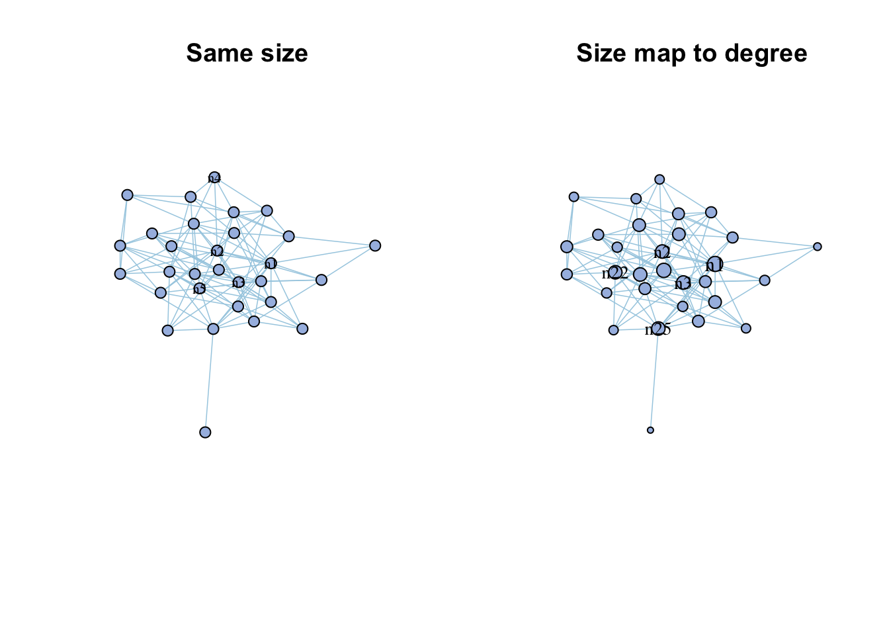
<p class="caption">(\#fig:6-degreep)Use vertex indexes for visualization.</p>
</div>

## Random network

You can use `rand_net()` to generate a random graphs according to the Erdos-Renyi model with same node number and edge number of your network, then compare two network.


```r
rand_net(co_net)->random_net
```

<div class="figure">
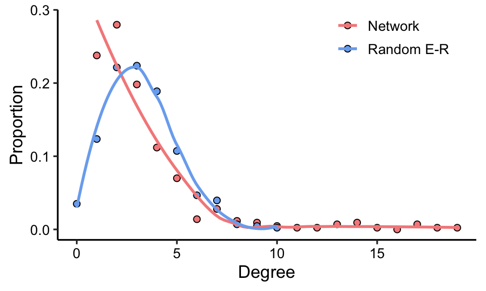
<p class="caption">(\#fig:rand)Comparison of complex network and random network degree distribution</p>
</div>

Or use `rand_net_par()` to generate lots of random network and summary their topology indexes, then use `compare_rand()` to do the comparison.


```r
rand_net_par(co_net,reps = 30)->randp
net_par(co_net)->pars
compare_rand(pars,randp,index =c("ave_path_len","clusteringC"))
```

<div class="figure">
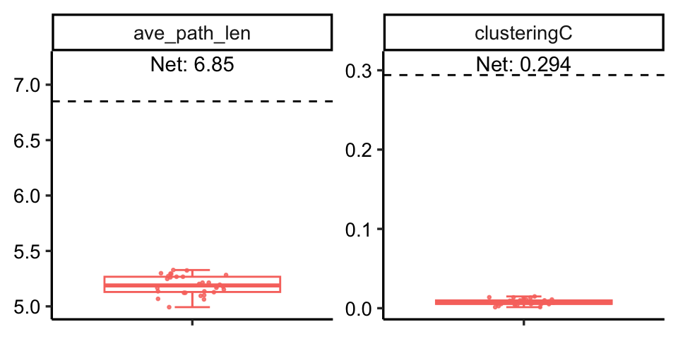
<p class="caption">(\#fig:unnamed-chunk-12)Comparison of complex network and random network on some indexes.</p>
</div>
