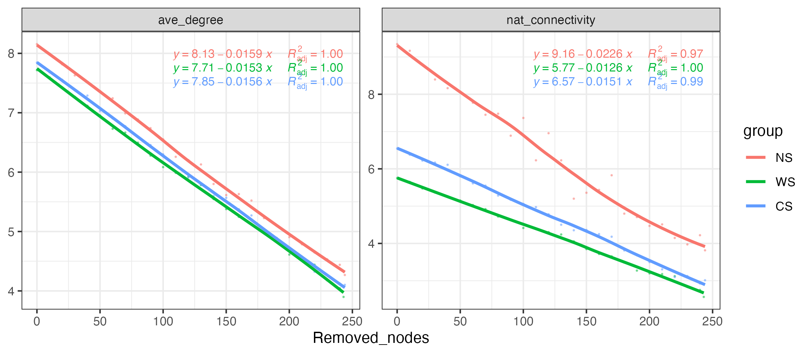
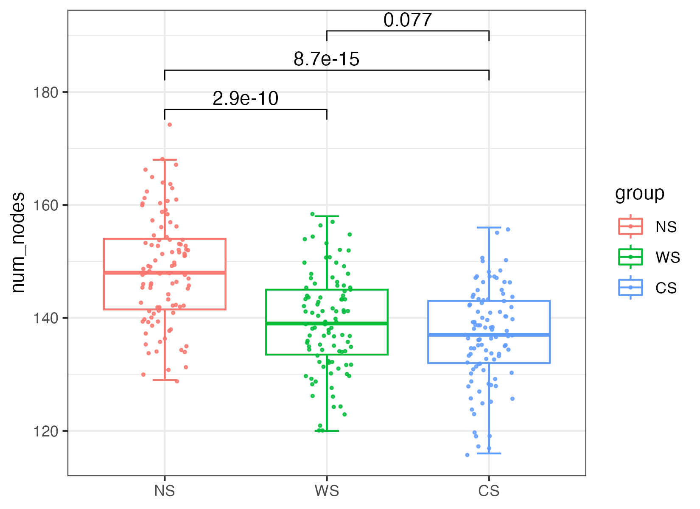
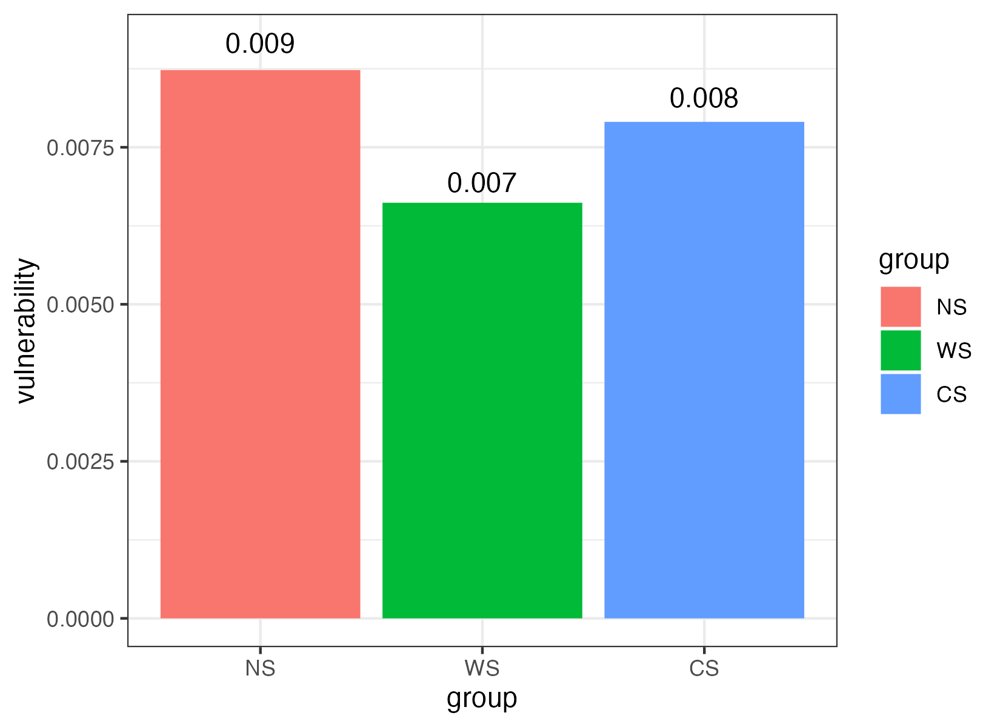
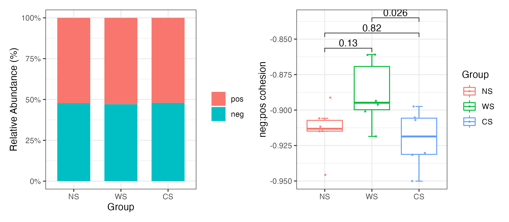

# Stability
It is very important to compare networks stability based on different groups. 
So MetaNet collects lots of methods to reflect the stability and complexity, 
these algorithms are coded using Parallel Computing which can be much faster.


```r
data("otutab",package = "pcutils")

#extract three-group sub-nets
hebing(otutab,metadata$Group)->otutab_G
sub_net_par=extract_sub_net(co_net,otutab_G,save_net = "Group_subnet")
sub_nets=readRDS("Group_subnet.RDS")

names(sub_nets)
```

Or construct a network for each group specifically:

```r
data("otutab",package = "pcutils")
totu=t(otutab)
#check all rows matched
all(rownames(totu)==rownames(metadata))

rmt=FALSE
sub_nets=lapply(levels(metadata$Group), \(i){
  totu[rownames(filter(metadata,Group==!!i)),]->t_tmp
  t_tmp[,colSums(t_tmp)>0]->t_tmp
  c_net_cal(t_tmp)->c_tmp
  if(rmt){
    RMT_threshold(c_tmp,quite = T)->tmp_rmt
    r_thres=tmp_rmt$r_threshold
  }
  else r_thres=0.6
  c_net_build(c_tmp,r_thres = r_thres,p_thres = 0.01,del_single = T)->n_tmp
  Abundance_df=data.frame("Abundance"=colSums(t_tmp))
  c_net_set(n_tmp,Abundance_df,taxonomy%>%select("Phylum"),vertex_class = "Phylum",vertex_size = "Abundance")
})

names(sub_nets)=levels(metadata$Group)
```

All calculation for network stability provide parallel version, use `parallel::detectCores()` 
to get you device cores and set `threads >1` to use parallel calculation.

## Robust test

Robust test of networks were done with natural connectivity as it can reflect the stability of networks @wujunNaturalConnectivityComplex2010. 
Specifically, natural connectivity was calculated after removing the nodes (remove five nodes from a network at one time until 70% of nodes disappear), 
and the downtrend level of natural connectivity indicated the connectivity performance of the network after being damaged to a certain extent.

```r
#recommend reps bigger than 99, you can set `threads >1` to use parallel calculation.
robust_test(sub_nets, partial = 0.5,step=10,reps=9,threads=1)->robust_res
plot(robust_res,mode = 2)
```

<div class="figure">

<p class="caption">(\#fig:unnamed-chunk-2)Robust test result.</p>
</div>


## Community stability
Community stability can be characterized by various indexes, such as __robustness__, __vulnerability__ and __cohesion__. 
Networks with higher robustness and lower vulnerability tend to be more stable @yuanClimateWarmingEnhances2021. 
Also, community stability is commonly associated with negative interactions, 
and high percentage of negative correlations within communities is essential for maintaining a stable ecological system.

### Robustness
The robustness was regarded as when 50% of nodes were randomly removed and results were based on repetitions of the simulation. 

```r
#recommend reps bigger than 99, you can set `threads >1` to use parallel calculation.
robustness(sub_nets,keystone=F,reps=99,threads=1)->robustness_res
plot(robustness_res,p_value2=T)
```

<div class="figure">

<p class="caption">(\#fig:unnamed-chunk-3)Robustness simulation result.</p>
</div>

### Vulnerability
To evaluate the speed of disturbance spreading within a network, 
the global efficiency was regarded as the average of the efficiency over all pairs of nodes, 
which was calculated by the number of edges in the shortest path between paired nodes. 
The vulnerability, which reflected the relative contribution of each node to the globe efficiency, 
was represented by the maximal vulnerability of nodes in the network.

```r
#You can set `threads >1` to use parallel calculation.
vulnerability_res=vulnerability(sub_nets,threads = 1)
plot(vulnerability_res)
```

<div class="figure">

<p class="caption">(\#fig:unnamed-chunk-4)Vulnerability calculate result.</p>
</div>

### Cohesion
Cohesion was calculated to quantify the connectivity of microbial communities in each group. 
Cohesion contains both positive and negative cohesion values, 
which indicate that associations between taxa attributed to positive and negative species interactions 
as well as similarities and differences in niches of microbial taxa. 

Briefly, pairwise Pearson correlation matrix across taxa was calculated based on abundance-weighted matrix. 
After "taxa shuffle" null module-correcting with 200 simulations, 
average positive and negative correlations was calculated to get a connectedness matrix. 
Finally, positive and negative cohesions were calculated for each sample respectively by 
multiplying the abundance-weighted matrix and connectedness matrix. 
The absolute value of negative: positive cohesion is an important index for community stability.

$cohesion=\sum_{i=1}^{m}{{\rm abundance}_i\times connectness}_i$


```r
#recommend reps bigger than 199, you can set `threads >1` to use parallel calculation.
Cohesion(otutab,reps = 9,threads = 1)->cohesion_res
p1=plot(cohesion_res,group = "Group",metadata,mode = 1)+theme_bw()
p2=plot(cohesion_res,group = "Group",metadata,mode = 2)
p1+p2
```

<div class="figure">

<p class="caption">(\#fig:unnamed-chunk-5)Cohesion result.</p>
</div>
