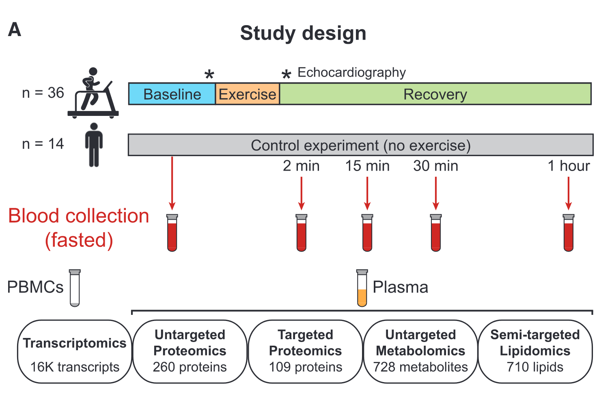

# Multi-omics {#Multi-omics}
## Case study
In-depth multi-omic profiling was performed on each sample including plasma proteomics (targeted and untargeted), 
metabolomics (untargeted), lipidomics (semi-targeted), and gene expression (transcriptomics) from peripheral blood mononuclear cells (PBMCs) @contrepoisMolecularChoreographyAcute2020.

<div class="figure">

<p class="caption">(\#fig:cell-study)Overview of the study design including an acute bout of exercise</p>
</div>


```r
list.files("../exercise/",pattern ="*.csv" )
Lipidomics=read.csv("../exercise/Lipidomics.csv",check.names = F,row.names = 1)
Metabolomics=read.csv("../exercise/Metabolomics.csv",check.names = F,row.names = 1)
Proteomics=read.csv("../exercise/Proteomics.csv",check.names = F,row.names = 1)
Targ.proteomics=read.csv("../exercise/Targ.proteomics.csv",check.names = F,row.names = 1)
#a little big
#Transcriptomics=read.csv("../exercise/Transcriptomics_VST_excl_3participants.csv",check.names = F,row.names = 1)
all_omics=list(Lipidomics=Lipidomics,Metabolomics=Metabolomics,Proteomics=Proteomics,Targ.proteomics=Targ.proteomics)
all_omics=lapply(all_omics,\(i){i[,unique(colnames(i))]})
all_omics=lapply(all_omics,\(i){i[is.na(i)]=0;i})
#all_omics=lapply(all_omics, trans,method = "hellinger",margin=1)

lapply(all_omics,rownames)%>%venn()

multi_net=multi_net_build(all_omics,method = "spearman",p.adjust.method="fdr",
                          r_thres = 0.7, p_thres = 0.05)

c_net_lay(multi_net)->coors
plot(multi_net,coors,legend_number=T)
fit_power(multi_net)
net_par(multi_net,"n")

g_lay_polygon(multi_net)->g_coors
plot(multi_net,g_coors,legend_number=T,vertex.size=2)

c_net_save(multi_net,"multi_net",format = "graphml")
#use gephi to adjust
gephi=input_gephi("multi_net_gephi.graphml")

plot(multi_net,gephi$coors,vertex.size=2,legend_number=T)
```


```r
metatbl=readxl::read_xlsx("../exercise/1-s2.0-S0092867420305080-mmc1.xlsx",sheet = "meta")
anno=readxl::read_xlsx("../exercise/1-s2.0-S0092867420305080-mmc1.xlsx",sheet = "anno")

```

