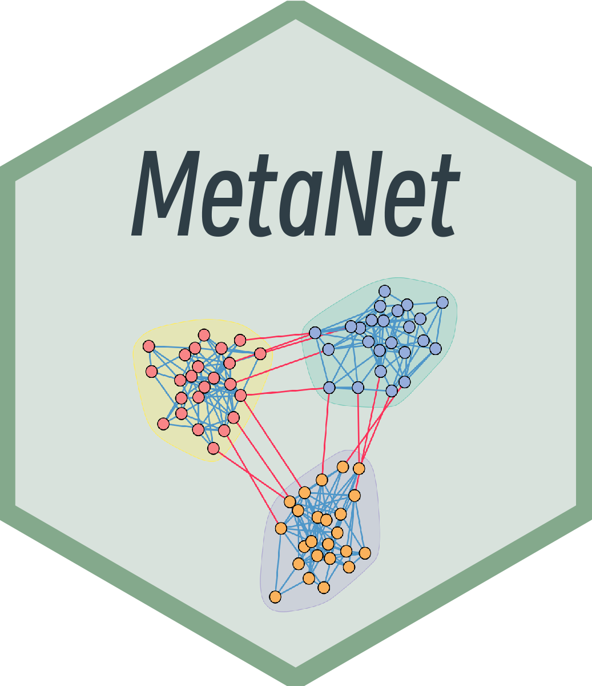

--- 
title: "MetaNet Tutorial"
author: "Peng Chen"
date: "2023-06-27"
site: bookdown::bookdown_site
documentclass: book
bibliography: [network.bib, packages.bib]
# url: https://github.com/Asa12138/MetaNet_tutorial
cover-image: images/hexSticker1.png
description: |
  This is a tutorial for the network analysis R package `MetaNet`.
biblio-style: apalike
csl: science.csl
link-citations: yes
colorlinks: yes
graphics: yes
---

# Welcome {-}

<a href="http://amzn.to/2tZkmxG"></a>

## Install {-}

MetaNet is a comprehensive network analysis package, especially in various biological omics.

The latest development version can be found in <https://github.com/Asa12138/MetaNet>.

For data manipulation, we recommend to use `dplyr`. Some functions of `MetaNet` are dependent with `pcutils`, so you also need to install.


```r
remotes::install_github('Asa12138/pcutils')
remotes::install_github('Asa12138/MetaNet',dependencies=T)
```


```r
library(MetaNet)
library(igraph)

#========data manipulation
library(dplyr)
library(pcutils)
```


```r
sessionInfo()
#> R version 4.2.2 (2022-10-31)
#> Platform: aarch64-apple-darwin20 (64-bit)
#> Running under: macOS Ventura 13.0.1
#> 
#> Matrix products: default
#> BLAS:   /Library/Frameworks/R.framework/Versions/4.2-arm64/Resources/lib/libRblas.0.dylib
#> LAPACK: /Library/Frameworks/R.framework/Versions/4.2-arm64/Resources/lib/libRlapack.dylib
#> 
#> locale:
#> [1] en_US.UTF-8/en_US.UTF-8/en_US.UTF-8/C/en_US.UTF-8/en_US.UTF-8
#> 
#> attached base packages:
#> [1] stats     graphics  grDevices utils     datasets 
#> [6] methods   base     
#> 
#> other attached packages:
#> [1] pcutils_0.1.1 dplyr_1.1.2   igraph_1.3.5  MetaNet_0.1.0
#> 
#> loaded via a namespace (and not attached):
#>  [1] Rcpp_1.0.10      plyr_1.8.8       bslib_0.4.2     
#>  [4] compiler_4.2.2   pillar_1.9.0     jquerylib_0.1.4 
#>  [7] tools_4.2.2      digest_0.6.31    downlit_0.4.2   
#> [10] jsonlite_1.8.4   evaluate_0.19    memoise_2.0.1   
#> [13] lifecycle_1.0.3  tibble_3.2.1     gtable_0.3.3    
#> [16] pkgconfig_2.0.3  rlang_1.1.1      cli_3.6.1       
#> [19] rstudioapi_0.14  yaml_2.3.6       xfun_0.36       
#> [22] fastmap_1.1.0    stringr_1.5.0    withr_2.5.0     
#> [25] xml2_1.3.3       knitr_1.42.3     generics_0.1.3  
#> [28] fs_1.5.2         sass_0.4.4       vctrs_0.6.2     
#> [31] tidyselect_1.2.0 grid_4.2.2       glue_1.6.2      
#> [34] R6_2.5.1         fansi_1.0.4      rmarkdown_2.19  
#> [37] bookdown_0.32    reshape2_1.4.4   ggplot2_3.4.2   
#> [40] magrittr_2.0.3   scales_1.2.1     htmltools_0.5.4 
#> [43] colorspace_2.1-0 utf8_1.2.3       stringi_1.7.8   
#> [46] munsell_0.5.0    cachem_1.0.6
```

## Citation {-}

Please cite:

Chen P (2023). *MetaNet: Network analysis for multi-omics*. R package, <https://github.com/Asa12138/MetaNet>.


