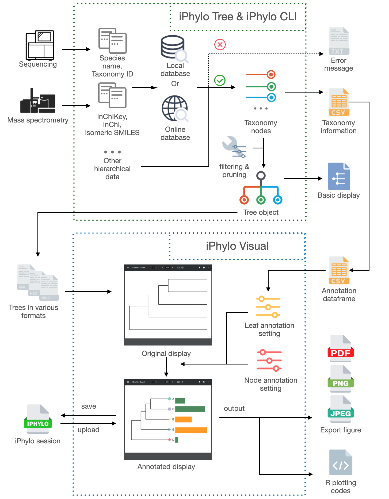

# Introduction

Accurate and rapid taxonomic classifications are essential for systematically exploring organisms and metabolites in diverse environments. Many tools have been developed for biological taxonomic trees, but limitations apply, and a streamlined method for constructing chemical taxonomic trees is lacking. 

We present the iPhylo suite: a fully automated and interactive platform for biological and chemical taxonomic analysis. The iPhylo suite includes three modules. Two web-based modules, iPhylo Tree and iPhylo Visual, aim to streamline the workflow, encompassing tree generation, interactive tree visualization, and extensive graphic and textual annotations. A stand-alone module, iPhylo CLI, was designed for local use and high-performance computing applications and equipped with up-to-date biological and chemical taxonomic databases.

