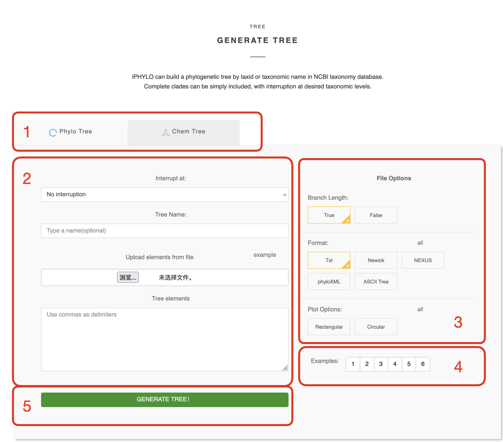
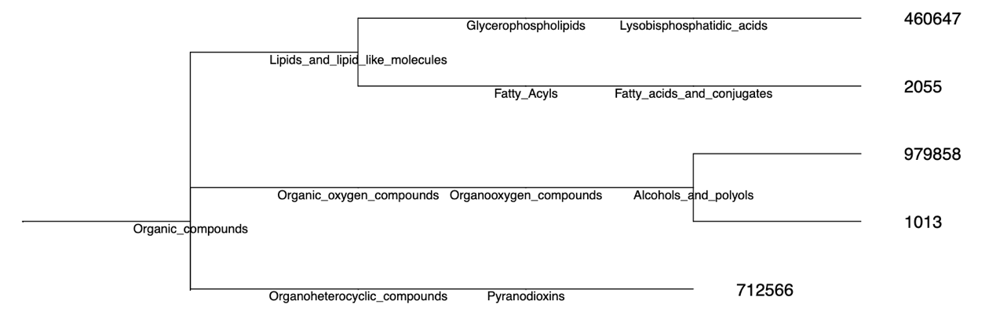

# (PART) iPhylo Tree {-}

# iPhylo Tree

iPhylo Tree is an online web application that rapidly generates biological or chemical taxonomic trees for up to tens of thousands of organisms and chemicals within minutes. iPhylo Tree can be accessed via <https://www.iphylo.net/tree>, or though the **Tree** button on the iPhylo homepage welcome image or navigation bar.


## Working on the Tree page



You can easily build your tree on through the form on the tree page.\

1.  **Select the tree type:** Switch between the `Phylo Tree` and `Chem Tree` tabs to choose whether you want to generate a phylogenetic tree or a chemical classification tree.\

2.  **Specify your tree:** Though this section, you can set the tree content and name.

-   **Interrupt at:** Choose a level to interrupt your tree. See [interrupt](#interrupt)

-   **Tree Name:** Specify a name for your tree, and the output file will be named accordingly.

-   **Upload elements from file:** Arrange your tree elements (taxa or chemicals) in a `.txt` file to upload. This is useful when you need to upload many elements.

-   **Tree elements:** You can also type the tree elements in this box. **If you both upload the file and enter this box, we will generate a tree based on the contents of the file.**

3.  **File Options:** Specify the options for the output with this section.

-   **Branch Length:** Choose whether the generated tree contains branch lengths. See [branch length](#branch_length).

-   **Format:** Opt to download the result tree in NEXUS, Newick or phyloXML formats. The TXT format is mandatory for download. You can alse choose ASCII Tree to get an ASCII representation of the tree structure. See [output](#output).

-   **Plot Options:** PDF visualization of the tree structure. See [output](#output).

4.  **Examples:** We have provided 6 examples for biological and chemical trees respectively, which are just a click away to try. Corresponding descriptions are provided below each example input.

5.  **Generate Tree:** Click this button to submit this form.

## Classification Systems

### Phylo Tree

**Phylo Tree** module builds biological taxonomic trees utilizing the **NCBI Taxonomy**. This system enables rapid retrieval of lineage information across all domains of life. The **Phylo Tree** classification uses data recorded in the NCBI Taxonomy database, including `TaxID`, `scientific name`, `common name`, and `synonyms`. It currently encompasses a total of 2,388,300 TaxIDs.

For more information, please refer to the official link:\
[NCBI taxonomy database](https://www.ncbi.nlm.nih.gov/Taxonomy/taxonomyhome.html/index.cgi?chapter=howcite)

### Chemical Tree

To meet diverse classification needs, we utilize two compound classification systems, **ChemOnt** and **NPClassifier**, for chemical taxonomies. Our database includes approximately 800,000 chemical compounds with information on IUPC names, InChiKey, InChI, isomeric SMILES, and taxonomy details.

**ChemOnt** classifies a large number of chemicals based on their structural features. It uses chemical structures and structural features to automatically assign all known chemical compounds into a taxonomy comprising more than 4,800 different categories.

**NPClassifier** uses machine learning models to classify natural products beyond simple chemical substructures. This system incorporates factors such as the producing organism, biosynthetic pathways, and their biological properties.

For more information, please consult the official publications:

[ChemOnt](https://jcheminf.biomedcentral.com/articles/10.1186/s13321-016-0174-y#citeas)

[NPClassifier](https://pubs.acs.org/doi/10.1021/acs.jnatprod.1c00399)

# Tree Object

## Taxonomic level

**Biological:** iPhylo trees show the taxonomic structure in 8 main taxonomic ranks: **Domain, Kingdom, Phylum, Class, Order, Family, Genus, Species** level of NCBI taxonomy database.\

If the node entered is outside of these ranks, e.g. subfamily, iPhylo will keep your node and provide the parent main rank above this rank.

**Chemical:** iPhylo creates chemical taxonomic trees according to the classification methodology [ChemOnt](https://jcheminf.biomedcentral.com/articles/10.1186/s13321-016-0174-y).\

The resulting chemical classification tree is organized around chemical taxonomy, starting from the highest level and descending to the lowest level: **Kingdom, SuperClass, Class, SubClass, Parent Level 1, and Parent Level 2**. The last two categories represent two taxonomic levels directly below SubClass.\

## Branch length {#branch_length}

iPhylo tree don't contain branch length information or support value, however you can set all branch length to 1.00000 for visual clarity and subsequent analysis in external software.

## Nodes

All nodes in the biological tree are labeled with scientific names.


The leaf nodes (the last node of each branch) of the chemical tree are labeled with ids, and the other internal nodes are labeled with compound category names, like "Glycerolipids". Don't worry about figuring out which compounds the ids correspond to, we'll provide a table of correspondences.



<div style="border: 1px solid #ddd; padding: 0px; overflow-y: scroll; height:800px; overflow-x: scroll; width:100%; "><table class="table" style="font-size: 13px; margin-left: auto; margin-right: auto;">
 <thead>
  <tr>
   <th style="text-align:right;position: sticky; top:0; background-color: #FFFFFF;"> id </th>
   <th style="text-align:left;position: sticky; top:0; background-color: #FFFFFF;"> name </th>
   <th style="text-align:left;position: sticky; top:0; background-color: #FFFFFF;"> inchi </th>
   <th style="text-align:left;position: sticky; top:0; background-color: #FFFFFF;"> inchikey </th>
   <th style="text-align:left;position: sticky; top:0; background-color: #FFFFFF;"> inchikey_Planar </th>
   <th style="text-align:left;position: sticky; top:0; background-color: #FFFFFF;"> SMILES </th>
   <th style="text-align:left;position: sticky; top:0; background-color: #FFFFFF;"> kingdom </th>
   <th style="text-align:left;position: sticky; top:0; background-color: #FFFFFF;"> superclass </th>
   <th style="text-align:left;position: sticky; top:0; background-color: #FFFFFF;"> class </th>
   <th style="text-align:left;position: sticky; top:0; background-color: #FFFFFF;"> subclass </th>
   <th style="text-align:left;position: sticky; top:0; background-color: #FFFFFF;"> parent_level_1 </th>
   <th style="text-align:left;position: sticky; top:0; background-color: #FFFFFF;"> parent_level_2 </th>
  </tr>
 </thead>
<tbody>
  <tr>
   <td style="text-align:right;"> 2055 </td>
   <td style="text-align:left;"> 9-SAHHDA </td>
   <td style="text-align:left;"> InChI=1S/C35H68O4/c1-3-5-7-9-11-12-13-14-15-16-17-18-19-24-28-32-35(38)39-33(29-25-21-10-8-6-4-2)30-26-22-20-23-27-31-34(36)37/h33H,3-32H2,1-2H3,(H,36,37) </td>
   <td style="text-align:left;"> RNTVFRIIJJCYMG-UHFFFAOYSA-N </td>
   <td style="text-align:left;"> NA </td>
   <td style="text-align:left;"> O=C(O)CCCCCCCC(OC(=O)CCCCCCCCCCCCCCCCC)CCCCCCCC </td>
   <td style="text-align:left;"> Organic_compounds </td>
   <td style="text-align:left;"> Lipids_and_lipid_like_molecules </td>
   <td style="text-align:left;"> Fatty_Acyls </td>
   <td style="text-align:left;"> Fatty_acids_and_conjugates </td>
   <td style="text-align:left;"> Long_chain_fatty_acids </td>
   <td style="text-align:left;"> NA </td>
  </tr>
  <tr>
   <td style="text-align:right;"> 460647 </td>
   <td style="text-align:left;"> BMP 40:2 </td>
   <td style="text-align:left;"> InChI=1S/C46H87O10P/c1-3-5-7-9-11-13-15-17-18-19-20-21-22-23-24-26-28-30-32-34-36-38-46(50)56-44(40-48)42-54-57(51,52)53-41-43(39-47)55-45(49)37-35-33-31-29-27-25-16-14-12-10-8-6-4-2/h15,17,19-20,43-44,47-48H,3-14,16,18,21-42H2,1-2H3,(H,51,52)/b17-15-,20-19- </td>
   <td style="text-align:left;"> AAABPESZRWCLEX-YVCOGYDTSA-N </td>
   <td style="text-align:left;"> NA </td>
   <td style="text-align:left;"> O=C(OC(CO)COP(=O)(O)OCC(OC(=O)CCCCCCCCCCCCCCC)CO)CCCCCCCCCCCC=CCC=CCCCCCCC </td>
   <td style="text-align:left;"> Organic_compounds </td>
   <td style="text-align:left;"> Lipids_and_lipid_like_molecules </td>
   <td style="text-align:left;"> Glycerophospholipids </td>
   <td style="text-align:left;"> Lysobisphosphatidic_acids </td>
   <td style="text-align:left;">  </td>
   <td style="text-align:left;"> NA </td>
  </tr>
  <tr>
   <td style="text-align:right;"> 979858 </td>
   <td style="text-align:left;"> Cer 9:0;2O/32:8 </td>
   <td style="text-align:left;"> InChI=1S/C41H67NO3/c1-3-5-7-9-10-11-12-13-14-15-16-17-18-19-20-21-22-23-24-25-26-27-28-29-30-31-32-33-35-37-41(45)42-39(38-43)40(44)36-34-8-6-4-2/h5,7,10-11,13-14,16-17,19-20,22-23,25-26,28-29,39-40,43-44H,3-4,6,8-9,12,15,18,21,24,27,30-38H2,1-2H3,(H,42,45)/b7-5-,11-10-,14-13-,17-16-,20-19-,23-22-,26-25-,29-28- </td>
   <td style="text-align:left;"> AAAAJZXUELYQDP-KRXQTBQASA-N </td>
   <td style="text-align:left;"> NA </td>
   <td style="text-align:left;"> O=C(NC(CO)C(O)CCCCCC)CCCCCCC=CCC=CCC=CCC=CCC=CCC=CCC=CCC=CCC </td>
   <td style="text-align:left;"> Organic_compounds </td>
   <td style="text-align:left;"> Organic_oxygen_compounds </td>
   <td style="text-align:left;"> Organooxygen_compounds </td>
   <td style="text-align:left;"> Alcohols_and_polyols </td>
   <td style="text-align:left;"> Secondary_alcohols </td>
   <td style="text-align:left;"> NA </td>
  </tr>
  <tr>
   <td style="text-align:right;"> 1013 </td>
   <td style="text-align:left;"> Cer 8:1;2O/26:5 </td>
   <td style="text-align:left;"> InChI=1S/C34H57NO3/c1-3-5-7-8-9-10-11-12-13-14-15-16-17-18-19-20-21-22-23-24-25-26-28-30-34(38)35-32(31-36)33(37)29-27-6-4-2/h5,7,9-10,12-13,15-16,18-19,27,29,32-33,36-37H,3-4,6,8,11,14,17,20-26,28,30-31H2,1-2H3,(H,35,38)/b7-5-,10-9-,13-12-,16-15-,19-18-,29-27+ </td>
   <td style="text-align:left;"> QABMGQOLCJWSNA-GVWODYQASA-N </td>
   <td style="text-align:left;"> NA </td>
   <td style="text-align:left;"> O=C(NC(CO)C(O)C=CCCC)CCCCCCCCCC=CCC=CCC=CCC=CCC=CCC </td>
   <td style="text-align:left;"> Organic_compounds </td>
   <td style="text-align:left;"> Organic_oxygen_compounds </td>
   <td style="text-align:left;"> Organooxygen_compounds </td>
   <td style="text-align:left;"> Alcohols_and_polyols </td>
   <td style="text-align:left;"> Secondary_alcohols </td>
   <td style="text-align:left;"> NA </td>
  </tr>
  <tr>
   <td style="text-align:right;"> 712566 </td>
   <td style="text-align:left;"> mycalamide E </td>
   <td style="text-align:left;"> InChI=1S/C25H43NO10/c1-13-10-25(32-8,36-15(3)14(13)2)20(28)22(29)26-23-19-18(33-12-34-23)21(31-7)24(4,5)17(35-19)9-16(11-27)30-6/h14-21,23,27-28H,1,9-12H2,2-8H3,(H,26,29)/t14-,15-,16+,17-,18+,19+,20-,21-,23+,25-/m1/s1 </td>
   <td style="text-align:left;"> AAABMNXUOFPYQK-GRMLSQNXSA-N </td>
   <td style="text-align:left;"> NA </td>
   <td style="text-align:left;"> C[C@H]1[C@H](O[C@](CC1=C)([C@@H](C(=O)N[C@@H]2[C@@H]3[C@@H]([C@H](C([C@H](O3)C[C@@H](CO)OC)(C)C)OC)OCO2)O)OC)C </td>
   <td style="text-align:left;"> Organic_compounds </td>
   <td style="text-align:left;"> Organoheterocyclic_compounds </td>
   <td style="text-align:left;"> Pyranodioxins </td>
   <td style="text-align:left;">  </td>
   <td style="text-align:left;">  </td>
   <td style="text-align:left;"> NA </td>
  </tr>
  <tr>
   <td style="text-align:right;"> 2141 </td>
   <td style="text-align:left;"> 1-Cinnamoylpyrrolidine </td>
   <td style="text-align:left;"> InChI=1S/C13H15NO/c15-13(14-10-4-5-11-14)9-8-12-6-2-1-3-7-12/h1-3,6-9H,4-5,10-11H2 </td>
   <td style="text-align:left;"> JSIGICUAXLIURX-UHFFFAOYSA-N </td>
   <td style="text-align:left;"> NA </td>
   <td style="text-align:left;"> O=C(C=CC=1C=CC=CC1)N2CCCC2 </td>
   <td style="text-align:left;"> Organic_compounds </td>
   <td style="text-align:left;"> Phenylpropanoids_and_polyketides </td>
   <td style="text-align:left;"> Cinnamic_acids_and_derivatives </td>
   <td style="text-align:left;">  </td>
   <td style="text-align:left;">  </td>
   <td style="text-align:left;"> NA </td>
  </tr>
</tbody>
</table></div>


## Manipulate your tree

### Interrupt {#interrupt}

Use the `Interrupt at` check box to interrupt the extension of a tree branch at any specific taxonomy level. This function will significantly avoid the formation of excessively large trees with an overwhelming number of nodes.

Example 4 from Phylo Tree is used as an example:

Before interrupt:

```         

                  _____ ____ _____ ____ _____ _____ s__Drosophila_melanogaster
                 |
       _____ ____|           _____ ____ _____ _____ s__Mus_musculus
      |          |      ____|
      |          |_____|    |_____ ____ _____ _____ s__Homo_sapiens
______|                |
      |                |____ _____ ____ _____ _____ s__Gallus_gallus
      |
      |_____ ____ _____ ____ _____ ____ _____ _____ s__Escherichia_coli
```

After interrupt (at Phylum level):

```         

                                               ______________ p__Chordata
                 ______________ ______________|
________________|                             |______________ p__Arthropoda
                |
                |______________ ______________ ______________ p__Proteobacteria
```

### Sub-tree {#subtree}

You can quickly obtain a full-clade tree for any taxonomic level using the operator \|subtree. The resulting sub-tree comprises the common ancestor and all its descendants in the specified clade.

For example:

```         
Primates|subtree
Liliaceae|subtree
```

This feature in chemical classification tree needs to input the chemical category names as the prefixes.

For example:

```         
Hydroxyindoles|subtree
Pentalenes|subtree
Organophosphorus compounds|subtree
```

# Input & Output

## Input

### Input elements

You can use the following element types, or any combination of them. Biological elements should be separated by **commas or newlines**. Chemical elements should be separated by **newlines** to prevent potential misinterpretation of names due to commas.

### Biological

-   **Organism names:** The names are flexible as long as they are indexed in the NCBI taxonomic database, such as "scientific name", "synonym", or "common name". For example, "human" can serve as the common name for "Homo sapiens". All leaf nodes within the iPhylo trees will be their corresponding scientific name. You can see how name changed in the output text file. For instance:

```         
honey bee -> Apis mellifera
house mouse -> Mus musculus
human -> Homo sapiens
```

-   **Taxonomy identifiers (taxid)**

-   **Subtree:** Follows the format "xxx\|subtree", see details in [Sub-tree](#subtree).

### Chemical

-   **InChIKey:** The InChIKey is a fixed length (27 character) condensed digital representation of the InChI that is not designed to be human-understandable.

We strongly recommend using the InChIKey to represent chemicals in the chemical tree online module, which utilizes the chemonline.py from the ClassyFire API in iPhylo CLI, due to its unique and concise nature.

For example:

```         
VXRWAWLEFDIKKA-NGVUZZMQSA-N
JWUMPSYUUYOAEP-GLYJLXGFSA-N
PLYVHUNKJZPXRH-RCNNPCQASA-N
```

-   **isomeric SMILES** The simplified molecular-input line-entry system (SMILES) is a specification in the form of a line notation for describing the structure of chemical species using short ASCII strings.

This format is highly recommended for use in the chemical tree online module, which employs the NPonline.py from the NPClassifier API in iPhylo CLI.

For example:

```         
O=C(NC(COC1OC(CO)C(OC2OC(CO)C(O)C(O)C2O)C(O)C1O)C(O)C=CCCC=CCCC=CCCCCCC)CCCCCCCCC=CCC=CCC=CCC=CCC
```

-   **InChI** The International Chemical Identifier (InChI) is a textual identifier for chemical substances, designed to be structure-based, strictly unique, and non-proprietary.

For example:

```         
InChI=1S/C23H25N5O5/c1-30-18-11-14-15(12-19(18)31-2)25-23(26-21(14)24)28-9-7-27(8-10-28)22(29)20-13-32-16-5-3-4-6-17(16)33-20/h3-6,11-12,20H,7-10,13H2,1-2H3,(H2,24,25,26)/t20-/m1/s1
```

-   **Subtree:** Follows the format "xxx\|subtree", see details in [Sub-tree](#subtree).


## Output {#output}

### Tree file

iPhylo can generate trees in the following formats: Newick, Nexus, and PhyloXML.

1. **Newick Format:**
   - **Description:** Newick, also known as New Hampshire or New Hampshire Extended format, is a simple and widely used text-based format for representing phylogenetic trees. It expresses tree structures using nested parentheses and commas.
   - **Example:**
     ```
     (A:0.1,B:0.2,(C:0.3,D:0.4):0.5);
     ```
   - **Usage:** It's commonly used for representing hierarchical relationships in evolutionary biology and bioinformatics.

2. **Nexus Format:**
   - **Description:** Nexus is a versatile file format that can store various types of biological data, including phylogenetic trees. It allows the inclusion of metadata, DNA/protein sequences, and more. It is both human-readable and writable.
   - **Example:**
     ```
     #NEXUS
     Begin trees;
        Tree myTree = (A,B,(C,D));
     End;
     ```
   - **Usage:** Nexus is often used in phylogenetics, systematics, and evolutionary biology due to its flexibility.

3. **PhyloXML:**
   - **Description:** PhyloXML is an XML-based format designed to store and exchange phylogenetic trees and associated data. It supports a variety of information, including node labels, branch lengths, and annotations.
   - **Example:**
     ```xml
     <phylogeny>
        <clade>
            <name>A</name>
            <branch_length>0.1</branch_length>
        </clade>
        <clade>
            <name>B</name>
            <branch_length>0.2</branch_length>
        </clade>
        <clade>
            <name>C</name>
            <branch_length>0.3</branch_length>
        </clade>
        <clade>
            <name>D</name>
            <branch_length>0.4</branch_length>
        </clade>
     </phylogeny>
     ```
   - **Usage:** PhyloXML is suitable for storing and sharing complex phylogenetic data, often used in bioinformatics.

4. **Phylip Format:**
   - **Description:** The Phylip (PHYLogeny Inference Package) format is a simple, line-based format developed for use with the Phylip software package. It is used to represent both sequence data and phylogenetic trees.
   - **Example:**
     ```
     4
     A 0.0 0.1 0.2
     B 0.1 0.0 0.3
     C 0.2 0.3 0.0
     D 0.3 0.2 0.1
     ```
   - **Usage:** Phylip format is commonly used for input and output in phylogenetic analysis software and tools.

These formats cater to different needs, from simple tree representations to more complex structures with additional metadata. The choice of format often depends on the specific requirements of the analysis or tool being used.

### Tree structure visualizations

**ASCII Tree:** Simple pretty-printing of your tree structures using pure ASCII characters for drawing branches and edges.

For instance:

```         
                 
                  _____ ____ _____ ____ _____ _____ s__Drosophila_melanogaster
                 |
       _____ ____|           _____ ____ _____ _____ s__Mus_musculus
      |          |      ____|
      |          |_____|    |_____ ____ _____ _____ s__Homo_sapiens
______|                |
      |                |____ _____ ____ _____ _____ s__Gallus_gallus
      |
      |_____ ____ _____ ____ _____ ____ _____ _____ s__Escherichia_coli
                       
```

**Simple tree plot:** The phylograph in PDF format, with clades colored by phyla or superclass. Plots are drawn using [ggtree](https://onlinelibrary.wiley.com/doi/full/10.1002/imt2.56)

For instance:

-   Rectangular Plot


-   Circular Plot


### Additional files

When running iPhylo, we generate some other files to help you understand the tree better:

-   `iphylo_tree_items.csv`, `ichem_tree_items.csv`

These spreadsheet enlist the taxID (id for chemicals), scientific name (name, InChI, InChIKey, SMILES for chemicals) and lineage for the taxa you input.

-   `iphylo_tree_items_for_anno.csv`

Similar to iphylo_tree_items.csv, but tailored for iPhylo Visual, serves as an annotation for basic visualization of tree leaves. It can be directly uploaded to iPhylo Visual for enhanced visualization and annotation.

-   `no_match_result.txt`

This file is used to alert you when you have input taxIDs and names that are not in the NCBI taxonomy database, or when you have input a name that corresponds to more than one taxID. Note that the taxID is the unique identifier for NCBI taxonomy database entries.

In the case of chemical trees, this file is used to indicate which compounds are not in the iPhylo database or are missing classification information. Our database mainly contains functional compounds, if you want more more compounds information, try our iPhylo CLI chemoline module.

# Integration with iPhylo Visual

After generating the tree, clicking the `VISUALIZE` button opens a new [iPhylo Visual](#iPhylo_v) page, automatically importing the generated **tree** and **leaf annotation** file.


In the Main panel, simply click the `Go` button on the page to display the tree's graphical representation without the need for additional file uploads.

In the Leaf Annotation panel, you can directly choose the annotation type, and we will automatically update the dropdown selector based on the generated tree.

{width=60%}
