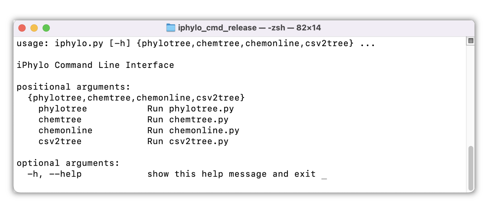
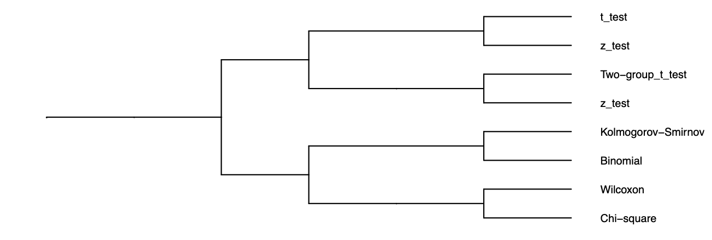

# (PART) iPhylo CLI {-}

# iPhylo CLI

The iPhylo Command-Line Interface (CLI) is an extension of the web-based iPhylo Tree. It operates offline and comes with integrated databases, which can be deployed either locally or on high-performance computing clusters for enhanced performance.



Importantly, the iPhylo CLI can also construct customized taxonomic trees based on a user-defined hierarchical database so the applications of the iPhylo suite can be extended beyond biological and chemical classifications.

The GitHub repository for iPhylo CLI can be accessed via <https://github.com/ARise-fox/iPhylo-CLI/>

The iPhylo CLI includes four modules:

1.  [Phylotree](#phylotree)
2.  [Chemtree](#chemtree)
3.  [Chem Online](#chemonline)
4.  [CSV2Tree](#csv2tree)

## Set up

Please use the **Python 3** environment. The develope and test environment is Python 38.

**Please keep your network available for the first load, as well as enough space on your disk (about 2G),** as the initial run needs to fetch the online database resources.

## Packages environment

`git clone https://github.com/ARise-fox/iPhylo-CLI.git` to clone this project to your local directory. Use `pip install -r requirements.txt` to preload the required packages.

# Modules

Here we provide introduction to each module along with example commands.

Please ensure that you are running the correct Python environment and execute these commands within the local project directory of iPhylo CLI.

If you choose to run them from other directories, we recommend specifying the script's location using an absolute path.

## Phylotree {#phylotree}

The phylo tree module offers the same functionality as the iPhylo Tree online web application, but run locally.

Run the following command to see a description of the module and help about the parameters.

``` python
python iphylo.py phylotree -h
```

Use the following commands to start your try:

``` python
python iphylo.py phylotree -i "Homo sapiens,Mus musculus,Gallus gallus,Drosophila melanogaster,Escherichia coli"
                                
python iphylo.py phylotree -i 9606,10090,9031,7227,562 
```

## Chemtree {#chemtree}

This module is used to generate a taxonomic tree of chemicals, run the following command for help

``` python
python iphylo.py chemtree -h 
```

Use the following commands to start your try:

``` python
python iphylo.py chemtree -f 'example/inchikeys.txt' -fn 'chem\_01'
```

## Chem Online {#chemonline}

The exclusive online chemical module enables chemical information retrieval from [ClassyFire](https://jcheminf.biomedcentral.com/articles/10.1186/s13321-016-0174-y) API, including the chemicals processed with corresponding taxonomy data stored in ClassyFire's database. Over 70 million chemicals can be queried through this online module, which is continually growing. This feature significantly augments the capabilities of chemical taxonomy analysis.

Run the following command for help:

``` python
python iphylo.py chemonline -h 
```

Use the following commands to have some try:

``` python
python iphylo.py chemonline -f 'example/inchikeys\_for\_online.txt' -fn 'chem\_02'
```

## CSV2Tree {#csv2tree}

You can use this module to build a tree for any data with a hierarchy.

Use the following command for more help information:

``` python
python iphylo.py csv2tree --help
```

The data should be presented in a csv table, with each row representing a categorized piece of information and each column representing a categorization level.

Here is an example of statistical analysis methods:

**Input table**

|                      |                  |                     |             |                     |                  |
|----------------------|------------------|---------------------|-------------|---------------------|------------------|
| Statistical Analysis | Hypothesis Tests | Parametric Tests    | One Sample  | t test              |                  |
| Statistical Analysis | Hypothesis Tests | Parametric Tests    | One Sample  | z test              |                  |
| Statistical Analysis | Hypothesis Tests | Parametric Tests    | Two Samples | Independent Samples | Two-group t test |
| Statistical Analysis | Hypothesis Tests | Parametric Tests    | Two Samples | Independent Samples | z test           |
| Statistical Analysis | Hypothesis Tests | Nonparametric Tests | One Samples | Kolmogorov-Smirnov  |                  |
| Statistical Analysis | Hypothesis Tests | Nonparametric Tests | One Samples | Binomial            |                  |
| Statistical Analysis | Hypothesis Tests | Nonparametric Tests | Two Samples | Paired Samples      | Wilcoxon         |
| Statistical Analysis | Hypothesis Tests | Nonparametric Tests | Two Samples | Paired Samples      | Chi-square       |


**Output tree in Newick format**

```         
((((((Chi-square,Wilcoxon)Paired_Samples)Two_Samples,(Binomial,Kolmogorov-Smirnov)One_Samples)Nonparametric_Tests,(((z_test,Two-group_t_test)Independent_Samples)Two_Samples,(z_test,t_test)One_Sample)Parametric_Tests)Hypothesis_Tests)Statistical_Analysis);
```

**Plot by iPhylo Visual**


