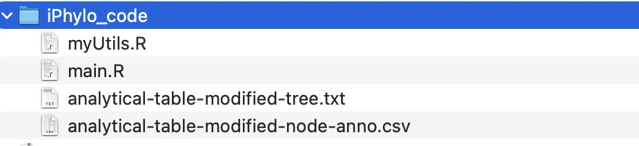
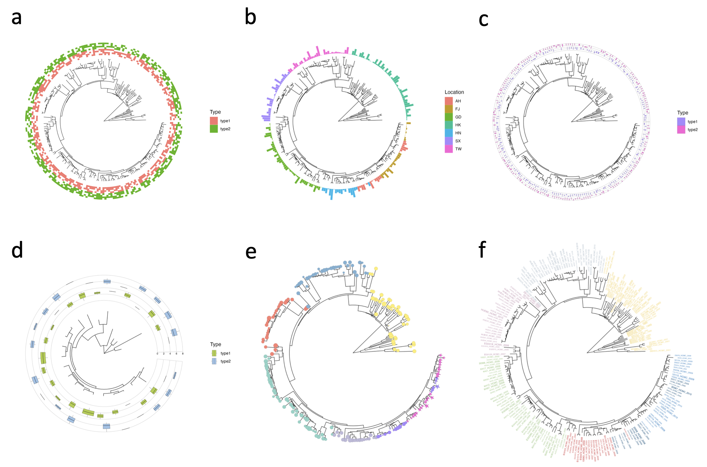
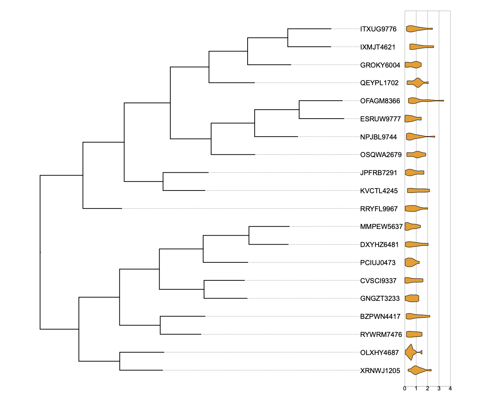
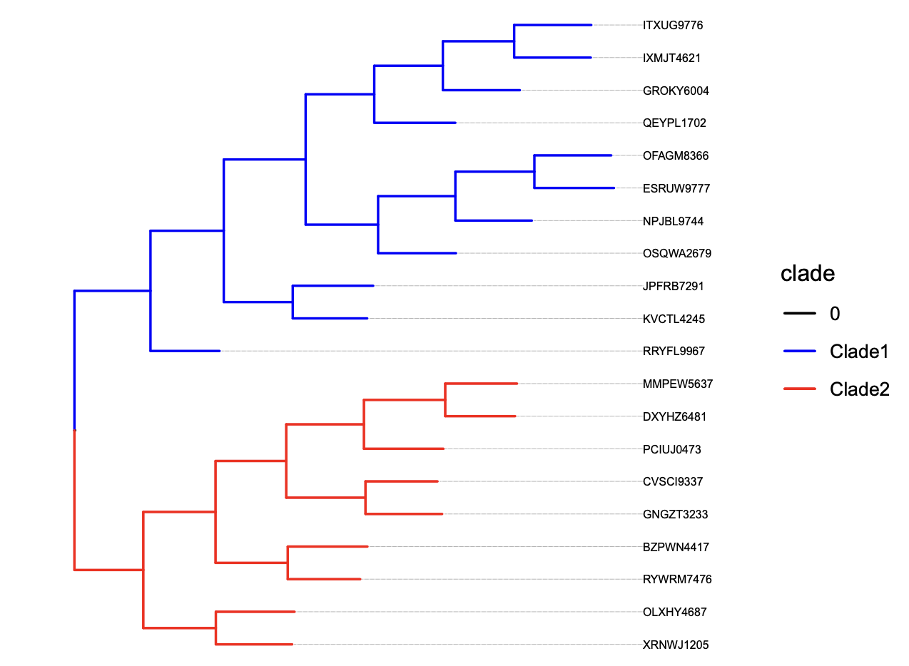

# (PART) iPhylo Visual {.unnumbered}

# iPhylo Visual {#iPhylo_v}


The iPhylo Visual was developed based on the R framework for visualizing and extensively annotating taxonomic trees (<https://www.iphylo.net/visual/>). The iPhylo Visual also offers the convenience of saving and uploading work sessions locally, as well as access to source codes for plotting and annotating. The iPhylo Visual leverages the full graphical capabilities of ggtree[^04-iphylo-visual-1] and ggtreeExtra[^04-iphylo-visual-2] for visualizing, manipulating, and annotating tree-structured data.

[^04-iphylo-visual-1]: Guangchuang Yu. Using ggtree to visualize data on tree-like structures. Current Protocols in Bioinformatics, 2020, 69:e96. <doi:10.1002/cpbi.96>

[^04-iphylo-visual-2]: S Xu, Z Dai, P Guo, X Fu, S Liu, L Zhou, W Tang, T Feng, M Chen, L Zhan, T Wu, E Hu, Y Jiang, X Bo, G Yu. ggtreeExtra: Compact visualization of richly annotated phylogenetic data. Molecular Biology and Evolution 2021, 38(9):4039-4042. <doi:10.1093/molbev/msab166>


The iPhylo Visual is an interactive online tool designed to facilitate the display, annotation, and inspection of tree-based structures, including but not limited to phylogenetic and chemical taxonomic trees generated from iPhylo modules.

The iPhylo Visual simplifies the process of annotating taxonomic trees by adopting a data frame-compatible format, enabling users to encapsulate all required information within one data frame for leaf annotation and one data frame for node annotation, respectively. Within the data frame, rows correspond to tree nodes, and columns represent specific features. Users can efficiently navigate and manage these uploaded data frames through the provided online table viewer, with sorting and retrieval capabilities. This design avoids uploading multiple annotation files and is directly compatible with R.

# User interface

## Dashboard

 

The dashboard page hosts the main annotation and display functions of iPhylo Visual. The user interface consists of several main components:

<ol>

<li><b>Tree Display:</b> The tree will be displayed in the main panel of the webpage in the form of a vector image. Click the [plus (+)]{.badge-light} and [minus (-)]{.badge-light} buttons on the display panel to zoom in and out of the tree visualization. Move and scroll the mouse cursor to move the visualization within the display panel.</li>

<li><b>Refresh Plot:</b> Once the user uploads a tree file, the [GO]{.badge-light} button, which is used to refresh the graphical representation of the tree file, will become enabled. To ensure optimal performance, adjustments made to the display or annotation parameters will not immediately update the tree image. Instead, you need to click the "GO" button to refresh the image after modifying any settings.</li>

<li><b>Download Plot:</b> Click the [JPEG]{.badge-light}, [PNG]{.badge-light} or [PDF]{.badge-light} download button to get the visualization in preferred formats.</li>

<li><b>Download Session:</b>Click the [Session]{.badge-light} button to download the ".iphylo" project file, as detailed in the <a href="www/static/img/dashboard.png">Session</a> section.</li>

<li><b>Upload Session: </b> The session upload widget allows users to upload previously saved project files. Click the reload button to restore session data. <b>You need to click the [GO]{.badge-light} button to get the session visualization.</b></li>

<li><b>Basic Controls: </b>This is the basic control panel. iPhylo Visual's basic controls allow users to adjust the fundamental attributes of the tree display. Click the toggle button to collapse or expand the basic control section.</li>

<li><b>Leaf Annotation: </b>Use these controls to assign annotation to the external tree nodes. Click the toggle button to collapse or expand the Leaf Annotation section. Click the [plus (+)]{.badge-light} and [minus (-)]{.badge-light} buttons of Leaf Annotation to add or remove annotation tracks.</li>

<li><b>Node Annotation: </b>Use these controls to assign annotation to the internal tree nodes. Click the toggle button to collapse or expand the Node Annotation section. Click the [plus (+)]{.badge-light} and [minus (-)]{.badge-light} buttons of Node Annotation to add or remove annotation tracks.</li>

<li><b>Legend Control: </b>This control panel allows you to adjust the canvas size and legends for each annotation layer.</li>

</ol>

## Inspection


The Inspection page allows users to explore the details of the tree structure and topology, as well as view the uploaded annotation files using an interactive online table.

<ol>

<li><b>Content Box: </b>The Content Box displays the uploaded tree file in its original format. This component provides a convenient way to examine the raw tree data.</li>

<li><b>Plot Box: </b>The Plot Box visually represents the rectangular topology of the tree.</li>

<li><b>Annotation Box: </b>The Annotation Box presents user-uploaded annotation files in a tabular format. The Annotation Box supports pagination and search functionality, enabling users to navigate through large datasets and easily locate specific annotations of interest.</li>

<li><b>Info Box: </b>The Info Box displays information about the nodes. When users perform a selection by dragging the mouse cursor on the Plot Box, the Info Box updates to show details such as node labels, branch lengths, parent's ID and other additional information associated with the selected nodes.</li>

</ol>

## Help

The help page aims to provide a comprehensive introduction to the key features and workflow of our website. We kindly request that you [contact us](liyueer8@gmail.com) if you have any inquiries or require assistance.

## Gallery and demo


Gallery provides 5 beautiful trees drawn using iPhylo Visual, including:

1.  Visualization of metabolic profiles for individual bacterial strains in the gut microbiome

2.  Visualization of the genome catalog of diverse bacterial strains from a glacial microbiome dataset

3.  Heatmap showing the taxonomy of microbes and their metabolite accumulation/consumption abundance

4.  A representative chemical taxonomy tree generated based on chemical InChIKeys and annotated at the superclass, class, and subclass levels

5.  A tree of common statistical methods was visualized as an example.

You can directly click ['Try'](https://iphylo.net/visual/) to draw and further adjust.

# Data

## Import

This guide will walk you through the process of preparing your data for annotation. To make the most of our tool, follow these steps:

Step 1: Upload Tree File

1.  **Select and Upload Tree File**
    -   Click the `Browse` button on the page.
    -   Choose your tree file (typically in Newick, Nexus, PhyloXML, etc., formats).

Step 2: Annotation Files (Optional)

If you want to add annotations to your tree, you can upload optional Leaf Annotation and Node Annotation files.

1.  **Leaf Annotation File**
    -   Prepare a file containing annotations for each leaf of the tree.
    -   This file may include information like labels, colors, or other details for individual leaves.
2.  **Node Annotation File**
    -   Prepare a file containing annotations for nodes in the tree.
    -   This file might include data for internal nodes, helping you provide additional context to your tree.

### Tree file

{width="80%"}

Click the `Browse` button to upload a tree file in the Newick, Nexus, PhyloXML, or Phylip tree formats:

1.  **Newick Format:**
    -   **Description:** Newick, also known as New Hampshire or New Hampshire Extended format, is a simple and widely used text-based format for representing phylogenetic trees. It expresses tree structures using nested parentheses and commas.

    -   **Example:**

        ```         
        (A:0.1,B:0.2,(C:0.3,D:0.4):0.5);
        ```

    -   **Usage:** It's commonly used for representing hierarchical relationships in evolutionary biology and bioinformatics.
2.  **Nexus Format:**
    -   **Description:** Nexus is a versatile file format that can store various types of biological data, including phylogenetic trees. It allows the inclusion of metadata, DNA/protein sequences, and more. It is both human-readable and writable.

    -   **Example:**

        ```         
        #NEXUS
        Begin trees;
           Tree myTree = (A,B,(C,D));
        End;
        ```

    -   **Usage:** Nexus is often used in phylogenetics, systematics, and evolutionary biology due to its flexibility.
3.  **PhyloXML:**
    -   **Description:** PhyloXML is an XML-based format designed to store and exchange phylogenetic trees and associated data. It supports a variety of information, including node labels, branch lengths, and annotations.

    -   **Example:**

        ``` xml
        <phylogeny>
           <clade>
               <name>A</name>
               <branch_length>0.1</branch_length>
           </clade>
           <clade>
               <name>B</name>
               <branch_length>0.2</branch_length>
           </clade>
           <clade>
               <name>C</name>
               <branch_length>0.3</branch_length>
           </clade>
           <clade>
               <name>D</name>
               <branch_length>0.4</branch_length>
           </clade>
        </phylogeny>
        ```

    -   **Usage:** PhyloXML is suitable for storing and sharing complex phylogenetic data, often used in bioinformatics.
4.  **Phylip Format:**
    -   **Description:** The Phylip (PHYLogeny Inference Package) format is a simple, line-based format developed for use with the Phylip software package. It is used to represent both sequence data and phylogenetic trees.

    -   **Example:**

        ```         
        4
        A 0.0 0.1 0.2
        B 0.1 0.0 0.3
        C 0.2 0.3 0.0
        D 0.3 0.2 0.1
        ```

    -   **Usage:** Phylip format is commonly used for input and output in phylogenetic analysis software and tools.

These formats cater to different needs, from simple tree representations to more complex structures with additional metadata. The choice of format often depends on the specific requirements of the analysis or tool being used.

### Leaf annotation

{width="80%"}

Click the `Browse` button to upload a leaf annotation file with the `,`, `\t`, or `;` separators:

When preparing your leaf annotation file, follow these guidelines for proper formatting:

1.  **Column Names:**
    -   The first column must be named "id" and corresponds to the identifiers of the leaves in your tree.
2.  **ID Repetition:**
    -   IDs can be repeated for multiple annotations. Any ID not matching a leaf in the tree will be ignored.
3.  **Avoid Reserved Columns:**
    -   Do not include built-in column names such as "parent," "node," "branch.length," "label," "isTip," "x," "y," "branch," and "angle."

-   **Example:**

Suppose you have a tree with the following leaf IDs:

-   Leaf 1: "A"
-   Leaf 2: "B"
-   Leaf 3: "C"

Your leaf annotation file should look like this:

``` plaintext
id,annotation1,annotation2
A,value1,infoA
B,value2,infoB
C,value3,infoC
A,value4,infoD
B,value5,infoE
```

In this example, "id" corresponds to the leaf IDs in your tree, and you can add multiple annotations for each leaf. Columns beyond "id" can be used to provide additional information for each leaf.

### Node annotation

{width="80%"}

Click the `Browse` button to upload a node annotation file with the `,`, `\t`, or `;` separators:

When preparing your node annotation file, follow these guidelines for proper formatting:

1.  **Column Names:**
    -   The first column must be named "id" and corresponds to the identifiers of the leaves in your tree.
2.  **ID Repetition:**
    -   IDs can be repeated for multiple annotations. Any ID not matching a node in the tree will be ignored.
3.  **Avoid Reserved Columns:**
    -   Do not include built-in column names such as "parent," "node," "branch.length," "label," "isTip," "x," "y," "branch," and "angle."

-   **Example:**

Suppose you have a tree with the following internal node IDs:

-   Internal Node 1: "N1"
-   Internal Node 2: "N2"
-   Internal Node 3: "N3"

Your leaf annotation file should look like this:

``` plaintext
id,annotationX,annotationY
N1,valueX1,valueY1
N2,valueX2,valueY2
N3,valueX3,valueY3
N1,valueX4,valueY4
N2,valueX5,valueY5
```

In this example, "id" corresponds to the internal node IDs in your tree, and you can add multiple annotations for each node. Columns beyond "id" can be used to provide additional information for each node.

Remember, the correct file format and adherence to the mentioned guidelines will ensure successful annotation.

### Session

{width="40%"}

To restore your work and retrieve your saved data, you can use the `Upload Session` component to upload the session file with the ".iphylo" extension.

The iPhylo Visual emphasizes the ease of exporting and replicating tree displays using the work session files. The unique exported ".iphylo" files pack all essential data for generating trees with iPhylo. These files are extremely compact, with a size of 30kB for a well-annotated tree of 1000 species. All tree-annotation sessions can be saved to and uploaded from the local computer, enabling the users to fine-tune complex trees while maintaining control over the original data. Moreover, the session files can facilitate cooperative annotation projects.

## Export


### Export image

iPhylo Visual provides different image export formats for trees, namely, PNG, PDF, and JPEG.

### Save session

iPhylo Visual offers a session saving feature that allows you to save your work at any point during the annotation process. Simply click the [Save Session]{.badge-light} button to save your data and selected options for the current page.

### Download R scripts

Importantly, iPhylo Visual's Export Code feature exports all the raw data and plotting code for the visualized and annotated tree in one click.

The package includes the tree file, the annotation table, detailed annotation parameters recorded in a JSON file, and an R script for visualizing the data:



By running this script locally (`source main.R`), users can replicate the tree visualization as seen in iPhylo Visual. Advanced users proficient with R programming can further customize the tree by modifying the code.

# Basic feature

{width="50%"}

## Tree layout

iPhylo Visual provides various layout options to display the tree in different styles. The available layout options include:

a.  circular (by default)
b.  inward circular
c.  daylight
d.  rectangular
e.  slanted
f.  ellipse
g.  roundrect


**Rotation and Opening:** For circular layouts, users can further customize the circular ring opening angle and rotation angle to achieve the desired circular representation.

## Branch color

Use the color picker widget to define the color of all tree branches.


## Line type

Change the branch line type and width. Line type options are shown below:

{width="70%"}

## Branch length

Without branch length will draw the cladogram of tree:


## Branch range

Use branch range to set where the branch start and end relative to the canvas:


# Leaf annotation

The "Leaf Annotation" tab manages the annotation tracks for tree leaves, encompassing bars, tiles, boxes, violins, tip points, and tip labels.



## Tip label

**Specifying the track type of leaf as 'tip label' enables showing tip labels:**


**We can also modify the styles of tip labels:**

Prepare the leaf annotation file:

Choose 'label' as the column name containing the labels we want to map.

Choose 'color' as the column name containing the labels we want to map. If the values are continuous, it will draw a gradient of colors.

Choose 'size' as the continuous variable for the label size.

**Example data:**

<div style="border: 1px solid #ddd; padding: 0px; overflow-y: scroll; height:300px; overflow-x: scroll; width:100%; "><table class="table" style="font-size: 13px; margin-left: auto; margin-right: auto;">
 <thead>
  <tr>
   <th style="text-align:left;position: sticky; top:0; background-color: #FFFFFF;"> id </th>
   <th style="text-align:right;position: sticky; top:0; background-color: #FFFFFF;"> value </th>
  </tr>
 </thead>
<tbody>
  <tr>
   <td style="text-align:left;"> OSQWA2679 </td>
   <td style="text-align:right;"> 0.55 </td>
  </tr>
  <tr>
   <td style="text-align:left;"> ESRUW9777 </td>
   <td style="text-align:right;"> 0.79 </td>
  </tr>
  <tr>
   <td style="text-align:left;"> OFAGM8366 </td>
   <td style="text-align:right;"> 1.01 </td>
  </tr>
  <tr>
   <td style="text-align:left;"> NPJBL9744 </td>
   <td style="text-align:right;"> 0.71 </td>
  </tr>
  <tr>
   <td style="text-align:left;"> IXMJT4621 </td>
   <td style="text-align:right;"> 0.16 </td>
  </tr>
  <tr>
   <td style="text-align:left;"> ITXUG9776 </td>
   <td style="text-align:right;"> 0.12 </td>
  </tr>
  <tr>
   <td style="text-align:left;"> GROKY6004 </td>
   <td style="text-align:right;"> 0.32 </td>
  </tr>
  <tr>
   <td style="text-align:left;"> QEYPL1702 </td>
   <td style="text-align:right;"> 1.54 </td>
  </tr>
  <tr>
   <td style="text-align:left;"> KVCTL4245 </td>
   <td style="text-align:right;"> 0.56 </td>
  </tr>
  <tr>
   <td style="text-align:left;"> JPFRB7291 </td>
   <td style="text-align:right;"> 0.94 </td>
  </tr>
  <tr>
   <td style="text-align:left;"> RRYFL9967 </td>
   <td style="text-align:right;"> 0.94 </td>
  </tr>
  <tr>
   <td style="text-align:left;"> XRNWJ1205 </td>
   <td style="text-align:right;"> 0.19 </td>
  </tr>
  <tr>
   <td style="text-align:left;"> OLXHY4687 </td>
   <td style="text-align:right;"> 1.73 </td>
  </tr>
  <tr>
   <td style="text-align:left;"> RYWRM7476 </td>
   <td style="text-align:right;"> 0.93 </td>
  </tr>
  <tr>
   <td style="text-align:left;"> BZPWN4417 </td>
   <td style="text-align:right;"> 1.39 </td>
  </tr>
  <tr>
   <td style="text-align:left;"> DXYHZ6481 </td>
   <td style="text-align:right;"> 0.53 </td>
  </tr>
  <tr>
   <td style="text-align:left;"> MMPEW5637 </td>
   <td style="text-align:right;"> 0.82 </td>
  </tr>
  <tr>
   <td style="text-align:left;"> PCIUJ0473 </td>
   <td style="text-align:right;"> 1.67 </td>
  </tr>
  <tr>
   <td style="text-align:left;"> GNGZT3233 </td>
   <td style="text-align:right;"> 0.26 </td>
  </tr>
  <tr>
   <td style="text-align:left;"> CVSCI9337 </td>
   <td style="text-align:right;"> 1.68 </td>
  </tr>
</tbody>
</table></div>


Other parameters:

-   **Manual color:** Allows users to manually specify colors for different categories or values.

-   **Manual size:** Allows users to manually specify size of points for different values.

-   **Offset:** Specifies the offset for the plot.

-   **Legend:** Controls the display of the legend for the plot.

-   **Line type:** Sets the line type if align is TRUE.

-   **Line size:** Adjusts the width of the line if align is TRUE.

-   **Align:** Specifies whether to align all labels.

## Tip point

**Specifying the track type of leaf as 'tip point' enables the drawing of points at tips:**

Prepare the leaf annotation file:

Choose 'color' as the column name containing the values we want to map. If the values are continuous, it will draw a gradient of colors.

Choose 'shape' as the categorical variable (group) for the points.

Choose 'size' as the continuous variable for the points.

**Example data:**

<div style="border: 1px solid #ddd; padding: 0px; overflow-y: scroll; height:300px; overflow-x: scroll; width:100%; "><table class="table" style="font-size: 13px; margin-left: auto; margin-right: auto;">
 <thead>
  <tr>
   <th style="text-align:left;position: sticky; top:0; background-color: #FFFFFF;"> id </th>
   <th style="text-align:left;position: sticky; top:0; background-color: #FFFFFF;"> group </th>
   <th style="text-align:right;position: sticky; top:0; background-color: #FFFFFF;"> value </th>
  </tr>
 </thead>
<tbody>
  <tr>
   <td style="text-align:left;"> OSQWA2679 </td>
   <td style="text-align:left;"> A </td>
   <td style="text-align:right;"> 0.3454520 </td>
  </tr>
  <tr>
   <td style="text-align:left;"> ESRUW9777 </td>
   <td style="text-align:left;"> A </td>
   <td style="text-align:right;"> 1.3195295 </td>
  </tr>
  <tr>
   <td style="text-align:left;"> OFAGM8366 </td>
   <td style="text-align:left;"> A </td>
   <td style="text-align:right;"> 0.5200337 </td>
  </tr>
  <tr>
   <td style="text-align:left;"> NPJBL9744 </td>
   <td style="text-align:left;"> A </td>
   <td style="text-align:right;"> 1.1939274 </td>
  </tr>
  <tr>
   <td style="text-align:left;"> IXMJT4621 </td>
   <td style="text-align:left;"> A </td>
   <td style="text-align:right;"> 1.1706463 </td>
  </tr>
  <tr>
   <td style="text-align:left;"> ITXUG9776 </td>
   <td style="text-align:left;"> A </td>
   <td style="text-align:right;"> 0.6910996 </td>
  </tr>
  <tr>
   <td style="text-align:left;"> GROKY6004 </td>
   <td style="text-align:left;"> A </td>
   <td style="text-align:right;"> 1.0380695 </td>
  </tr>
  <tr>
   <td style="text-align:left;"> QEYPL1702 </td>
   <td style="text-align:left;"> A </td>
   <td style="text-align:right;"> 1.3366934 </td>
  </tr>
  <tr>
   <td style="text-align:left;"> KVCTL4245 </td>
   <td style="text-align:left;"> A </td>
   <td style="text-align:right;"> 0.5482420 </td>
  </tr>
  <tr>
   <td style="text-align:left;"> JPFRB7291 </td>
   <td style="text-align:left;"> A </td>
   <td style="text-align:right;"> 0.3555761 </td>
  </tr>
  <tr>
   <td style="text-align:left;"> RRYFL9967 </td>
   <td style="text-align:left;"> B </td>
   <td style="text-align:right;"> 0.2518943 </td>
  </tr>
  <tr>
   <td style="text-align:left;"> XRNWJ1205 </td>
   <td style="text-align:left;"> B </td>
   <td style="text-align:right;"> 0.5427021 </td>
  </tr>
  <tr>
   <td style="text-align:left;"> OLXHY4687 </td>
   <td style="text-align:left;"> B </td>
   <td style="text-align:right;"> 0.0797344 </td>
  </tr>
  <tr>
   <td style="text-align:left;"> RYWRM7476 </td>
   <td style="text-align:left;"> B </td>
   <td style="text-align:right;"> 2.1533550 </td>
  </tr>
  <tr>
   <td style="text-align:left;"> BZPWN4417 </td>
   <td style="text-align:left;"> B </td>
   <td style="text-align:right;"> 0.3020899 </td>
  </tr>
  <tr>
   <td style="text-align:left;"> DXYHZ6481 </td>
   <td style="text-align:left;"> C </td>
   <td style="text-align:right;"> 1.2910100 </td>
  </tr>
  <tr>
   <td style="text-align:left;"> MMPEW5637 </td>
   <td style="text-align:left;"> C </td>
   <td style="text-align:right;"> 1.8894510 </td>
  </tr>
  <tr>
   <td style="text-align:left;"> PCIUJ0473 </td>
   <td style="text-align:left;"> C </td>
   <td style="text-align:right;"> 0.6348867 </td>
  </tr>
  <tr>
   <td style="text-align:left;"> GNGZT3233 </td>
   <td style="text-align:left;"> C </td>
   <td style="text-align:right;"> 0.8754801 </td>
  </tr>
  <tr>
   <td style="text-align:left;"> CVSCI9337 </td>
   <td style="text-align:left;"> C </td>
   <td style="text-align:right;"> 0.6716307 </td>
  </tr>
</tbody>
</table></div>


Other parameters:

-   **Manual color:** Allows users to manually specify colors for different categories or values.

-   **Column order:** Determines the order in which columns are displayed in the plot.

-   **Manual size:** Allows users to manually specify size of points for different values.

-   **Offset:** Specifies the offset for the plot.

-   **Legend:** Controls the display of the legend for the plot.

-   **Border color:** Sets the color of the borders around plot tiles.

-   **Border width:** Adjusts the width of the borders around plot tiles.

-   **Manual shape:** Allows users to manually specify shape of points for different categories.

{width="60%"}

-   **Track height:** Defines the height of the entire track.

-   **Alpha:** Sets the transparency level for the plot.

-   **Grid:** Enables or disables the grid lines in the plot.

-   **Axis:** Specifies whether to display axes for the plot.

-   **Font size:** Adjusts the size of the font used for labels.

-   **Label angle:** Sets the angle of the labels in the plot.

-   **Label align:** Controls the alignment of labels in the plot (e.g., top, bottom, center).

-   **Align:** Specifies whether to align all points.

## Heatmap


**Specifying the track type of leaf as 'tile' enables the drawing of a heatmap:**

Prepare the leaf annotation file:

Choose 'color' as the column name containing the values we want to map.

If the values are categorical, it will draw grouped color blocks.

**Example data:**

<div style="border: 1px solid #ddd; padding: 0px; overflow-y: scroll; height:300px; overflow-x: scroll; width:100%; "><table class="table" style="font-size: 13px; margin-left: auto; margin-right: auto;">
 <thead>
  <tr>
   <th style="text-align:left;position: sticky; top:0; background-color: #FFFFFF;"> id </th>
   <th style="text-align:left;position: sticky; top:0; background-color: #FFFFFF;"> group </th>
  </tr>
 </thead>
<tbody>
  <tr>
   <td style="text-align:left;"> OSQWA2679 </td>
   <td style="text-align:left;"> A </td>
  </tr>
  <tr>
   <td style="text-align:left;"> ESRUW9777 </td>
   <td style="text-align:left;"> A </td>
  </tr>
  <tr>
   <td style="text-align:left;"> OFAGM8366 </td>
   <td style="text-align:left;"> A </td>
  </tr>
  <tr>
   <td style="text-align:left;"> NPJBL9744 </td>
   <td style="text-align:left;"> A </td>
  </tr>
  <tr>
   <td style="text-align:left;"> IXMJT4621 </td>
   <td style="text-align:left;"> A </td>
  </tr>
  <tr>
   <td style="text-align:left;"> ITXUG9776 </td>
   <td style="text-align:left;"> A </td>
  </tr>
  <tr>
   <td style="text-align:left;"> GROKY6004 </td>
   <td style="text-align:left;"> A </td>
  </tr>
  <tr>
   <td style="text-align:left;"> QEYPL1702 </td>
   <td style="text-align:left;"> A </td>
  </tr>
  <tr>
   <td style="text-align:left;"> KVCTL4245 </td>
   <td style="text-align:left;"> A </td>
  </tr>
  <tr>
   <td style="text-align:left;"> JPFRB7291 </td>
   <td style="text-align:left;"> A </td>
  </tr>
  <tr>
   <td style="text-align:left;"> RRYFL9967 </td>
   <td style="text-align:left;"> B </td>
  </tr>
  <tr>
   <td style="text-align:left;"> XRNWJ1205 </td>
   <td style="text-align:left;"> B </td>
  </tr>
  <tr>
   <td style="text-align:left;"> OLXHY4687 </td>
   <td style="text-align:left;"> B </td>
  </tr>
  <tr>
   <td style="text-align:left;"> RYWRM7476 </td>
   <td style="text-align:left;"> B </td>
  </tr>
  <tr>
   <td style="text-align:left;"> BZPWN4417 </td>
   <td style="text-align:left;"> B </td>
  </tr>
  <tr>
   <td style="text-align:left;"> DXYHZ6481 </td>
   <td style="text-align:left;"> C </td>
  </tr>
  <tr>
   <td style="text-align:left;"> MMPEW5637 </td>
   <td style="text-align:left;"> C </td>
  </tr>
  <tr>
   <td style="text-align:left;"> PCIUJ0473 </td>
   <td style="text-align:left;"> C </td>
  </tr>
  <tr>
   <td style="text-align:left;"> GNGZT3233 </td>
   <td style="text-align:left;"> C </td>
  </tr>
  <tr>
   <td style="text-align:left;"> CVSCI9337 </td>
   <td style="text-align:left;"> C </td>
  </tr>
</tbody>
</table></div>


If the values are continuous, it will draw a gradient of colors.

Choose 'column' as the categorical variable (layer) for the heatmap, making it easy to draw multiple columns of heatmaps.

**Example data:**

<div style="border: 1px solid #ddd; padding: 0px; overflow-y: scroll; height:300px; overflow-x: scroll; width:100%; "><table class="table" style="font-size: 13px; margin-left: auto; margin-right: auto;">
 <thead>
  <tr>
   <th style="text-align:left;position: sticky; top:0; background-color: #FFFFFF;"> id </th>
   <th style="text-align:left;position: sticky; top:0; background-color: #FFFFFF;"> layer </th>
   <th style="text-align:right;position: sticky; top:0; background-color: #FFFFFF;"> value </th>
  </tr>
 </thead>
<tbody>
  <tr>
   <td style="text-align:left;"> OSQWA2679 </td>
   <td style="text-align:left;"> Layer1 </td>
   <td style="text-align:right;"> 0.55 </td>
  </tr>
  <tr>
   <td style="text-align:left;"> ESRUW9777 </td>
   <td style="text-align:left;"> Layer1 </td>
   <td style="text-align:right;"> 0.79 </td>
  </tr>
  <tr>
   <td style="text-align:left;"> OFAGM8366 </td>
   <td style="text-align:left;"> Layer1 </td>
   <td style="text-align:right;"> 1.01 </td>
  </tr>
  <tr>
   <td style="text-align:left;"> NPJBL9744 </td>
   <td style="text-align:left;"> Layer1 </td>
   <td style="text-align:right;"> 0.71 </td>
  </tr>
  <tr>
   <td style="text-align:left;"> IXMJT4621 </td>
   <td style="text-align:left;"> Layer1 </td>
   <td style="text-align:right;"> 0.16 </td>
  </tr>
  <tr>
   <td style="text-align:left;"> ITXUG9776 </td>
   <td style="text-align:left;"> Layer1 </td>
   <td style="text-align:right;"> 0.12 </td>
  </tr>
  <tr>
   <td style="text-align:left;"> GROKY6004 </td>
   <td style="text-align:left;"> Layer1 </td>
   <td style="text-align:right;"> 0.32 </td>
  </tr>
  <tr>
   <td style="text-align:left;"> QEYPL1702 </td>
   <td style="text-align:left;"> Layer1 </td>
   <td style="text-align:right;"> 1.54 </td>
  </tr>
  <tr>
   <td style="text-align:left;"> KVCTL4245 </td>
   <td style="text-align:left;"> Layer1 </td>
   <td style="text-align:right;"> 0.56 </td>
  </tr>
  <tr>
   <td style="text-align:left;"> JPFRB7291 </td>
   <td style="text-align:left;"> Layer1 </td>
   <td style="text-align:right;"> 0.94 </td>
  </tr>
  <tr>
   <td style="text-align:left;"> RRYFL9967 </td>
   <td style="text-align:left;"> Layer1 </td>
   <td style="text-align:right;"> 0.94 </td>
  </tr>
  <tr>
   <td style="text-align:left;"> XRNWJ1205 </td>
   <td style="text-align:left;"> Layer1 </td>
   <td style="text-align:right;"> 0.19 </td>
  </tr>
  <tr>
   <td style="text-align:left;"> OLXHY4687 </td>
   <td style="text-align:left;"> Layer1 </td>
   <td style="text-align:right;"> 1.73 </td>
  </tr>
  <tr>
   <td style="text-align:left;"> RYWRM7476 </td>
   <td style="text-align:left;"> Layer1 </td>
   <td style="text-align:right;"> 0.93 </td>
  </tr>
  <tr>
   <td style="text-align:left;"> BZPWN4417 </td>
   <td style="text-align:left;"> Layer1 </td>
   <td style="text-align:right;"> 1.39 </td>
  </tr>
  <tr>
   <td style="text-align:left;"> DXYHZ6481 </td>
   <td style="text-align:left;"> Layer1 </td>
   <td style="text-align:right;"> 0.53 </td>
  </tr>
  <tr>
   <td style="text-align:left;"> MMPEW5637 </td>
   <td style="text-align:left;"> Layer1 </td>
   <td style="text-align:right;"> 0.82 </td>
  </tr>
  <tr>
   <td style="text-align:left;"> PCIUJ0473 </td>
   <td style="text-align:left;"> Layer1 </td>
   <td style="text-align:right;"> 1.67 </td>
  </tr>
  <tr>
   <td style="text-align:left;"> GNGZT3233 </td>
   <td style="text-align:left;"> Layer1 </td>
   <td style="text-align:right;"> 0.26 </td>
  </tr>
  <tr>
   <td style="text-align:left;"> CVSCI9337 </td>
   <td style="text-align:left;"> Layer1 </td>
   <td style="text-align:right;"> 1.68 </td>
  </tr>
  <tr>
   <td style="text-align:left;"> OSQWA2679 </td>
   <td style="text-align:left;"> Layer2 </td>
   <td style="text-align:right;"> 1.32 </td>
  </tr>
  <tr>
   <td style="text-align:left;"> ESRUW9777 </td>
   <td style="text-align:left;"> Layer2 </td>
   <td style="text-align:right;"> 1.37 </td>
  </tr>
  <tr>
   <td style="text-align:left;"> OFAGM8366 </td>
   <td style="text-align:left;"> Layer2 </td>
   <td style="text-align:right;"> 0.36 </td>
  </tr>
  <tr>
   <td style="text-align:left;"> NPJBL9744 </td>
   <td style="text-align:left;"> Layer2 </td>
   <td style="text-align:right;"> 0.61 </td>
  </tr>
  <tr>
   <td style="text-align:left;"> IXMJT4621 </td>
   <td style="text-align:left;"> Layer2 </td>
   <td style="text-align:right;"> 0.49 </td>
  </tr>
  <tr>
   <td style="text-align:left;"> ITXUG9776 </td>
   <td style="text-align:left;"> Layer2 </td>
   <td style="text-align:right;"> 0.18 </td>
  </tr>
  <tr>
   <td style="text-align:left;"> GROKY6004 </td>
   <td style="text-align:left;"> Layer2 </td>
   <td style="text-align:right;"> 0.27 </td>
  </tr>
  <tr>
   <td style="text-align:left;"> QEYPL1702 </td>
   <td style="text-align:left;"> Layer2 </td>
   <td style="text-align:right;"> 0.49 </td>
  </tr>
  <tr>
   <td style="text-align:left;"> KVCTL4245 </td>
   <td style="text-align:left;"> Layer2 </td>
   <td style="text-align:right;"> 0.16 </td>
  </tr>
  <tr>
   <td style="text-align:left;"> JPFRB7291 </td>
   <td style="text-align:left;"> Layer2 </td>
   <td style="text-align:right;"> 0.65 </td>
  </tr>
  <tr>
   <td style="text-align:left;"> RRYFL9967 </td>
   <td style="text-align:left;"> Layer2 </td>
   <td style="text-align:right;"> 1.16 </td>
  </tr>
  <tr>
   <td style="text-align:left;"> XRNWJ1205 </td>
   <td style="text-align:left;"> Layer2 </td>
   <td style="text-align:right;"> 0.59 </td>
  </tr>
  <tr>
   <td style="text-align:left;"> OLXHY4687 </td>
   <td style="text-align:left;"> Layer2 </td>
   <td style="text-align:right;"> 0.17 </td>
  </tr>
  <tr>
   <td style="text-align:left;"> RYWRM7476 </td>
   <td style="text-align:left;"> Layer2 </td>
   <td style="text-align:right;"> 0.62 </td>
  </tr>
  <tr>
   <td style="text-align:left;"> BZPWN4417 </td>
   <td style="text-align:left;"> Layer2 </td>
   <td style="text-align:right;"> 0.02 </td>
  </tr>
  <tr>
   <td style="text-align:left;"> DXYHZ6481 </td>
   <td style="text-align:left;"> Layer2 </td>
   <td style="text-align:right;"> 1.35 </td>
  </tr>
  <tr>
   <td style="text-align:left;"> MMPEW5637 </td>
   <td style="text-align:left;"> Layer2 </td>
   <td style="text-align:right;"> 0.22 </td>
  </tr>
  <tr>
   <td style="text-align:left;"> PCIUJ0473 </td>
   <td style="text-align:left;"> Layer2 </td>
   <td style="text-align:right;"> 1.43 </td>
  </tr>
  <tr>
   <td style="text-align:left;"> GNGZT3233 </td>
   <td style="text-align:left;"> Layer2 </td>
   <td style="text-align:right;"> 1.80 </td>
  </tr>
  <tr>
   <td style="text-align:left;"> CVSCI9337 </td>
   <td style="text-align:left;"> Layer2 </td>
   <td style="text-align:right;"> 1.83 </td>
  </tr>
  <tr>
   <td style="text-align:left;"> OSQWA2679 </td>
   <td style="text-align:left;"> Layer3 </td>
   <td style="text-align:right;"> 0.71 </td>
  </tr>
  <tr>
   <td style="text-align:left;"> ESRUW9777 </td>
   <td style="text-align:left;"> Layer3 </td>
   <td style="text-align:right;"> 1.83 </td>
  </tr>
  <tr>
   <td style="text-align:left;"> OFAGM8366 </td>
   <td style="text-align:left;"> Layer3 </td>
   <td style="text-align:right;"> 0.76 </td>
  </tr>
  <tr>
   <td style="text-align:left;"> NPJBL9744 </td>
   <td style="text-align:left;"> Layer3 </td>
   <td style="text-align:right;"> 0.80 </td>
  </tr>
  <tr>
   <td style="text-align:left;"> IXMJT4621 </td>
   <td style="text-align:left;"> Layer3 </td>
   <td style="text-align:right;"> 0.53 </td>
  </tr>
  <tr>
   <td style="text-align:left;"> ITXUG9776 </td>
   <td style="text-align:left;"> Layer3 </td>
   <td style="text-align:right;"> 0.94 </td>
  </tr>
  <tr>
   <td style="text-align:left;"> GROKY6004 </td>
   <td style="text-align:left;"> Layer3 </td>
   <td style="text-align:right;"> 0.40 </td>
  </tr>
  <tr>
   <td style="text-align:left;"> QEYPL1702 </td>
   <td style="text-align:left;"> Layer3 </td>
   <td style="text-align:right;"> 0.77 </td>
  </tr>
  <tr>
   <td style="text-align:left;"> KVCTL4245 </td>
   <td style="text-align:left;"> Layer3 </td>
   <td style="text-align:right;"> 0.03 </td>
  </tr>
  <tr>
   <td style="text-align:left;"> JPFRB7291 </td>
   <td style="text-align:left;"> Layer3 </td>
   <td style="text-align:right;"> 0.81 </td>
  </tr>
  <tr>
   <td style="text-align:left;"> RRYFL9967 </td>
   <td style="text-align:left;"> Layer3 </td>
   <td style="text-align:right;"> 0.17 </td>
  </tr>
  <tr>
   <td style="text-align:left;"> XRNWJ1205 </td>
   <td style="text-align:left;"> Layer3 </td>
   <td style="text-align:right;"> 1.36 </td>
  </tr>
  <tr>
   <td style="text-align:left;"> OLXHY4687 </td>
   <td style="text-align:left;"> Layer3 </td>
   <td style="text-align:right;"> 0.61 </td>
  </tr>
  <tr>
   <td style="text-align:left;"> RYWRM7476 </td>
   <td style="text-align:left;"> Layer3 </td>
   <td style="text-align:right;"> 1.27 </td>
  </tr>
  <tr>
   <td style="text-align:left;"> BZPWN4417 </td>
   <td style="text-align:left;"> Layer3 </td>
   <td style="text-align:right;"> 2.23 </td>
  </tr>
  <tr>
   <td style="text-align:left;"> DXYHZ6481 </td>
   <td style="text-align:left;"> Layer3 </td>
   <td style="text-align:right;"> 0.23 </td>
  </tr>
  <tr>
   <td style="text-align:left;"> MMPEW5637 </td>
   <td style="text-align:left;"> Layer3 </td>
   <td style="text-align:right;"> 1.14 </td>
  </tr>
  <tr>
   <td style="text-align:left;"> PCIUJ0473 </td>
   <td style="text-align:left;"> Layer3 </td>
   <td style="text-align:right;"> 0.09 </td>
  </tr>
  <tr>
   <td style="text-align:left;"> GNGZT3233 </td>
   <td style="text-align:left;"> Layer3 </td>
   <td style="text-align:right;"> 1.22 </td>
  </tr>
  <tr>
   <td style="text-align:left;"> CVSCI9337 </td>
   <td style="text-align:left;"> Layer3 </td>
   <td style="text-align:right;"> 0.08 </td>
  </tr>
</tbody>
</table></div>


Other parameters:

-   **Manual color:** Allows users to manually specify colors for different categories or values.

-   **Column order:** Determines the order in which columns are displayed in the heatmap.

-   **Offset:** Specifies the offset for the heatmap.

-   **Legend:** Controls the display of the legend for the heatmap.

-   **Border color:** Sets the color of the borders around heatmap tiles.

-   **Border width:** Adjusts the width of the borders around heatmap tiles.

-   **Track height:** Defines the height of the entire track.

-   **Alpha:** Sets the transparency level for the heatmap tiles.

-   **Grid:** Enables or disables the grid lines in the heatmap.

-   **Axis:** Specifies whether to display axes for the heatmap.

-   **Font size:** Adjusts the size of the font used for labels.

-   **Label angle:** Sets the angle of the labels in the heatmap.

-   **Label align:** Controls the alignment of labels in the heatmap (e.g., top, bottom, center).

## Bar plot

**Specifying the track type of leaf as 'bar' enables the drawing of a bar plot:**

Prepare the leaf annotation file:

Choose 'color' as the column name containing the values we want to map. If the values are categorical, it will draw grouped color blocks. If the values are continuous, it will draw a gradient of colors.

Choose 'column' as the continuous variable (value) for the bar plot, it will be the y-axis value of each leaf.

**Example data:**

<div style="border: 1px solid #ddd; padding: 0px; overflow-y: scroll; height:300px; overflow-x: scroll; width:100%; "><table class="table" style="font-size: 13px; margin-left: auto; margin-right: auto;">
 <thead>
  <tr>
   <th style="text-align:left;position: sticky; top:0; background-color: #FFFFFF;"> id </th>
   <th style="text-align:left;position: sticky; top:0; background-color: #FFFFFF;"> group </th>
   <th style="text-align:right;position: sticky; top:0; background-color: #FFFFFF;"> value </th>
  </tr>
 </thead>
<tbody>
  <tr>
   <td style="text-align:left;"> OSQWA2679 </td>
   <td style="text-align:left;"> A </td>
   <td style="text-align:right;"> 0.3454520 </td>
  </tr>
  <tr>
   <td style="text-align:left;"> ESRUW9777 </td>
   <td style="text-align:left;"> A </td>
   <td style="text-align:right;"> 1.3195295 </td>
  </tr>
  <tr>
   <td style="text-align:left;"> OFAGM8366 </td>
   <td style="text-align:left;"> A </td>
   <td style="text-align:right;"> 0.5200337 </td>
  </tr>
  <tr>
   <td style="text-align:left;"> NPJBL9744 </td>
   <td style="text-align:left;"> A </td>
   <td style="text-align:right;"> 1.1939274 </td>
  </tr>
  <tr>
   <td style="text-align:left;"> IXMJT4621 </td>
   <td style="text-align:left;"> A </td>
   <td style="text-align:right;"> 1.1706463 </td>
  </tr>
  <tr>
   <td style="text-align:left;"> ITXUG9776 </td>
   <td style="text-align:left;"> A </td>
   <td style="text-align:right;"> 0.6910996 </td>
  </tr>
  <tr>
   <td style="text-align:left;"> GROKY6004 </td>
   <td style="text-align:left;"> A </td>
   <td style="text-align:right;"> 1.0380695 </td>
  </tr>
  <tr>
   <td style="text-align:left;"> QEYPL1702 </td>
   <td style="text-align:left;"> A </td>
   <td style="text-align:right;"> 1.3366934 </td>
  </tr>
  <tr>
   <td style="text-align:left;"> KVCTL4245 </td>
   <td style="text-align:left;"> A </td>
   <td style="text-align:right;"> 0.5482420 </td>
  </tr>
  <tr>
   <td style="text-align:left;"> JPFRB7291 </td>
   <td style="text-align:left;"> A </td>
   <td style="text-align:right;"> 0.3555761 </td>
  </tr>
  <tr>
   <td style="text-align:left;"> RRYFL9967 </td>
   <td style="text-align:left;"> B </td>
   <td style="text-align:right;"> 0.2518943 </td>
  </tr>
  <tr>
   <td style="text-align:left;"> XRNWJ1205 </td>
   <td style="text-align:left;"> B </td>
   <td style="text-align:right;"> 0.5427021 </td>
  </tr>
  <tr>
   <td style="text-align:left;"> OLXHY4687 </td>
   <td style="text-align:left;"> B </td>
   <td style="text-align:right;"> 0.0797344 </td>
  </tr>
  <tr>
   <td style="text-align:left;"> RYWRM7476 </td>
   <td style="text-align:left;"> B </td>
   <td style="text-align:right;"> 2.1533550 </td>
  </tr>
  <tr>
   <td style="text-align:left;"> BZPWN4417 </td>
   <td style="text-align:left;"> B </td>
   <td style="text-align:right;"> 0.3020899 </td>
  </tr>
  <tr>
   <td style="text-align:left;"> DXYHZ6481 </td>
   <td style="text-align:left;"> C </td>
   <td style="text-align:right;"> 1.2910100 </td>
  </tr>
  <tr>
   <td style="text-align:left;"> MMPEW5637 </td>
   <td style="text-align:left;"> C </td>
   <td style="text-align:right;"> 1.8894510 </td>
  </tr>
  <tr>
   <td style="text-align:left;"> PCIUJ0473 </td>
   <td style="text-align:left;"> C </td>
   <td style="text-align:right;"> 0.6348867 </td>
  </tr>
  <tr>
   <td style="text-align:left;"> GNGZT3233 </td>
   <td style="text-align:left;"> C </td>
   <td style="text-align:right;"> 0.8754801 </td>
  </tr>
  <tr>
   <td style="text-align:left;"> CVSCI9337 </td>
   <td style="text-align:left;"> C </td>
   <td style="text-align:right;"> 0.6716307 </td>
  </tr>
</tbody>
</table></div>


Other parameters:

-   **Manual color:** Allows users to manually specify colors for different categories or values.

-   **Column order:** Determines the order in which columns are displayed in the plot.

-   **Offset:** Specifies the offset for the plot.

-   **Legend:** Controls the display of the legend for the plot.

-   **Border color:** Sets the color of the borders around plot tiles.

-   **Border width:** Adjusts the width of the borders around plot tiles.

-   **Track height:** Defines the height of the entire track.

-   **Alpha:** Sets the transparency level for the plot.

-   **Grid:** Enables or disables the grid lines in the plot.

-   **Axis:** Specifies whether to display axes for the plot.

-   **Font size:** Adjusts the size of the font used for labels.

-   **Label angle:** Sets the angle of the labels in the plot.

-   **Label align:** Controls the alignment of labels in the plot (e.g., top, bottom, center).

## Bubble plot

**Specifying the track type of leaf as 'tip point' enables the drawing of a bubble plot:**

Prepare the leaf annotation file:

Choose 'color' as the column name containing the values we want to map. If the values are continuous, it will draw a gradient of colors.

Choose 'column' as the categorical variable (layer) for the bubble plot, making it easy to draw multiple columns of bubble plot.

Choose 'column' as the categorical variable (layer) for the bubble plot, making it easy to draw multiple columns of bubble plot.

Choose 'size' as the continuous variable for the bubble plot.

**Example data:**

<div style="border: 1px solid #ddd; padding: 0px; overflow-y: scroll; height:300px; overflow-x: scroll; width:100%; "><table class="table" style="font-size: 13px; margin-left: auto; margin-right: auto;">
 <thead>
  <tr>
   <th style="text-align:left;position: sticky; top:0; background-color: #FFFFFF;"> id </th>
   <th style="text-align:left;position: sticky; top:0; background-color: #FFFFFF;"> layer </th>
   <th style="text-align:right;position: sticky; top:0; background-color: #FFFFFF;"> value </th>
  </tr>
 </thead>
<tbody>
  <tr>
   <td style="text-align:left;"> OSQWA2679 </td>
   <td style="text-align:left;"> Layer1 </td>
   <td style="text-align:right;"> 0.55 </td>
  </tr>
  <tr>
   <td style="text-align:left;"> ESRUW9777 </td>
   <td style="text-align:left;"> Layer1 </td>
   <td style="text-align:right;"> 0.79 </td>
  </tr>
  <tr>
   <td style="text-align:left;"> OFAGM8366 </td>
   <td style="text-align:left;"> Layer1 </td>
   <td style="text-align:right;"> 1.01 </td>
  </tr>
  <tr>
   <td style="text-align:left;"> NPJBL9744 </td>
   <td style="text-align:left;"> Layer1 </td>
   <td style="text-align:right;"> 0.71 </td>
  </tr>
  <tr>
   <td style="text-align:left;"> IXMJT4621 </td>
   <td style="text-align:left;"> Layer1 </td>
   <td style="text-align:right;"> 0.16 </td>
  </tr>
  <tr>
   <td style="text-align:left;"> ITXUG9776 </td>
   <td style="text-align:left;"> Layer1 </td>
   <td style="text-align:right;"> 0.12 </td>
  </tr>
  <tr>
   <td style="text-align:left;"> GROKY6004 </td>
   <td style="text-align:left;"> Layer1 </td>
   <td style="text-align:right;"> 0.32 </td>
  </tr>
  <tr>
   <td style="text-align:left;"> QEYPL1702 </td>
   <td style="text-align:left;"> Layer1 </td>
   <td style="text-align:right;"> 1.54 </td>
  </tr>
  <tr>
   <td style="text-align:left;"> KVCTL4245 </td>
   <td style="text-align:left;"> Layer1 </td>
   <td style="text-align:right;"> 0.56 </td>
  </tr>
  <tr>
   <td style="text-align:left;"> JPFRB7291 </td>
   <td style="text-align:left;"> Layer1 </td>
   <td style="text-align:right;"> 0.94 </td>
  </tr>
  <tr>
   <td style="text-align:left;"> RRYFL9967 </td>
   <td style="text-align:left;"> Layer1 </td>
   <td style="text-align:right;"> 0.94 </td>
  </tr>
  <tr>
   <td style="text-align:left;"> XRNWJ1205 </td>
   <td style="text-align:left;"> Layer1 </td>
   <td style="text-align:right;"> 0.19 </td>
  </tr>
  <tr>
   <td style="text-align:left;"> OLXHY4687 </td>
   <td style="text-align:left;"> Layer1 </td>
   <td style="text-align:right;"> 1.73 </td>
  </tr>
  <tr>
   <td style="text-align:left;"> RYWRM7476 </td>
   <td style="text-align:left;"> Layer1 </td>
   <td style="text-align:right;"> 0.93 </td>
  </tr>
  <tr>
   <td style="text-align:left;"> BZPWN4417 </td>
   <td style="text-align:left;"> Layer1 </td>
   <td style="text-align:right;"> 1.39 </td>
  </tr>
  <tr>
   <td style="text-align:left;"> DXYHZ6481 </td>
   <td style="text-align:left;"> Layer1 </td>
   <td style="text-align:right;"> 0.53 </td>
  </tr>
  <tr>
   <td style="text-align:left;"> MMPEW5637 </td>
   <td style="text-align:left;"> Layer1 </td>
   <td style="text-align:right;"> 0.82 </td>
  </tr>
  <tr>
   <td style="text-align:left;"> PCIUJ0473 </td>
   <td style="text-align:left;"> Layer1 </td>
   <td style="text-align:right;"> 1.67 </td>
  </tr>
  <tr>
   <td style="text-align:left;"> GNGZT3233 </td>
   <td style="text-align:left;"> Layer1 </td>
   <td style="text-align:right;"> 0.26 </td>
  </tr>
  <tr>
   <td style="text-align:left;"> CVSCI9337 </td>
   <td style="text-align:left;"> Layer1 </td>
   <td style="text-align:right;"> 1.68 </td>
  </tr>
  <tr>
   <td style="text-align:left;"> OSQWA2679 </td>
   <td style="text-align:left;"> Layer2 </td>
   <td style="text-align:right;"> 1.32 </td>
  </tr>
  <tr>
   <td style="text-align:left;"> ESRUW9777 </td>
   <td style="text-align:left;"> Layer2 </td>
   <td style="text-align:right;"> 1.37 </td>
  </tr>
  <tr>
   <td style="text-align:left;"> OFAGM8366 </td>
   <td style="text-align:left;"> Layer2 </td>
   <td style="text-align:right;"> 0.36 </td>
  </tr>
  <tr>
   <td style="text-align:left;"> NPJBL9744 </td>
   <td style="text-align:left;"> Layer2 </td>
   <td style="text-align:right;"> 0.61 </td>
  </tr>
  <tr>
   <td style="text-align:left;"> IXMJT4621 </td>
   <td style="text-align:left;"> Layer2 </td>
   <td style="text-align:right;"> 0.49 </td>
  </tr>
  <tr>
   <td style="text-align:left;"> ITXUG9776 </td>
   <td style="text-align:left;"> Layer2 </td>
   <td style="text-align:right;"> 0.18 </td>
  </tr>
  <tr>
   <td style="text-align:left;"> GROKY6004 </td>
   <td style="text-align:left;"> Layer2 </td>
   <td style="text-align:right;"> 0.27 </td>
  </tr>
  <tr>
   <td style="text-align:left;"> QEYPL1702 </td>
   <td style="text-align:left;"> Layer2 </td>
   <td style="text-align:right;"> 0.49 </td>
  </tr>
  <tr>
   <td style="text-align:left;"> KVCTL4245 </td>
   <td style="text-align:left;"> Layer2 </td>
   <td style="text-align:right;"> 0.16 </td>
  </tr>
  <tr>
   <td style="text-align:left;"> JPFRB7291 </td>
   <td style="text-align:left;"> Layer2 </td>
   <td style="text-align:right;"> 0.65 </td>
  </tr>
  <tr>
   <td style="text-align:left;"> RRYFL9967 </td>
   <td style="text-align:left;"> Layer2 </td>
   <td style="text-align:right;"> 1.16 </td>
  </tr>
  <tr>
   <td style="text-align:left;"> XRNWJ1205 </td>
   <td style="text-align:left;"> Layer2 </td>
   <td style="text-align:right;"> 0.59 </td>
  </tr>
  <tr>
   <td style="text-align:left;"> OLXHY4687 </td>
   <td style="text-align:left;"> Layer2 </td>
   <td style="text-align:right;"> 0.17 </td>
  </tr>
  <tr>
   <td style="text-align:left;"> RYWRM7476 </td>
   <td style="text-align:left;"> Layer2 </td>
   <td style="text-align:right;"> 0.62 </td>
  </tr>
  <tr>
   <td style="text-align:left;"> BZPWN4417 </td>
   <td style="text-align:left;"> Layer2 </td>
   <td style="text-align:right;"> 0.02 </td>
  </tr>
  <tr>
   <td style="text-align:left;"> DXYHZ6481 </td>
   <td style="text-align:left;"> Layer2 </td>
   <td style="text-align:right;"> 1.35 </td>
  </tr>
  <tr>
   <td style="text-align:left;"> MMPEW5637 </td>
   <td style="text-align:left;"> Layer2 </td>
   <td style="text-align:right;"> 0.22 </td>
  </tr>
  <tr>
   <td style="text-align:left;"> PCIUJ0473 </td>
   <td style="text-align:left;"> Layer2 </td>
   <td style="text-align:right;"> 1.43 </td>
  </tr>
  <tr>
   <td style="text-align:left;"> GNGZT3233 </td>
   <td style="text-align:left;"> Layer2 </td>
   <td style="text-align:right;"> 1.80 </td>
  </tr>
  <tr>
   <td style="text-align:left;"> CVSCI9337 </td>
   <td style="text-align:left;"> Layer2 </td>
   <td style="text-align:right;"> 1.83 </td>
  </tr>
  <tr>
   <td style="text-align:left;"> OSQWA2679 </td>
   <td style="text-align:left;"> Layer3 </td>
   <td style="text-align:right;"> 0.71 </td>
  </tr>
  <tr>
   <td style="text-align:left;"> ESRUW9777 </td>
   <td style="text-align:left;"> Layer3 </td>
   <td style="text-align:right;"> 1.83 </td>
  </tr>
  <tr>
   <td style="text-align:left;"> OFAGM8366 </td>
   <td style="text-align:left;"> Layer3 </td>
   <td style="text-align:right;"> 0.76 </td>
  </tr>
  <tr>
   <td style="text-align:left;"> NPJBL9744 </td>
   <td style="text-align:left;"> Layer3 </td>
   <td style="text-align:right;"> 0.80 </td>
  </tr>
  <tr>
   <td style="text-align:left;"> IXMJT4621 </td>
   <td style="text-align:left;"> Layer3 </td>
   <td style="text-align:right;"> 0.53 </td>
  </tr>
  <tr>
   <td style="text-align:left;"> ITXUG9776 </td>
   <td style="text-align:left;"> Layer3 </td>
   <td style="text-align:right;"> 0.94 </td>
  </tr>
  <tr>
   <td style="text-align:left;"> GROKY6004 </td>
   <td style="text-align:left;"> Layer3 </td>
   <td style="text-align:right;"> 0.40 </td>
  </tr>
  <tr>
   <td style="text-align:left;"> QEYPL1702 </td>
   <td style="text-align:left;"> Layer3 </td>
   <td style="text-align:right;"> 0.77 </td>
  </tr>
  <tr>
   <td style="text-align:left;"> KVCTL4245 </td>
   <td style="text-align:left;"> Layer3 </td>
   <td style="text-align:right;"> 0.03 </td>
  </tr>
  <tr>
   <td style="text-align:left;"> JPFRB7291 </td>
   <td style="text-align:left;"> Layer3 </td>
   <td style="text-align:right;"> 0.81 </td>
  </tr>
  <tr>
   <td style="text-align:left;"> RRYFL9967 </td>
   <td style="text-align:left;"> Layer3 </td>
   <td style="text-align:right;"> 0.17 </td>
  </tr>
  <tr>
   <td style="text-align:left;"> XRNWJ1205 </td>
   <td style="text-align:left;"> Layer3 </td>
   <td style="text-align:right;"> 1.36 </td>
  </tr>
  <tr>
   <td style="text-align:left;"> OLXHY4687 </td>
   <td style="text-align:left;"> Layer3 </td>
   <td style="text-align:right;"> 0.61 </td>
  </tr>
  <tr>
   <td style="text-align:left;"> RYWRM7476 </td>
   <td style="text-align:left;"> Layer3 </td>
   <td style="text-align:right;"> 1.27 </td>
  </tr>
  <tr>
   <td style="text-align:left;"> BZPWN4417 </td>
   <td style="text-align:left;"> Layer3 </td>
   <td style="text-align:right;"> 2.23 </td>
  </tr>
  <tr>
   <td style="text-align:left;"> DXYHZ6481 </td>
   <td style="text-align:left;"> Layer3 </td>
   <td style="text-align:right;"> 0.23 </td>
  </tr>
  <tr>
   <td style="text-align:left;"> MMPEW5637 </td>
   <td style="text-align:left;"> Layer3 </td>
   <td style="text-align:right;"> 1.14 </td>
  </tr>
  <tr>
   <td style="text-align:left;"> PCIUJ0473 </td>
   <td style="text-align:left;"> Layer3 </td>
   <td style="text-align:right;"> 0.09 </td>
  </tr>
  <tr>
   <td style="text-align:left;"> GNGZT3233 </td>
   <td style="text-align:left;"> Layer3 </td>
   <td style="text-align:right;"> 1.22 </td>
  </tr>
  <tr>
   <td style="text-align:left;"> CVSCI9337 </td>
   <td style="text-align:left;"> Layer3 </td>
   <td style="text-align:right;"> 0.08 </td>
  </tr>
</tbody>
</table></div>


Other parameters:

-   **Manual color:** Allows users to manually specify colors for different categories or values.

-   **Column order:** Determines the order in which columns are displayed in the plot.

-   **Manual size:** Allows users to manually specify size of points for different values.

-   **Offset:** Specifies the offset for the plot.

-   **Legend:** Controls the display of the legend for the plot.

-   **Border color:** Sets the color of the borders around plot tiles.

-   **Border width:** Adjusts the width of the borders around plot tiles.

-   **Shape:** Allows users to mapping shape of points.

-   **Manual shape:** Allows users to manually specify shape of points for different categories.

{width="60%"}

-   **Track height:** Defines the height of the entire track.

-   **Alpha:** Sets the transparency level for the plot.

-   **Grid:** Enables or disables the grid lines in the plot.

-   **Axis:** Specifies whether to display axes for the plot.

-   **Font size:** Adjusts the size of the font used for labels.

-   **Label angle:** Sets the angle of the labels in the plot.

-   **Label align:** Controls the alignment of labels in the plot (e.g., top, bottom, center).

-   **Align:** Specifies whether to align all points.

## Box plot

**Specifying the track type of leaf as 'box' enables the drawing of a box plot:**

Prepare the leaf annotation file:

Choose 'column' as the continuous variable (value) for the box plot, it will be the y-axis value of each leaf.

**Example data:**

<div style="border: 1px solid #ddd; padding: 0px; overflow-y: scroll; height:300px; overflow-x: scroll; width:100%; "><table class="table" style="font-size: 13px; margin-left: auto; margin-right: auto;">
 <thead>
  <tr>
   <th style="text-align:left;position: sticky; top:0; background-color: #FFFFFF;"> id </th>
   <th style="text-align:right;position: sticky; top:0; background-color: #FFFFFF;"> value </th>
  </tr>
 </thead>
<tbody>
  <tr>
   <td style="text-align:left;"> OSQWA2679 </td>
   <td style="text-align:right;"> 1.7139226 </td>
  </tr>
  <tr>
   <td style="text-align:left;"> ESRUW9777 </td>
   <td style="text-align:right;"> 0.1692439 </td>
  </tr>
  <tr>
   <td style="text-align:left;"> OFAGM8366 </td>
   <td style="text-align:right;"> 0.7890045 </td>
  </tr>
  <tr>
   <td style="text-align:left;"> NPJBL9744 </td>
   <td style="text-align:right;"> 0.1380269 </td>
  </tr>
  <tr>
   <td style="text-align:left;"> IXMJT4621 </td>
   <td style="text-align:right;"> 2.5331384 </td>
  </tr>
  <tr>
   <td style="text-align:left;"> ITXUG9776 </td>
   <td style="text-align:right;"> 0.1402700 </td>
  </tr>
  <tr>
   <td style="text-align:left;"> GROKY6004 </td>
   <td style="text-align:right;"> 0.0877751 </td>
  </tr>
  <tr>
   <td style="text-align:left;"> QEYPL1702 </td>
   <td style="text-align:right;"> 0.3324896 </td>
  </tr>
  <tr>
   <td style="text-align:left;"> KVCTL4245 </td>
   <td style="text-align:right;"> 0.4958188 </td>
  </tr>
  <tr>
   <td style="text-align:left;"> JPFRB7291 </td>
   <td style="text-align:right;"> 1.6763859 </td>
  </tr>
  <tr>
   <td style="text-align:left;"> RRYFL9967 </td>
   <td style="text-align:right;"> 0.7254029 </td>
  </tr>
  <tr>
   <td style="text-align:left;"> XRNWJ1205 </td>
   <td style="text-align:right;"> 0.8223092 </td>
  </tr>
  <tr>
   <td style="text-align:left;"> OLXHY4687 </td>
   <td style="text-align:right;"> 0.5365051 </td>
  </tr>
  <tr>
   <td style="text-align:left;"> RYWRM7476 </td>
   <td style="text-align:right;"> 0.1955164 </td>
  </tr>
  <tr>
   <td style="text-align:left;"> BZPWN4417 </td>
   <td style="text-align:right;"> 1.6762909 </td>
  </tr>
  <tr>
   <td style="text-align:left;"> DXYHZ6481 </td>
   <td style="text-align:right;"> 0.0495314 </td>
  </tr>
  <tr>
   <td style="text-align:left;"> MMPEW5637 </td>
   <td style="text-align:right;"> 0.0134147 </td>
  </tr>
  <tr>
   <td style="text-align:left;"> PCIUJ0473 </td>
   <td style="text-align:right;"> 0.8426530 </td>
  </tr>
  <tr>
   <td style="text-align:left;"> GNGZT3233 </td>
   <td style="text-align:right;"> 1.0146761 </td>
  </tr>
  <tr>
   <td style="text-align:left;"> CVSCI9337 </td>
   <td style="text-align:right;"> 0.1381128 </td>
  </tr>
  <tr>
   <td style="text-align:left;"> OSQWA2679 </td>
   <td style="text-align:right;"> 1.1391237 </td>
  </tr>
  <tr>
   <td style="text-align:left;"> ESRUW9777 </td>
   <td style="text-align:right;"> 0.6916754 </td>
  </tr>
  <tr>
   <td style="text-align:left;"> OFAGM8366 </td>
   <td style="text-align:right;"> 3.4170925 </td>
  </tr>
  <tr>
   <td style="text-align:left;"> NPJBL9744 </td>
   <td style="text-align:right;"> 0.3702410 </td>
  </tr>
  <tr>
   <td style="text-align:left;"> IXMJT4621 </td>
   <td style="text-align:right;"> 0.6876392 </td>
  </tr>
  <tr>
   <td style="text-align:left;"> ITXUG9776 </td>
   <td style="text-align:right;"> 0.3520154 </td>
  </tr>
  <tr>
   <td style="text-align:left;"> GROKY6004 </td>
   <td style="text-align:right;"> 1.0738444 </td>
  </tr>
  <tr>
   <td style="text-align:left;"> QEYPL1702 </td>
   <td style="text-align:right;"> 1.2603112 </td>
  </tr>
  <tr>
   <td style="text-align:left;"> KVCTL4245 </td>
   <td style="text-align:right;"> 0.4417195 </td>
  </tr>
  <tr>
   <td style="text-align:left;"> JPFRB7291 </td>
   <td style="text-align:right;"> 0.0543929 </td>
  </tr>
  <tr>
   <td style="text-align:left;"> RRYFL9967 </td>
   <td style="text-align:right;"> 1.3202823 </td>
  </tr>
  <tr>
   <td style="text-align:left;"> XRNWJ1205 </td>
   <td style="text-align:right;"> 1.2026172 </td>
  </tr>
  <tr>
   <td style="text-align:left;"> OLXHY4687 </td>
   <td style="text-align:right;"> 0.2408666 </td>
  </tr>
  <tr>
   <td style="text-align:left;"> RYWRM7476 </td>
   <td style="text-align:right;"> 0.5810605 </td>
  </tr>
  <tr>
   <td style="text-align:left;"> BZPWN4417 </td>
   <td style="text-align:right;"> 0.3973637 </td>
  </tr>
  <tr>
   <td style="text-align:left;"> DXYHZ6481 </td>
   <td style="text-align:right;"> 1.1037415 </td>
  </tr>
  <tr>
   <td style="text-align:left;"> MMPEW5637 </td>
   <td style="text-align:right;"> 0.2369583 </td>
  </tr>
  <tr>
   <td style="text-align:left;"> PCIUJ0473 </td>
   <td style="text-align:right;"> 1.2722285 </td>
  </tr>
  <tr>
   <td style="text-align:left;"> GNGZT3233 </td>
   <td style="text-align:right;"> 1.0196708 </td>
  </tr>
  <tr>
   <td style="text-align:left;"> CVSCI9337 </td>
   <td style="text-align:right;"> 1.5938927 </td>
  </tr>
  <tr>
   <td style="text-align:left;"> OSQWA2679 </td>
   <td style="text-align:right;"> 0.4049199 </td>
  </tr>
  <tr>
   <td style="text-align:left;"> ESRUW9777 </td>
   <td style="text-align:right;"> 0.0034813 </td>
  </tr>
  <tr>
   <td style="text-align:left;"> OFAGM8366 </td>
   <td style="text-align:right;"> 0.4912153 </td>
  </tr>
  <tr>
   <td style="text-align:left;"> NPJBL9744 </td>
   <td style="text-align:right;"> 0.8548826 </td>
  </tr>
  <tr>
   <td style="text-align:left;"> IXMJT4621 </td>
   <td style="text-align:right;"> 2.2421701 </td>
  </tr>
  <tr>
   <td style="text-align:left;"> ITXUG9776 </td>
   <td style="text-align:right;"> 1.2994069 </td>
  </tr>
  <tr>
   <td style="text-align:left;"> GROKY6004 </td>
   <td style="text-align:right;"> 0.8203667 </td>
  </tr>
  <tr>
   <td style="text-align:left;"> QEYPL1702 </td>
   <td style="text-align:right;"> 1.0513009 </td>
  </tr>
  <tr>
   <td style="text-align:left;"> KVCTL4245 </td>
   <td style="text-align:right;"> 0.2231083 </td>
  </tr>
  <tr>
   <td style="text-align:left;"> JPFRB7291 </td>
   <td style="text-align:right;"> 0.3680792 </td>
  </tr>
  <tr>
   <td style="text-align:left;"> RRYFL9967 </td>
   <td style="text-align:right;"> 0.0249564 </td>
  </tr>
  <tr>
   <td style="text-align:left;"> XRNWJ1205 </td>
   <td style="text-align:right;"> 1.5978399 </td>
  </tr>
  <tr>
   <td style="text-align:left;"> OLXHY4687 </td>
   <td style="text-align:right;"> 0.3452257 </td>
  </tr>
  <tr>
   <td style="text-align:left;"> RYWRM7476 </td>
   <td style="text-align:right;"> 1.4500343 </td>
  </tr>
  <tr>
   <td style="text-align:left;"> BZPWN4417 </td>
   <td style="text-align:right;"> 0.2521606 </td>
  </tr>
  <tr>
   <td style="text-align:left;"> DXYHZ6481 </td>
   <td style="text-align:right;"> 1.8992152 </td>
  </tr>
  <tr>
   <td style="text-align:left;"> MMPEW5637 </td>
   <td style="text-align:right;"> 0.0139672 </td>
  </tr>
  <tr>
   <td style="text-align:left;"> PCIUJ0473 </td>
   <td style="text-align:right;"> 0.3236669 </td>
  </tr>
  <tr>
   <td style="text-align:left;"> GNGZT3233 </td>
   <td style="text-align:right;"> 0.0316505 </td>
  </tr>
  <tr>
   <td style="text-align:left;"> CVSCI9337 </td>
   <td style="text-align:right;"> 0.1521737 </td>
  </tr>
  <tr>
   <td style="text-align:left;"> OSQWA2679 </td>
   <td style="text-align:right;"> 1.8386026 </td>
  </tr>
  <tr>
   <td style="text-align:left;"> ESRUW9777 </td>
   <td style="text-align:right;"> 0.3293844 </td>
  </tr>
  <tr>
   <td style="text-align:left;"> OFAGM8366 </td>
   <td style="text-align:right;"> 0.8225729 </td>
  </tr>
  <tr>
   <td style="text-align:left;"> NPJBL9744 </td>
   <td style="text-align:right;"> 1.3337066 </td>
  </tr>
  <tr>
   <td style="text-align:left;"> IXMJT4621 </td>
   <td style="text-align:right;"> 1.4325406 </td>
  </tr>
  <tr>
   <td style="text-align:left;"> ITXUG9776 </td>
   <td style="text-align:right;"> 0.4031323 </td>
  </tr>
  <tr>
   <td style="text-align:left;"> GROKY6004 </td>
   <td style="text-align:right;"> 0.0139731 </td>
  </tr>
  <tr>
   <td style="text-align:left;"> QEYPL1702 </td>
   <td style="text-align:right;"> 1.1990303 </td>
  </tr>
  <tr>
   <td style="text-align:left;"> KVCTL4245 </td>
   <td style="text-align:right;"> 0.7451819 </td>
  </tr>
  <tr>
   <td style="text-align:left;"> JPFRB7291 </td>
   <td style="text-align:right;"> 1.4913384 </td>
  </tr>
  <tr>
   <td style="text-align:left;"> RRYFL9967 </td>
   <td style="text-align:right;"> 0.8062194 </td>
  </tr>
  <tr>
   <td style="text-align:left;"> XRNWJ1205 </td>
   <td style="text-align:right;"> 0.8239946 </td>
  </tr>
  <tr>
   <td style="text-align:left;"> OLXHY4687 </td>
   <td style="text-align:right;"> 1.5079721 </td>
  </tr>
  <tr>
   <td style="text-align:left;"> RYWRM7476 </td>
   <td style="text-align:right;"> 1.0203457 </td>
  </tr>
  <tr>
   <td style="text-align:left;"> BZPWN4417 </td>
   <td style="text-align:right;"> 0.6194179 </td>
  </tr>
  <tr>
   <td style="text-align:left;"> DXYHZ6481 </td>
   <td style="text-align:right;"> 2.0465736 </td>
  </tr>
  <tr>
   <td style="text-align:left;"> MMPEW5637 </td>
   <td style="text-align:right;"> 0.8001764 </td>
  </tr>
  <tr>
   <td style="text-align:left;"> PCIUJ0473 </td>
   <td style="text-align:right;"> 0.0208043 </td>
  </tr>
  <tr>
   <td style="text-align:left;"> GNGZT3233 </td>
   <td style="text-align:right;"> 0.5763465 </td>
  </tr>
  <tr>
   <td style="text-align:left;"> CVSCI9337 </td>
   <td style="text-align:right;"> 1.1345368 </td>
  </tr>
  <tr>
   <td style="text-align:left;"> OSQWA2679 </td>
   <td style="text-align:right;"> 0.8864298 </td>
  </tr>
  <tr>
   <td style="text-align:left;"> ESRUW9777 </td>
   <td style="text-align:right;"> 0.0402544 </td>
  </tr>
  <tr>
   <td style="text-align:left;"> OFAGM8366 </td>
   <td style="text-align:right;"> 2.0405460 </td>
  </tr>
  <tr>
   <td style="text-align:left;"> NPJBL9744 </td>
   <td style="text-align:right;"> 0.3900764 </td>
  </tr>
  <tr>
   <td style="text-align:left;"> IXMJT4621 </td>
   <td style="text-align:right;"> 0.5319518 </td>
  </tr>
  <tr>
   <td style="text-align:left;"> ITXUG9776 </td>
   <td style="text-align:right;"> 0.6353661 </td>
  </tr>
  <tr>
   <td style="text-align:left;"> GROKY6004 </td>
   <td style="text-align:right;"> 0.1376743 </td>
  </tr>
  <tr>
   <td style="text-align:left;"> QEYPL1702 </td>
   <td style="text-align:right;"> 0.1912515 </td>
  </tr>
  <tr>
   <td style="text-align:left;"> KVCTL4245 </td>
   <td style="text-align:right;"> 0.3128723 </td>
  </tr>
  <tr>
   <td style="text-align:left;"> JPFRB7291 </td>
   <td style="text-align:right;"> 0.3461296 </td>
  </tr>
  <tr>
   <td style="text-align:left;"> RRYFL9967 </td>
   <td style="text-align:right;"> 1.9989839 </td>
  </tr>
  <tr>
   <td style="text-align:left;"> XRNWJ1205 </td>
   <td style="text-align:right;"> 1.0400758 </td>
  </tr>
  <tr>
   <td style="text-align:left;"> OLXHY4687 </td>
   <td style="text-align:right;"> 0.5526598 </td>
  </tr>
  <tr>
   <td style="text-align:left;"> RYWRM7476 </td>
   <td style="text-align:right;"> 1.5144789 </td>
  </tr>
  <tr>
   <td style="text-align:left;"> BZPWN4417 </td>
   <td style="text-align:right;"> 0.3811676 </td>
  </tr>
  <tr>
   <td style="text-align:left;"> DXYHZ6481 </td>
   <td style="text-align:right;"> 1.1819449 </td>
  </tr>
  <tr>
   <td style="text-align:left;"> MMPEW5637 </td>
   <td style="text-align:right;"> 0.2991659 </td>
  </tr>
  <tr>
   <td style="text-align:left;"> PCIUJ0473 </td>
   <td style="text-align:right;"> 0.7365343 </td>
  </tr>
  <tr>
   <td style="text-align:left;"> GNGZT3233 </td>
   <td style="text-align:right;"> 1.0422128 </td>
  </tr>
  <tr>
   <td style="text-align:left;"> CVSCI9337 </td>
   <td style="text-align:right;"> 0.1700525 </td>
  </tr>
  <tr>
   <td style="text-align:left;"> OSQWA2679 </td>
   <td style="text-align:right;"> 0.1747209 </td>
  </tr>
  <tr>
   <td style="text-align:left;"> ESRUW9777 </td>
   <td style="text-align:right;"> 1.4388000 </td>
  </tr>
  <tr>
   <td style="text-align:left;"> OFAGM8366 </td>
   <td style="text-align:right;"> 0.8022827 </td>
  </tr>
  <tr>
   <td style="text-align:left;"> NPJBL9744 </td>
   <td style="text-align:right;"> 1.2308044 </td>
  </tr>
  <tr>
   <td style="text-align:left;"> IXMJT4621 </td>
   <td style="text-align:right;"> 0.5257156 </td>
  </tr>
  <tr>
   <td style="text-align:left;"> ITXUG9776 </td>
   <td style="text-align:right;"> 1.0239022 </td>
  </tr>
  <tr>
   <td style="text-align:left;"> GROKY6004 </td>
   <td style="text-align:right;"> 0.9037053 </td>
  </tr>
  <tr>
   <td style="text-align:left;"> QEYPL1702 </td>
   <td style="text-align:right;"> 1.3148140 </td>
  </tr>
  <tr>
   <td style="text-align:left;"> KVCTL4245 </td>
   <td style="text-align:right;"> 1.6196226 </td>
  </tr>
  <tr>
   <td style="text-align:left;"> JPFRB7291 </td>
   <td style="text-align:right;"> 0.7776291 </td>
  </tr>
  <tr>
   <td style="text-align:left;"> RRYFL9967 </td>
   <td style="text-align:right;"> 0.3716507 </td>
  </tr>
  <tr>
   <td style="text-align:left;"> XRNWJ1205 </td>
   <td style="text-align:right;"> 2.3177442 </td>
  </tr>
  <tr>
   <td style="text-align:left;"> OLXHY4687 </td>
   <td style="text-align:right;"> 0.3851916 </td>
  </tr>
  <tr>
   <td style="text-align:left;"> RYWRM7476 </td>
   <td style="text-align:right;"> 0.1991026 </td>
  </tr>
  <tr>
   <td style="text-align:left;"> BZPWN4417 </td>
   <td style="text-align:right;"> 0.1176758 </td>
  </tr>
  <tr>
   <td style="text-align:left;"> DXYHZ6481 </td>
   <td style="text-align:right;"> 0.4453197 </td>
  </tr>
  <tr>
   <td style="text-align:left;"> MMPEW5637 </td>
   <td style="text-align:right;"> 1.0093290 </td>
  </tr>
  <tr>
   <td style="text-align:left;"> PCIUJ0473 </td>
   <td style="text-align:right;"> 0.5976304 </td>
  </tr>
  <tr>
   <td style="text-align:left;"> GNGZT3233 </td>
   <td style="text-align:right;"> 0.4727152 </td>
  </tr>
  <tr>
   <td style="text-align:left;"> CVSCI9337 </td>
   <td style="text-align:right;"> 0.0003796 </td>
  </tr>
  <tr>
   <td style="text-align:left;"> OSQWA2679 </td>
   <td style="text-align:right;"> 1.1199306 </td>
  </tr>
  <tr>
   <td style="text-align:left;"> ESRUW9777 </td>
   <td style="text-align:right;"> 1.3958571 </td>
  </tr>
  <tr>
   <td style="text-align:left;"> OFAGM8366 </td>
   <td style="text-align:right;"> 0.7234590 </td>
  </tr>
  <tr>
   <td style="text-align:left;"> NPJBL9744 </td>
   <td style="text-align:right;"> 0.4626633 </td>
  </tr>
  <tr>
   <td style="text-align:left;"> IXMJT4621 </td>
   <td style="text-align:right;"> 0.9788236 </td>
  </tr>
  <tr>
   <td style="text-align:left;"> ITXUG9776 </td>
   <td style="text-align:right;"> 1.5865962 </td>
  </tr>
  <tr>
   <td style="text-align:left;"> GROKY6004 </td>
   <td style="text-align:right;"> 1.4471481 </td>
  </tr>
  <tr>
   <td style="text-align:left;"> QEYPL1702 </td>
   <td style="text-align:right;"> 1.0109909 </td>
  </tr>
  <tr>
   <td style="text-align:left;"> KVCTL4245 </td>
   <td style="text-align:right;"> 2.1631712 </td>
  </tr>
  <tr>
   <td style="text-align:left;"> JPFRB7291 </td>
   <td style="text-align:right;"> 0.3460799 </td>
  </tr>
  <tr>
   <td style="text-align:left;"> RRYFL9967 </td>
   <td style="text-align:right;"> 0.7885243 </td>
  </tr>
  <tr>
   <td style="text-align:left;"> XRNWJ1205 </td>
   <td style="text-align:right;"> 0.8841424 </td>
  </tr>
  <tr>
   <td style="text-align:left;"> OLXHY4687 </td>
   <td style="text-align:right;"> 0.6062781 </td>
  </tr>
  <tr>
   <td style="text-align:left;"> RYWRM7476 </td>
   <td style="text-align:right;"> 0.1444490 </td>
  </tr>
  <tr>
   <td style="text-align:left;"> BZPWN4417 </td>
   <td style="text-align:right;"> 2.1969155 </td>
  </tr>
  <tr>
   <td style="text-align:left;"> DXYHZ6481 </td>
   <td style="text-align:right;"> 0.9013570 </td>
  </tr>
  <tr>
   <td style="text-align:left;"> MMPEW5637 </td>
   <td style="text-align:right;"> 1.3755314 </td>
  </tr>
  <tr>
   <td style="text-align:left;"> PCIUJ0473 </td>
   <td style="text-align:right;"> 0.5871956 </td>
  </tr>
  <tr>
   <td style="text-align:left;"> GNGZT3233 </td>
   <td style="text-align:right;"> 1.2236890 </td>
  </tr>
  <tr>
   <td style="text-align:left;"> CVSCI9337 </td>
   <td style="text-align:right;"> 0.1966324 </td>
  </tr>
  <tr>
   <td style="text-align:left;"> OSQWA2679 </td>
   <td style="text-align:right;"> 1.1804610 </td>
  </tr>
  <tr>
   <td style="text-align:left;"> ESRUW9777 </td>
   <td style="text-align:right;"> 0.6567064 </td>
  </tr>
  <tr>
   <td style="text-align:left;"> OFAGM8366 </td>
   <td style="text-align:right;"> 0.3153820 </td>
  </tr>
  <tr>
   <td style="text-align:left;"> NPJBL9744 </td>
   <td style="text-align:right;"> 2.6317379 </td>
  </tr>
  <tr>
   <td style="text-align:left;"> IXMJT4621 </td>
   <td style="text-align:right;"> 0.5318544 </td>
  </tr>
  <tr>
   <td style="text-align:left;"> ITXUG9776 </td>
   <td style="text-align:right;"> 0.5783791 </td>
  </tr>
  <tr>
   <td style="text-align:left;"> GROKY6004 </td>
   <td style="text-align:right;"> 0.9792216 </td>
  </tr>
  <tr>
   <td style="text-align:left;"> QEYPL1702 </td>
   <td style="text-align:right;"> 0.6389339 </td>
  </tr>
  <tr>
   <td style="text-align:left;"> KVCTL4245 </td>
   <td style="text-align:right;"> 2.0289271 </td>
  </tr>
  <tr>
   <td style="text-align:left;"> JPFRB7291 </td>
   <td style="text-align:right;"> 0.7357921 </td>
  </tr>
  <tr>
   <td style="text-align:left;"> RRYFL9967 </td>
   <td style="text-align:right;"> 0.0724318 </td>
  </tr>
  <tr>
   <td style="text-align:left;"> XRNWJ1205 </td>
   <td style="text-align:right;"> 0.2830424 </td>
  </tr>
  <tr>
   <td style="text-align:left;"> OLXHY4687 </td>
   <td style="text-align:right;"> 0.0475461 </td>
  </tr>
  <tr>
   <td style="text-align:left;"> RYWRM7476 </td>
   <td style="text-align:right;"> 0.5188582 </td>
  </tr>
  <tr>
   <td style="text-align:left;"> BZPWN4417 </td>
   <td style="text-align:right;"> 1.1795441 </td>
  </tr>
  <tr>
   <td style="text-align:left;"> DXYHZ6481 </td>
   <td style="text-align:right;"> 0.2921048 </td>
  </tr>
  <tr>
   <td style="text-align:left;"> MMPEW5637 </td>
   <td style="text-align:right;"> 0.7915654 </td>
  </tr>
  <tr>
   <td style="text-align:left;"> PCIUJ0473 </td>
   <td style="text-align:right;"> 0.1252748 </td>
  </tr>
  <tr>
   <td style="text-align:left;"> GNGZT3233 </td>
   <td style="text-align:right;"> 0.4395111 </td>
  </tr>
  <tr>
   <td style="text-align:left;"> CVSCI9337 </td>
   <td style="text-align:right;"> 1.0279077 </td>
  </tr>
  <tr>
   <td style="text-align:left;"> OSQWA2679 </td>
   <td style="text-align:right;"> 0.2523669 </td>
  </tr>
  <tr>
   <td style="text-align:left;"> ESRUW9777 </td>
   <td style="text-align:right;"> 0.0228920 </td>
  </tr>
  <tr>
   <td style="text-align:left;"> OFAGM8366 </td>
   <td style="text-align:right;"> 0.7660293 </td>
  </tr>
  <tr>
   <td style="text-align:left;"> NPJBL9744 </td>
   <td style="text-align:right;"> 0.4806514 </td>
  </tr>
  <tr>
   <td style="text-align:left;"> IXMJT4621 </td>
   <td style="text-align:right;"> 1.4311540 </td>
  </tr>
  <tr>
   <td style="text-align:left;"> ITXUG9776 </td>
   <td style="text-align:right;"> 0.5941172 </td>
  </tr>
  <tr>
   <td style="text-align:left;"> GROKY6004 </td>
   <td style="text-align:right;"> 1.0895659 </td>
  </tr>
  <tr>
   <td style="text-align:left;"> QEYPL1702 </td>
   <td style="text-align:right;"> 2.0600244 </td>
  </tr>
  <tr>
   <td style="text-align:left;"> KVCTL4245 </td>
   <td style="text-align:right;"> 1.5102025 </td>
  </tr>
  <tr>
   <td style="text-align:left;"> JPFRB7291 </td>
   <td style="text-align:right;"> 0.4385944 </td>
  </tr>
  <tr>
   <td style="text-align:left;"> RRYFL9967 </td>
   <td style="text-align:right;"> 1.0164413 </td>
  </tr>
  <tr>
   <td style="text-align:left;"> XRNWJ1205 </td>
   <td style="text-align:right;"> 1.4155280 </td>
  </tr>
  <tr>
   <td style="text-align:left;"> OLXHY4687 </td>
   <td style="text-align:right;"> 0.8617560 </td>
  </tr>
  <tr>
   <td style="text-align:left;"> RYWRM7476 </td>
   <td style="text-align:right;"> 0.7761275 </td>
  </tr>
  <tr>
   <td style="text-align:left;"> BZPWN4417 </td>
   <td style="text-align:right;"> 1.3001602 </td>
  </tr>
  <tr>
   <td style="text-align:left;"> DXYHZ6481 </td>
   <td style="text-align:right;"> 0.4010517 </td>
  </tr>
  <tr>
   <td style="text-align:left;"> MMPEW5637 </td>
   <td style="text-align:right;"> 0.2601128 </td>
  </tr>
  <tr>
   <td style="text-align:left;"> PCIUJ0473 </td>
   <td style="text-align:right;"> 0.1800129 </td>
  </tr>
  <tr>
   <td style="text-align:left;"> GNGZT3233 </td>
   <td style="text-align:right;"> 0.6271655 </td>
  </tr>
  <tr>
   <td style="text-align:left;"> CVSCI9337 </td>
   <td style="text-align:right;"> 1.5569636 </td>
  </tr>
  <tr>
   <td style="text-align:left;"> OSQWA2679 </td>
   <td style="text-align:right;"> 1.1516524 </td>
  </tr>
  <tr>
   <td style="text-align:left;"> ESRUW9777 </td>
   <td style="text-align:right;"> 0.6992130 </td>
  </tr>
  <tr>
   <td style="text-align:left;"> OFAGM8366 </td>
   <td style="text-align:right;"> 1.9920143 </td>
  </tr>
  <tr>
   <td style="text-align:left;"> NPJBL9744 </td>
   <td style="text-align:right;"> 0.3106052 </td>
  </tr>
  <tr>
   <td style="text-align:left;"> IXMJT4621 </td>
   <td style="text-align:right;"> 0.4364596 </td>
  </tr>
  <tr>
   <td style="text-align:left;"> ITXUG9776 </td>
   <td style="text-align:right;"> 2.4271736 </td>
  </tr>
  <tr>
   <td style="text-align:left;"> GROKY6004 </td>
   <td style="text-align:right;"> 0.3010645 </td>
  </tr>
  <tr>
   <td style="text-align:left;"> QEYPL1702 </td>
   <td style="text-align:right;"> 1.1296851 </td>
  </tr>
  <tr>
   <td style="text-align:left;"> KVCTL4245 </td>
   <td style="text-align:right;"> 1.1725890 </td>
  </tr>
  <tr>
   <td style="text-align:left;"> JPFRB7291 </td>
   <td style="text-align:right;"> 1.4492794 </td>
  </tr>
  <tr>
   <td style="text-align:left;"> RRYFL9967 </td>
   <td style="text-align:right;"> 0.3099543 </td>
  </tr>
  <tr>
   <td style="text-align:left;"> XRNWJ1205 </td>
   <td style="text-align:right;"> 0.8783183 </td>
  </tr>
  <tr>
   <td style="text-align:left;"> OLXHY4687 </td>
   <td style="text-align:right;"> 0.5560619 </td>
  </tr>
  <tr>
   <td style="text-align:left;"> RYWRM7476 </td>
   <td style="text-align:right;"> 1.1508815 </td>
  </tr>
  <tr>
   <td style="text-align:left;"> BZPWN4417 </td>
   <td style="text-align:right;"> 0.4008188 </td>
  </tr>
  <tr>
   <td style="text-align:left;"> DXYHZ6481 </td>
   <td style="text-align:right;"> 0.3066845 </td>
  </tr>
  <tr>
   <td style="text-align:left;"> MMPEW5637 </td>
   <td style="text-align:right;"> 0.1228437 </td>
  </tr>
  <tr>
   <td style="text-align:left;"> PCIUJ0473 </td>
   <td style="text-align:right;"> 0.3823029 </td>
  </tr>
  <tr>
   <td style="text-align:left;"> GNGZT3233 </td>
   <td style="text-align:right;"> 0.0567727 </td>
  </tr>
  <tr>
   <td style="text-align:left;"> CVSCI9337 </td>
   <td style="text-align:right;"> 0.6852805 </td>
  </tr>
</tbody>
</table></div>


Other parameters:

-   **Manual color:** Allows users to manually specify colors for different categories or values.

-   **Column order:** Determines the order in which columns are displayed in the plot.

-   **Offset:** Specifies the offset for the plot.

-   **Legend:** Controls the display of the legend for the plot.

-   **Border color:** Sets the color of the borders around plot tiles.

-   **Border width:** Adjusts the width of the borders around plot tiles.

-   **Track height:** Defines the height of the entire track.

-   **Alpha:** Sets the transparency level for the plot.

-   **Grid:** Enables or disables the grid lines in the plot.

-   **Axis:** Specifies whether to display axes for the plot.

-   **Font size:** Adjusts the size of the font used for labels.

-   **Label angle:** Sets the angle of the labels in the plot.

-   **Label align:** Controls the alignment of labels in the plot (e.g., top, bottom, center).

## Violin plot

**Specifying the track type of leaf as 'violin' enables the drawing of a violin plot:**

Prepare the leaf annotation file:

Choose 'column' as the continuous variable (value) for the violin plot, it will be the y-axis value of each leaf.

**Example data:**

<div style="border: 1px solid #ddd; padding: 0px; overflow-y: scroll; height:300px; overflow-x: scroll; width:100%; "><table class="table" style="font-size: 13px; margin-left: auto; margin-right: auto;">
 <thead>
  <tr>
   <th style="text-align:left;position: sticky; top:0; background-color: #FFFFFF;"> id </th>
   <th style="text-align:right;position: sticky; top:0; background-color: #FFFFFF;"> value </th>
  </tr>
 </thead>
<tbody>
  <tr>
   <td style="text-align:left;"> OSQWA2679 </td>
   <td style="text-align:right;"> 1.7139226 </td>
  </tr>
  <tr>
   <td style="text-align:left;"> ESRUW9777 </td>
   <td style="text-align:right;"> 0.1692439 </td>
  </tr>
  <tr>
   <td style="text-align:left;"> OFAGM8366 </td>
   <td style="text-align:right;"> 0.7890045 </td>
  </tr>
  <tr>
   <td style="text-align:left;"> NPJBL9744 </td>
   <td style="text-align:right;"> 0.1380269 </td>
  </tr>
  <tr>
   <td style="text-align:left;"> IXMJT4621 </td>
   <td style="text-align:right;"> 2.5331384 </td>
  </tr>
  <tr>
   <td style="text-align:left;"> ITXUG9776 </td>
   <td style="text-align:right;"> 0.1402700 </td>
  </tr>
  <tr>
   <td style="text-align:left;"> GROKY6004 </td>
   <td style="text-align:right;"> 0.0877751 </td>
  </tr>
  <tr>
   <td style="text-align:left;"> QEYPL1702 </td>
   <td style="text-align:right;"> 0.3324896 </td>
  </tr>
  <tr>
   <td style="text-align:left;"> KVCTL4245 </td>
   <td style="text-align:right;"> 0.4958188 </td>
  </tr>
  <tr>
   <td style="text-align:left;"> JPFRB7291 </td>
   <td style="text-align:right;"> 1.6763859 </td>
  </tr>
  <tr>
   <td style="text-align:left;"> RRYFL9967 </td>
   <td style="text-align:right;"> 0.7254029 </td>
  </tr>
  <tr>
   <td style="text-align:left;"> XRNWJ1205 </td>
   <td style="text-align:right;"> 0.8223092 </td>
  </tr>
  <tr>
   <td style="text-align:left;"> OLXHY4687 </td>
   <td style="text-align:right;"> 0.5365051 </td>
  </tr>
  <tr>
   <td style="text-align:left;"> RYWRM7476 </td>
   <td style="text-align:right;"> 0.1955164 </td>
  </tr>
  <tr>
   <td style="text-align:left;"> BZPWN4417 </td>
   <td style="text-align:right;"> 1.6762909 </td>
  </tr>
  <tr>
   <td style="text-align:left;"> DXYHZ6481 </td>
   <td style="text-align:right;"> 0.0495314 </td>
  </tr>
  <tr>
   <td style="text-align:left;"> MMPEW5637 </td>
   <td style="text-align:right;"> 0.0134147 </td>
  </tr>
  <tr>
   <td style="text-align:left;"> PCIUJ0473 </td>
   <td style="text-align:right;"> 0.8426530 </td>
  </tr>
  <tr>
   <td style="text-align:left;"> GNGZT3233 </td>
   <td style="text-align:right;"> 1.0146761 </td>
  </tr>
  <tr>
   <td style="text-align:left;"> CVSCI9337 </td>
   <td style="text-align:right;"> 0.1381128 </td>
  </tr>
  <tr>
   <td style="text-align:left;"> OSQWA2679 </td>
   <td style="text-align:right;"> 1.1391237 </td>
  </tr>
  <tr>
   <td style="text-align:left;"> ESRUW9777 </td>
   <td style="text-align:right;"> 0.6916754 </td>
  </tr>
  <tr>
   <td style="text-align:left;"> OFAGM8366 </td>
   <td style="text-align:right;"> 3.4170925 </td>
  </tr>
  <tr>
   <td style="text-align:left;"> NPJBL9744 </td>
   <td style="text-align:right;"> 0.3702410 </td>
  </tr>
  <tr>
   <td style="text-align:left;"> IXMJT4621 </td>
   <td style="text-align:right;"> 0.6876392 </td>
  </tr>
  <tr>
   <td style="text-align:left;"> ITXUG9776 </td>
   <td style="text-align:right;"> 0.3520154 </td>
  </tr>
  <tr>
   <td style="text-align:left;"> GROKY6004 </td>
   <td style="text-align:right;"> 1.0738444 </td>
  </tr>
  <tr>
   <td style="text-align:left;"> QEYPL1702 </td>
   <td style="text-align:right;"> 1.2603112 </td>
  </tr>
  <tr>
   <td style="text-align:left;"> KVCTL4245 </td>
   <td style="text-align:right;"> 0.4417195 </td>
  </tr>
  <tr>
   <td style="text-align:left;"> JPFRB7291 </td>
   <td style="text-align:right;"> 0.0543929 </td>
  </tr>
  <tr>
   <td style="text-align:left;"> RRYFL9967 </td>
   <td style="text-align:right;"> 1.3202823 </td>
  </tr>
  <tr>
   <td style="text-align:left;"> XRNWJ1205 </td>
   <td style="text-align:right;"> 1.2026172 </td>
  </tr>
  <tr>
   <td style="text-align:left;"> OLXHY4687 </td>
   <td style="text-align:right;"> 0.2408666 </td>
  </tr>
  <tr>
   <td style="text-align:left;"> RYWRM7476 </td>
   <td style="text-align:right;"> 0.5810605 </td>
  </tr>
  <tr>
   <td style="text-align:left;"> BZPWN4417 </td>
   <td style="text-align:right;"> 0.3973637 </td>
  </tr>
  <tr>
   <td style="text-align:left;"> DXYHZ6481 </td>
   <td style="text-align:right;"> 1.1037415 </td>
  </tr>
  <tr>
   <td style="text-align:left;"> MMPEW5637 </td>
   <td style="text-align:right;"> 0.2369583 </td>
  </tr>
  <tr>
   <td style="text-align:left;"> PCIUJ0473 </td>
   <td style="text-align:right;"> 1.2722285 </td>
  </tr>
  <tr>
   <td style="text-align:left;"> GNGZT3233 </td>
   <td style="text-align:right;"> 1.0196708 </td>
  </tr>
  <tr>
   <td style="text-align:left;"> CVSCI9337 </td>
   <td style="text-align:right;"> 1.5938927 </td>
  </tr>
  <tr>
   <td style="text-align:left;"> OSQWA2679 </td>
   <td style="text-align:right;"> 0.4049199 </td>
  </tr>
  <tr>
   <td style="text-align:left;"> ESRUW9777 </td>
   <td style="text-align:right;"> 0.0034813 </td>
  </tr>
  <tr>
   <td style="text-align:left;"> OFAGM8366 </td>
   <td style="text-align:right;"> 0.4912153 </td>
  </tr>
  <tr>
   <td style="text-align:left;"> NPJBL9744 </td>
   <td style="text-align:right;"> 0.8548826 </td>
  </tr>
  <tr>
   <td style="text-align:left;"> IXMJT4621 </td>
   <td style="text-align:right;"> 2.2421701 </td>
  </tr>
  <tr>
   <td style="text-align:left;"> ITXUG9776 </td>
   <td style="text-align:right;"> 1.2994069 </td>
  </tr>
  <tr>
   <td style="text-align:left;"> GROKY6004 </td>
   <td style="text-align:right;"> 0.8203667 </td>
  </tr>
  <tr>
   <td style="text-align:left;"> QEYPL1702 </td>
   <td style="text-align:right;"> 1.0513009 </td>
  </tr>
  <tr>
   <td style="text-align:left;"> KVCTL4245 </td>
   <td style="text-align:right;"> 0.2231083 </td>
  </tr>
  <tr>
   <td style="text-align:left;"> JPFRB7291 </td>
   <td style="text-align:right;"> 0.3680792 </td>
  </tr>
  <tr>
   <td style="text-align:left;"> RRYFL9967 </td>
   <td style="text-align:right;"> 0.0249564 </td>
  </tr>
  <tr>
   <td style="text-align:left;"> XRNWJ1205 </td>
   <td style="text-align:right;"> 1.5978399 </td>
  </tr>
  <tr>
   <td style="text-align:left;"> OLXHY4687 </td>
   <td style="text-align:right;"> 0.3452257 </td>
  </tr>
  <tr>
   <td style="text-align:left;"> RYWRM7476 </td>
   <td style="text-align:right;"> 1.4500343 </td>
  </tr>
  <tr>
   <td style="text-align:left;"> BZPWN4417 </td>
   <td style="text-align:right;"> 0.2521606 </td>
  </tr>
  <tr>
   <td style="text-align:left;"> DXYHZ6481 </td>
   <td style="text-align:right;"> 1.8992152 </td>
  </tr>
  <tr>
   <td style="text-align:left;"> MMPEW5637 </td>
   <td style="text-align:right;"> 0.0139672 </td>
  </tr>
  <tr>
   <td style="text-align:left;"> PCIUJ0473 </td>
   <td style="text-align:right;"> 0.3236669 </td>
  </tr>
  <tr>
   <td style="text-align:left;"> GNGZT3233 </td>
   <td style="text-align:right;"> 0.0316505 </td>
  </tr>
  <tr>
   <td style="text-align:left;"> CVSCI9337 </td>
   <td style="text-align:right;"> 0.1521737 </td>
  </tr>
  <tr>
   <td style="text-align:left;"> OSQWA2679 </td>
   <td style="text-align:right;"> 1.8386026 </td>
  </tr>
  <tr>
   <td style="text-align:left;"> ESRUW9777 </td>
   <td style="text-align:right;"> 0.3293844 </td>
  </tr>
  <tr>
   <td style="text-align:left;"> OFAGM8366 </td>
   <td style="text-align:right;"> 0.8225729 </td>
  </tr>
  <tr>
   <td style="text-align:left;"> NPJBL9744 </td>
   <td style="text-align:right;"> 1.3337066 </td>
  </tr>
  <tr>
   <td style="text-align:left;"> IXMJT4621 </td>
   <td style="text-align:right;"> 1.4325406 </td>
  </tr>
  <tr>
   <td style="text-align:left;"> ITXUG9776 </td>
   <td style="text-align:right;"> 0.4031323 </td>
  </tr>
  <tr>
   <td style="text-align:left;"> GROKY6004 </td>
   <td style="text-align:right;"> 0.0139731 </td>
  </tr>
  <tr>
   <td style="text-align:left;"> QEYPL1702 </td>
   <td style="text-align:right;"> 1.1990303 </td>
  </tr>
  <tr>
   <td style="text-align:left;"> KVCTL4245 </td>
   <td style="text-align:right;"> 0.7451819 </td>
  </tr>
  <tr>
   <td style="text-align:left;"> JPFRB7291 </td>
   <td style="text-align:right;"> 1.4913384 </td>
  </tr>
  <tr>
   <td style="text-align:left;"> RRYFL9967 </td>
   <td style="text-align:right;"> 0.8062194 </td>
  </tr>
  <tr>
   <td style="text-align:left;"> XRNWJ1205 </td>
   <td style="text-align:right;"> 0.8239946 </td>
  </tr>
  <tr>
   <td style="text-align:left;"> OLXHY4687 </td>
   <td style="text-align:right;"> 1.5079721 </td>
  </tr>
  <tr>
   <td style="text-align:left;"> RYWRM7476 </td>
   <td style="text-align:right;"> 1.0203457 </td>
  </tr>
  <tr>
   <td style="text-align:left;"> BZPWN4417 </td>
   <td style="text-align:right;"> 0.6194179 </td>
  </tr>
  <tr>
   <td style="text-align:left;"> DXYHZ6481 </td>
   <td style="text-align:right;"> 2.0465736 </td>
  </tr>
  <tr>
   <td style="text-align:left;"> MMPEW5637 </td>
   <td style="text-align:right;"> 0.8001764 </td>
  </tr>
  <tr>
   <td style="text-align:left;"> PCIUJ0473 </td>
   <td style="text-align:right;"> 0.0208043 </td>
  </tr>
  <tr>
   <td style="text-align:left;"> GNGZT3233 </td>
   <td style="text-align:right;"> 0.5763465 </td>
  </tr>
  <tr>
   <td style="text-align:left;"> CVSCI9337 </td>
   <td style="text-align:right;"> 1.1345368 </td>
  </tr>
  <tr>
   <td style="text-align:left;"> OSQWA2679 </td>
   <td style="text-align:right;"> 0.8864298 </td>
  </tr>
  <tr>
   <td style="text-align:left;"> ESRUW9777 </td>
   <td style="text-align:right;"> 0.0402544 </td>
  </tr>
  <tr>
   <td style="text-align:left;"> OFAGM8366 </td>
   <td style="text-align:right;"> 2.0405460 </td>
  </tr>
  <tr>
   <td style="text-align:left;"> NPJBL9744 </td>
   <td style="text-align:right;"> 0.3900764 </td>
  </tr>
  <tr>
   <td style="text-align:left;"> IXMJT4621 </td>
   <td style="text-align:right;"> 0.5319518 </td>
  </tr>
  <tr>
   <td style="text-align:left;"> ITXUG9776 </td>
   <td style="text-align:right;"> 0.6353661 </td>
  </tr>
  <tr>
   <td style="text-align:left;"> GROKY6004 </td>
   <td style="text-align:right;"> 0.1376743 </td>
  </tr>
  <tr>
   <td style="text-align:left;"> QEYPL1702 </td>
   <td style="text-align:right;"> 0.1912515 </td>
  </tr>
  <tr>
   <td style="text-align:left;"> KVCTL4245 </td>
   <td style="text-align:right;"> 0.3128723 </td>
  </tr>
  <tr>
   <td style="text-align:left;"> JPFRB7291 </td>
   <td style="text-align:right;"> 0.3461296 </td>
  </tr>
  <tr>
   <td style="text-align:left;"> RRYFL9967 </td>
   <td style="text-align:right;"> 1.9989839 </td>
  </tr>
  <tr>
   <td style="text-align:left;"> XRNWJ1205 </td>
   <td style="text-align:right;"> 1.0400758 </td>
  </tr>
  <tr>
   <td style="text-align:left;"> OLXHY4687 </td>
   <td style="text-align:right;"> 0.5526598 </td>
  </tr>
  <tr>
   <td style="text-align:left;"> RYWRM7476 </td>
   <td style="text-align:right;"> 1.5144789 </td>
  </tr>
  <tr>
   <td style="text-align:left;"> BZPWN4417 </td>
   <td style="text-align:right;"> 0.3811676 </td>
  </tr>
  <tr>
   <td style="text-align:left;"> DXYHZ6481 </td>
   <td style="text-align:right;"> 1.1819449 </td>
  </tr>
  <tr>
   <td style="text-align:left;"> MMPEW5637 </td>
   <td style="text-align:right;"> 0.2991659 </td>
  </tr>
  <tr>
   <td style="text-align:left;"> PCIUJ0473 </td>
   <td style="text-align:right;"> 0.7365343 </td>
  </tr>
  <tr>
   <td style="text-align:left;"> GNGZT3233 </td>
   <td style="text-align:right;"> 1.0422128 </td>
  </tr>
  <tr>
   <td style="text-align:left;"> CVSCI9337 </td>
   <td style="text-align:right;"> 0.1700525 </td>
  </tr>
  <tr>
   <td style="text-align:left;"> OSQWA2679 </td>
   <td style="text-align:right;"> 0.1747209 </td>
  </tr>
  <tr>
   <td style="text-align:left;"> ESRUW9777 </td>
   <td style="text-align:right;"> 1.4388000 </td>
  </tr>
  <tr>
   <td style="text-align:left;"> OFAGM8366 </td>
   <td style="text-align:right;"> 0.8022827 </td>
  </tr>
  <tr>
   <td style="text-align:left;"> NPJBL9744 </td>
   <td style="text-align:right;"> 1.2308044 </td>
  </tr>
  <tr>
   <td style="text-align:left;"> IXMJT4621 </td>
   <td style="text-align:right;"> 0.5257156 </td>
  </tr>
  <tr>
   <td style="text-align:left;"> ITXUG9776 </td>
   <td style="text-align:right;"> 1.0239022 </td>
  </tr>
  <tr>
   <td style="text-align:left;"> GROKY6004 </td>
   <td style="text-align:right;"> 0.9037053 </td>
  </tr>
  <tr>
   <td style="text-align:left;"> QEYPL1702 </td>
   <td style="text-align:right;"> 1.3148140 </td>
  </tr>
  <tr>
   <td style="text-align:left;"> KVCTL4245 </td>
   <td style="text-align:right;"> 1.6196226 </td>
  </tr>
  <tr>
   <td style="text-align:left;"> JPFRB7291 </td>
   <td style="text-align:right;"> 0.7776291 </td>
  </tr>
  <tr>
   <td style="text-align:left;"> RRYFL9967 </td>
   <td style="text-align:right;"> 0.3716507 </td>
  </tr>
  <tr>
   <td style="text-align:left;"> XRNWJ1205 </td>
   <td style="text-align:right;"> 2.3177442 </td>
  </tr>
  <tr>
   <td style="text-align:left;"> OLXHY4687 </td>
   <td style="text-align:right;"> 0.3851916 </td>
  </tr>
  <tr>
   <td style="text-align:left;"> RYWRM7476 </td>
   <td style="text-align:right;"> 0.1991026 </td>
  </tr>
  <tr>
   <td style="text-align:left;"> BZPWN4417 </td>
   <td style="text-align:right;"> 0.1176758 </td>
  </tr>
  <tr>
   <td style="text-align:left;"> DXYHZ6481 </td>
   <td style="text-align:right;"> 0.4453197 </td>
  </tr>
  <tr>
   <td style="text-align:left;"> MMPEW5637 </td>
   <td style="text-align:right;"> 1.0093290 </td>
  </tr>
  <tr>
   <td style="text-align:left;"> PCIUJ0473 </td>
   <td style="text-align:right;"> 0.5976304 </td>
  </tr>
  <tr>
   <td style="text-align:left;"> GNGZT3233 </td>
   <td style="text-align:right;"> 0.4727152 </td>
  </tr>
  <tr>
   <td style="text-align:left;"> CVSCI9337 </td>
   <td style="text-align:right;"> 0.0003796 </td>
  </tr>
  <tr>
   <td style="text-align:left;"> OSQWA2679 </td>
   <td style="text-align:right;"> 1.1199306 </td>
  </tr>
  <tr>
   <td style="text-align:left;"> ESRUW9777 </td>
   <td style="text-align:right;"> 1.3958571 </td>
  </tr>
  <tr>
   <td style="text-align:left;"> OFAGM8366 </td>
   <td style="text-align:right;"> 0.7234590 </td>
  </tr>
  <tr>
   <td style="text-align:left;"> NPJBL9744 </td>
   <td style="text-align:right;"> 0.4626633 </td>
  </tr>
  <tr>
   <td style="text-align:left;"> IXMJT4621 </td>
   <td style="text-align:right;"> 0.9788236 </td>
  </tr>
  <tr>
   <td style="text-align:left;"> ITXUG9776 </td>
   <td style="text-align:right;"> 1.5865962 </td>
  </tr>
  <tr>
   <td style="text-align:left;"> GROKY6004 </td>
   <td style="text-align:right;"> 1.4471481 </td>
  </tr>
  <tr>
   <td style="text-align:left;"> QEYPL1702 </td>
   <td style="text-align:right;"> 1.0109909 </td>
  </tr>
  <tr>
   <td style="text-align:left;"> KVCTL4245 </td>
   <td style="text-align:right;"> 2.1631712 </td>
  </tr>
  <tr>
   <td style="text-align:left;"> JPFRB7291 </td>
   <td style="text-align:right;"> 0.3460799 </td>
  </tr>
  <tr>
   <td style="text-align:left;"> RRYFL9967 </td>
   <td style="text-align:right;"> 0.7885243 </td>
  </tr>
  <tr>
   <td style="text-align:left;"> XRNWJ1205 </td>
   <td style="text-align:right;"> 0.8841424 </td>
  </tr>
  <tr>
   <td style="text-align:left;"> OLXHY4687 </td>
   <td style="text-align:right;"> 0.6062781 </td>
  </tr>
  <tr>
   <td style="text-align:left;"> RYWRM7476 </td>
   <td style="text-align:right;"> 0.1444490 </td>
  </tr>
  <tr>
   <td style="text-align:left;"> BZPWN4417 </td>
   <td style="text-align:right;"> 2.1969155 </td>
  </tr>
  <tr>
   <td style="text-align:left;"> DXYHZ6481 </td>
   <td style="text-align:right;"> 0.9013570 </td>
  </tr>
  <tr>
   <td style="text-align:left;"> MMPEW5637 </td>
   <td style="text-align:right;"> 1.3755314 </td>
  </tr>
  <tr>
   <td style="text-align:left;"> PCIUJ0473 </td>
   <td style="text-align:right;"> 0.5871956 </td>
  </tr>
  <tr>
   <td style="text-align:left;"> GNGZT3233 </td>
   <td style="text-align:right;"> 1.2236890 </td>
  </tr>
  <tr>
   <td style="text-align:left;"> CVSCI9337 </td>
   <td style="text-align:right;"> 0.1966324 </td>
  </tr>
  <tr>
   <td style="text-align:left;"> OSQWA2679 </td>
   <td style="text-align:right;"> 1.1804610 </td>
  </tr>
  <tr>
   <td style="text-align:left;"> ESRUW9777 </td>
   <td style="text-align:right;"> 0.6567064 </td>
  </tr>
  <tr>
   <td style="text-align:left;"> OFAGM8366 </td>
   <td style="text-align:right;"> 0.3153820 </td>
  </tr>
  <tr>
   <td style="text-align:left;"> NPJBL9744 </td>
   <td style="text-align:right;"> 2.6317379 </td>
  </tr>
  <tr>
   <td style="text-align:left;"> IXMJT4621 </td>
   <td style="text-align:right;"> 0.5318544 </td>
  </tr>
  <tr>
   <td style="text-align:left;"> ITXUG9776 </td>
   <td style="text-align:right;"> 0.5783791 </td>
  </tr>
  <tr>
   <td style="text-align:left;"> GROKY6004 </td>
   <td style="text-align:right;"> 0.9792216 </td>
  </tr>
  <tr>
   <td style="text-align:left;"> QEYPL1702 </td>
   <td style="text-align:right;"> 0.6389339 </td>
  </tr>
  <tr>
   <td style="text-align:left;"> KVCTL4245 </td>
   <td style="text-align:right;"> 2.0289271 </td>
  </tr>
  <tr>
   <td style="text-align:left;"> JPFRB7291 </td>
   <td style="text-align:right;"> 0.7357921 </td>
  </tr>
  <tr>
   <td style="text-align:left;"> RRYFL9967 </td>
   <td style="text-align:right;"> 0.0724318 </td>
  </tr>
  <tr>
   <td style="text-align:left;"> XRNWJ1205 </td>
   <td style="text-align:right;"> 0.2830424 </td>
  </tr>
  <tr>
   <td style="text-align:left;"> OLXHY4687 </td>
   <td style="text-align:right;"> 0.0475461 </td>
  </tr>
  <tr>
   <td style="text-align:left;"> RYWRM7476 </td>
   <td style="text-align:right;"> 0.5188582 </td>
  </tr>
  <tr>
   <td style="text-align:left;"> BZPWN4417 </td>
   <td style="text-align:right;"> 1.1795441 </td>
  </tr>
  <tr>
   <td style="text-align:left;"> DXYHZ6481 </td>
   <td style="text-align:right;"> 0.2921048 </td>
  </tr>
  <tr>
   <td style="text-align:left;"> MMPEW5637 </td>
   <td style="text-align:right;"> 0.7915654 </td>
  </tr>
  <tr>
   <td style="text-align:left;"> PCIUJ0473 </td>
   <td style="text-align:right;"> 0.1252748 </td>
  </tr>
  <tr>
   <td style="text-align:left;"> GNGZT3233 </td>
   <td style="text-align:right;"> 0.4395111 </td>
  </tr>
  <tr>
   <td style="text-align:left;"> CVSCI9337 </td>
   <td style="text-align:right;"> 1.0279077 </td>
  </tr>
  <tr>
   <td style="text-align:left;"> OSQWA2679 </td>
   <td style="text-align:right;"> 0.2523669 </td>
  </tr>
  <tr>
   <td style="text-align:left;"> ESRUW9777 </td>
   <td style="text-align:right;"> 0.0228920 </td>
  </tr>
  <tr>
   <td style="text-align:left;"> OFAGM8366 </td>
   <td style="text-align:right;"> 0.7660293 </td>
  </tr>
  <tr>
   <td style="text-align:left;"> NPJBL9744 </td>
   <td style="text-align:right;"> 0.4806514 </td>
  </tr>
  <tr>
   <td style="text-align:left;"> IXMJT4621 </td>
   <td style="text-align:right;"> 1.4311540 </td>
  </tr>
  <tr>
   <td style="text-align:left;"> ITXUG9776 </td>
   <td style="text-align:right;"> 0.5941172 </td>
  </tr>
  <tr>
   <td style="text-align:left;"> GROKY6004 </td>
   <td style="text-align:right;"> 1.0895659 </td>
  </tr>
  <tr>
   <td style="text-align:left;"> QEYPL1702 </td>
   <td style="text-align:right;"> 2.0600244 </td>
  </tr>
  <tr>
   <td style="text-align:left;"> KVCTL4245 </td>
   <td style="text-align:right;"> 1.5102025 </td>
  </tr>
  <tr>
   <td style="text-align:left;"> JPFRB7291 </td>
   <td style="text-align:right;"> 0.4385944 </td>
  </tr>
  <tr>
   <td style="text-align:left;"> RRYFL9967 </td>
   <td style="text-align:right;"> 1.0164413 </td>
  </tr>
  <tr>
   <td style="text-align:left;"> XRNWJ1205 </td>
   <td style="text-align:right;"> 1.4155280 </td>
  </tr>
  <tr>
   <td style="text-align:left;"> OLXHY4687 </td>
   <td style="text-align:right;"> 0.8617560 </td>
  </tr>
  <tr>
   <td style="text-align:left;"> RYWRM7476 </td>
   <td style="text-align:right;"> 0.7761275 </td>
  </tr>
  <tr>
   <td style="text-align:left;"> BZPWN4417 </td>
   <td style="text-align:right;"> 1.3001602 </td>
  </tr>
  <tr>
   <td style="text-align:left;"> DXYHZ6481 </td>
   <td style="text-align:right;"> 0.4010517 </td>
  </tr>
  <tr>
   <td style="text-align:left;"> MMPEW5637 </td>
   <td style="text-align:right;"> 0.2601128 </td>
  </tr>
  <tr>
   <td style="text-align:left;"> PCIUJ0473 </td>
   <td style="text-align:right;"> 0.1800129 </td>
  </tr>
  <tr>
   <td style="text-align:left;"> GNGZT3233 </td>
   <td style="text-align:right;"> 0.6271655 </td>
  </tr>
  <tr>
   <td style="text-align:left;"> CVSCI9337 </td>
   <td style="text-align:right;"> 1.5569636 </td>
  </tr>
  <tr>
   <td style="text-align:left;"> OSQWA2679 </td>
   <td style="text-align:right;"> 1.1516524 </td>
  </tr>
  <tr>
   <td style="text-align:left;"> ESRUW9777 </td>
   <td style="text-align:right;"> 0.6992130 </td>
  </tr>
  <tr>
   <td style="text-align:left;"> OFAGM8366 </td>
   <td style="text-align:right;"> 1.9920143 </td>
  </tr>
  <tr>
   <td style="text-align:left;"> NPJBL9744 </td>
   <td style="text-align:right;"> 0.3106052 </td>
  </tr>
  <tr>
   <td style="text-align:left;"> IXMJT4621 </td>
   <td style="text-align:right;"> 0.4364596 </td>
  </tr>
  <tr>
   <td style="text-align:left;"> ITXUG9776 </td>
   <td style="text-align:right;"> 2.4271736 </td>
  </tr>
  <tr>
   <td style="text-align:left;"> GROKY6004 </td>
   <td style="text-align:right;"> 0.3010645 </td>
  </tr>
  <tr>
   <td style="text-align:left;"> QEYPL1702 </td>
   <td style="text-align:right;"> 1.1296851 </td>
  </tr>
  <tr>
   <td style="text-align:left;"> KVCTL4245 </td>
   <td style="text-align:right;"> 1.1725890 </td>
  </tr>
  <tr>
   <td style="text-align:left;"> JPFRB7291 </td>
   <td style="text-align:right;"> 1.4492794 </td>
  </tr>
  <tr>
   <td style="text-align:left;"> RRYFL9967 </td>
   <td style="text-align:right;"> 0.3099543 </td>
  </tr>
  <tr>
   <td style="text-align:left;"> XRNWJ1205 </td>
   <td style="text-align:right;"> 0.8783183 </td>
  </tr>
  <tr>
   <td style="text-align:left;"> OLXHY4687 </td>
   <td style="text-align:right;"> 0.5560619 </td>
  </tr>
  <tr>
   <td style="text-align:left;"> RYWRM7476 </td>
   <td style="text-align:right;"> 1.1508815 </td>
  </tr>
  <tr>
   <td style="text-align:left;"> BZPWN4417 </td>
   <td style="text-align:right;"> 0.4008188 </td>
  </tr>
  <tr>
   <td style="text-align:left;"> DXYHZ6481 </td>
   <td style="text-align:right;"> 0.3066845 </td>
  </tr>
  <tr>
   <td style="text-align:left;"> MMPEW5637 </td>
   <td style="text-align:right;"> 0.1228437 </td>
  </tr>
  <tr>
   <td style="text-align:left;"> PCIUJ0473 </td>
   <td style="text-align:right;"> 0.3823029 </td>
  </tr>
  <tr>
   <td style="text-align:left;"> GNGZT3233 </td>
   <td style="text-align:right;"> 0.0567727 </td>
  </tr>
  <tr>
   <td style="text-align:left;"> CVSCI9337 </td>
   <td style="text-align:right;"> 0.6852805 </td>
  </tr>
</tbody>
</table></div>




Other parameters:

-   **Manual color:** Allows users to manually specify colors for different categories or values.

-   **Column order:** Determines the order in which columns are displayed in the plot.

-   **Offset:** Specifies the offset for the plot.

-   **Legend:** Controls the display of the legend for the plot.

-   **Border color:** Sets the color of the borders around plot tiles.

-   **Border width:** Adjusts the width of the borders around plot tiles.

-   **Track height:** Defines the height of the entire track.

-   **Alpha:** Sets the transparency level for the plot.

-   **Grid:** Enables or disables the grid lines in the plot.

-   **Axis:** Specifies whether to display axes for the plot.

-   **Font size:** Adjusts the size of the font used for labels.

-   **Label angle:** Sets the angle of the labels in the plot.

-   **Label align:** Controls the alignment of labels in the plot (e.g., top, bottom, center).

# Node annotation


The "Node Annotation" tab handles annotation tracks related to internal nodes and branches, including strips, clade branch colors, clade backgrounds, and node labels.

## Node label

**Specifying the track type of node as 'node label' enables showing node labels:**

Prepare the node annotation file:

Choose 'label' as the column name containing the labels we want to map.

Choose 'color' as the column name containing the values we want to map. If the values are continuous, it will draw a gradient of colors.

Choose 'size' as the continuous variable for the label size.

Choose 'background' as the column name containing the values we want to map. If the values are continuous, it will draw a gradient of colors.

**Example data:**


 id  clade  
---  -------
 22  Clade1 
 32  Clade2 


Other parameters:

-   **Manual color:** Allows users to manually specify colors for different categories or values.

-   **Manual size:** Allows users to manually specify size of points for different values.

-   **Offset x:** Specifies the offset for the labels at x-axis.

-   **Offset y:** Specifies the offset for the labels at y-axis.

-   **Alpha:** Sets the transparency level for the plot.

-   **Label display:** Sets the direction of node labels (rotating or horizontal?).

-   **Border:** Specifies whether to plot the border.

-   **Legend:** Controls the display of the legend for the plot.

## Color branch

**Specifying the track type of node as 'color branch' enables the coloring branch of a tree plot:**

Prepare the node annotation file:

Choose 'color' as the variable (clade) for coloring branch.

**Example data:**


 id  clade  
---  -------
 22  Clade1 
 32  Clade2 




Other parameters:

-   **Manual color:** Allows users to manually specify colors for different categories or values.

-   **Legend:** Controls the display of the legend for the plot.

## Highlight

**Specifying the track type of node as 'highlight' enables the highlighting of a tree plot:**

Prepare the node annotation file:

Choose 'color' as the variable (clade) for highlighting branch.

**Example data:**


 id  clade  
---  -------
 22  Clade1 
 32  Clade2 


Other parameters:

-   **Manual color:** Allows users to manually specify colors for different categories or values.

-   **Legend:** Controls the display of the legend for the plot.

-   **Border color:** Sets the color of the borders around plot tiles.

-   **Border width:** Adjusts the width of the borders around plot tiles.

-   **Alpha:** Sets the transparency level for the plot.

-   **To bottom:** Control the highlighting to the bottom of the plot.

## Strip

**Specifying the track type of node as 'strip' enables the drawing of strips of a tree plot:**

Prepare the node annotation file:

Choose 'color' as the variable (clade) for drawing strips.

**Example data:**


 id  clade  
---  -------
 22  Clade1 
 32  Clade2 


Other parameters:

-   **Manual color:** Allows users to manually specify colors for different categories or values.

-   **Offset:** Specifies the offset for the plot.

-   **Legend:** Controls the display of the legend for the plot.

-   **Alpha:** Sets the transparency level for the plot.

-   **Font size:** Adjusts the size of the font used for labels.

-   **Label offset:** Sets the offset of the labels in the plot.

# Canvas and Legend


1.  **Canvas Width:**
    -   *Description:* Determines the width of the entire canvas or plotting area where the visualization will be displayed.
    -   *Usage:* Adjust this parameter to control the horizontal size of the entire visualization canvas.
2.  **Canvas Height:**
    -   *Description:* Specifies the height of the canvas or plotting area.
    -   *Usage:* Use this parameter to control the vertical size of the entire visualization canvas.
3.  **Legend X Position:**
    -   *Description:* Sets the horizontal position of the legend within the canvas.
    -   *Usage:* Adjust this parameter to move the legend horizontally, helping to optimize its placement.
4.  **Legend Y Position:**
    -   *Description:* Determines the vertical position of the legend within the canvas.
    -   *Usage:* Use this parameter to control the vertical placement of the legend in relation to the canvas.
5.  **Legend Scale:**
    -   *Description:* Defines the scale or size of the legend.
    -   *Usage:* Adjust this parameter to control the overall size of the legend, making it more prominent or compact.
6.  **Legend Direction:**
    -   *Description:* Specifies the orientation or direction of the legend, whether it is horizontal or vertical.
    -   *Usage:* Use this parameter to choose the orientation that best fits your visualization layout.

These parameters provide control over the overall canvas dimensions, legend placement, size, and orientation, allowing users to customize the appearance of their visualizations to suit their needs.
